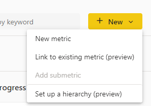
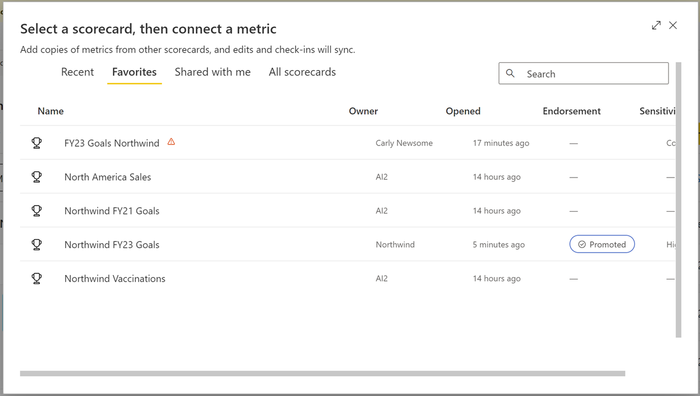
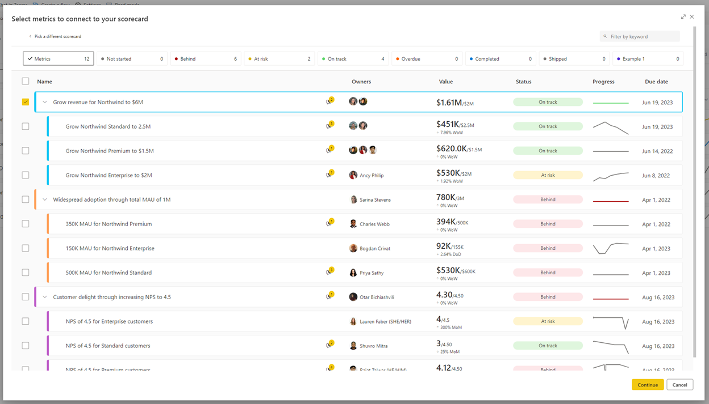
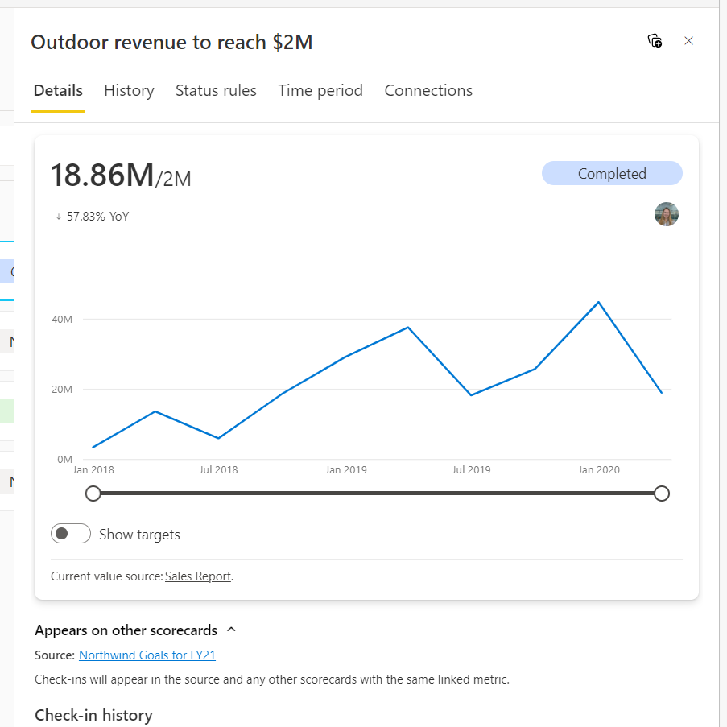
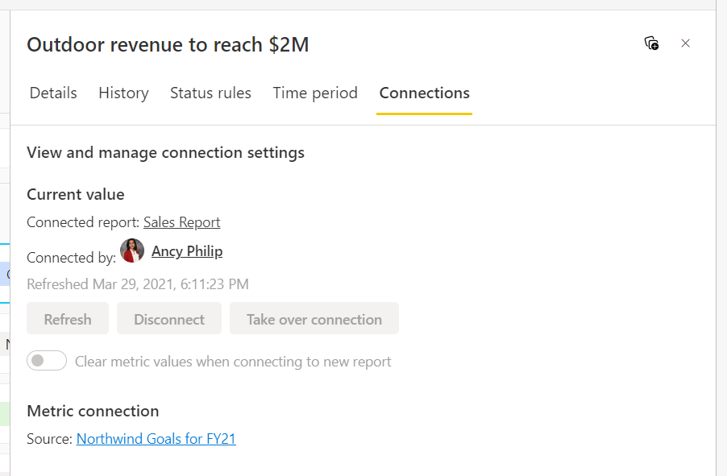

# Create linked metrics in the Power BI service (Preview)

[!INCLUDE [applies-no-desktop-yes-service](../includes/applies-no-desktop-yes-service.md)]

With linked metrics, you now have the ability to show the same metric on multiple scorecards, across multiple workspaces. 
All check-ins, edits, and updates will be reflected in all the metric locations, making it easier to not create duplicate metrics tracking the same thing. 
For example, in many organizations, the leadership team has a scorecard, and each department has its own scorecard with metrics from the former along with others 
that are relevant to the specific department. Using this feature, you can now link such metrics to any number of scorecards and get them to be in sync automatically. 

## Permissions

You can link metrics from a scorecard you have build access (i.e., permissions to build content with the data associated with the scorecard), 
to any scorecards you have edit access. A linked metric will only be visible to users who have view access to the source metric.

## Create a linked metric 

1. Open a scorecard and select **Edit**
2. Click on the **New** button.
3. Select **Link to existing metric (preview)** option.

  

4.Pick the scorecard that contains the metric you’d like to link from the list provided.

 

5. Select the metric(s) you’d like to include in this scorecard.

 
   
6. Select **Continue** and the linked metric(s) will appear on this scorecard.

## Check-in and edit a linked metric

You can add check-ins right from the linked metric if you have permission to check-in on the source metric.  
Check-ins will be reflected in all scorecards that contain the linked metric and source metric.

You can make edits only in the source metric. 
You can navigate from the linked metric to the source metric by selecting “Go to source metric” from the overflow menu of the linked metric.

 
   
Edits will be reflected in all scorecards that contain the linked metric.

## Linked metric details

You can see the name and link to the source scorecard in the Details pane.

 
   
You can also see this information in the Connections pane.

 

## Linked metrics considerations

- Linked metrics and hierarchies: If you filter your scorecard by a hierarchy, linked metrics will not be filtered but will continue showing their original value. Check-ins to linked metrics are not allowed on a hierarchical child scorecard.

- Linked metrics and rollups: If you link a rollup metric onto a different scorecard, it will continue to show its calculated value from the source scorecard and will not take into account any child metrics on the destination scorecard. Additionally, if a linked metric is the child of a rollup metric, it's not included in the parent's calculation.

## Next steps

- [Get started with metrics in Power BI](service-goals-introduction.md)
- [Create scorecards and manual metrics in Power BI](service-goals-create.md)
- [Create connected metrics in Power BI](service-goals-create-connected.md)

More questions? [Try the Power BI Community](https://community.powerbi.com/).
