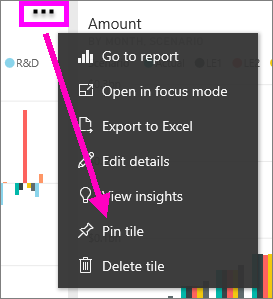
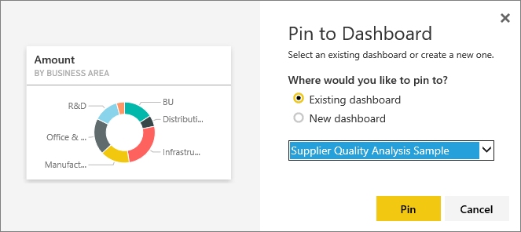

# Pin a tile from one dashboard to another dashboard
One way to add a new [dashboard tile](../consumer/end-user-tiles.md) is by copying it from another dashboard. Each of these tiles, when clicked, is a link back to where it was created -- either in Q&A or a report. 

> [!NOTE]
> You cannot pin tiles from shared dashboards.

## Pin a tile to another dashboard
1. [Get data](../connect-data/service-get-data.md). This example uses the [IT Spend Analysis sample](sample-it-spend.md).
2. Open a [dashboard](../consumer/end-user-dashboards.md).
3. Hover over the tile you want to pin, select **More options** (...) and choose **Pin tile**.  
   
   
4. Pin the tile to an existing dashboard or to a new dashboard. 
   
   * **Existing dashboard**: select the name of the dashboard from the dropdown.
   * **New dashboard**: type the name of the new dashboard.
   
   
5. Select **Pin**.
   A Success message (near the top right corner) lets you know the visualization was added, as a tile, to the selected dashboard.
   
   
6. Select **Go to dashboard** to see the pinned tile. There, you can [rename, resize, link, and move](service-dashboard-edit-tile.md) the pinned visualization.

## Next steps
[Tiles in Power BI](../consumer/end-user-tiles.md)  
[Dashboards in Power BI](../consumer/end-user-dashboards.md)  
More questions? [Try the Power BI Community](https://community.powerbi.com/)
