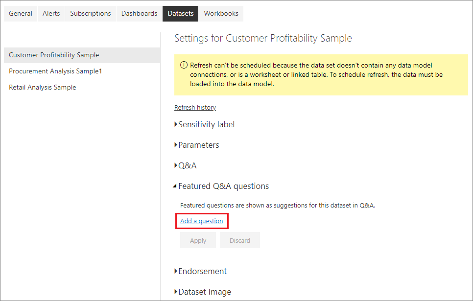
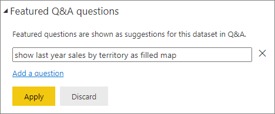
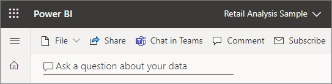
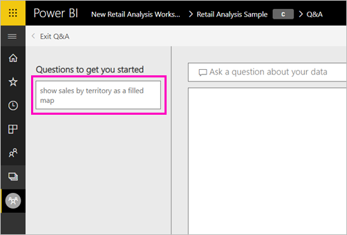
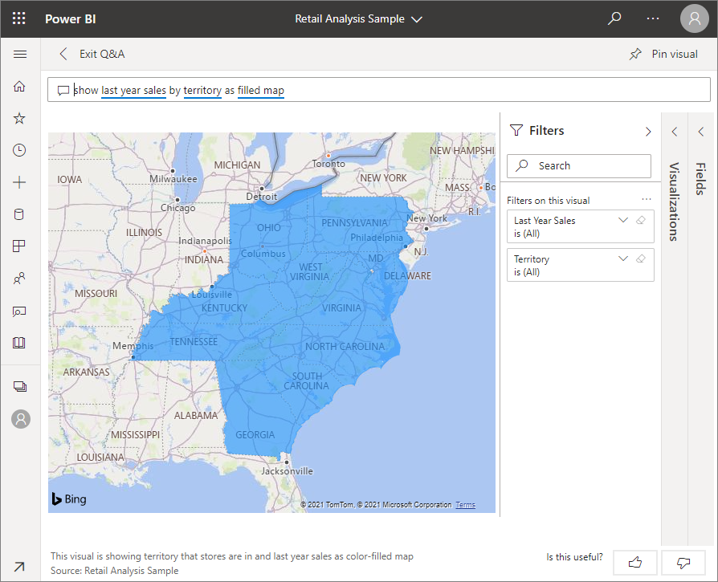

# Create featured questions for Power BI Q&A
If you have edit permission for a dataset, you can add your own featured questions to that dataset. Power BI Q&A will show those questions to colleagues who consume dashboards based on that dataset.  Featured questions give your colleagues ideas about the types of questions they can ask about the dataset. The featured questions you add are up to you -- add popular questions, questions that display interesting results, or questions that may be hard to phrase.

> [!NOTE]
> Q&A featured questions are available for use in the [Microsoft Power BI app on iPads, iPhones, and iPod Touch devices](../consumer/mobile/mobile-apps-ios-qna.md), and in the Power BI service (app.powerbi.com). Creating the questions is only available in the Power BI service.
> 

## Create a featured question

This article uses the [Retail Analysis Sales sample](sample-datasets.md). Follow these step-by-step instructions to try exploring a dataset yourself.

1. On the dashboard, select the **Ask a question about your data** Q&A question box.   Notice that Q&A is already being helpful by displaying some suggested questions.
2. To create a featured question, in the top-right corner of Power BI, select the **More options** ellipsis, point to **Settings**, and select **Settings**.  
   
3. Select **Datasets** &gt; **Retail Analysis sample** &gt; **Featured Q&A questions**.  
4. Select **Add a question**.
   
   
5. Type your question in the text box. For example, type "show last year sales by territory as filled map" and select **Apply**.   Optionally, add another question by selecting **Add a question** again.
   
   
6. Navigate back to the Power BI dashboard for Retail Analysis Sample, and place your cursor in the Q&A question box.
   
   
7. The Q&A screen appears, with the new featured question, **show last year sales by territory as filled map** showing. Select the featured question.
   
8. Power BI creates the answer and displays it as a filled map visualization.  
   

## Next steps

- [Q&A for consumers](../consumer/end-user-q-and-a.md)  
- [Use Q&A in dashboards and reports](power-bi-tutorial-q-and-a.md)  
- [Basic concepts for designers in the Power BI service](../fundamentals/service-basic-concepts.md)  

More questions? [Try the Power BI Community](https://community.powerbi.com/)
