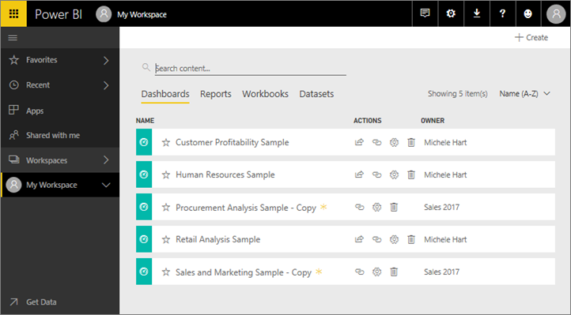
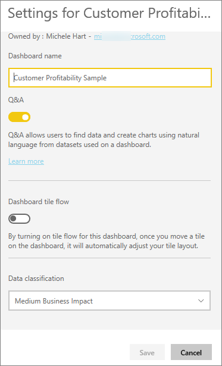
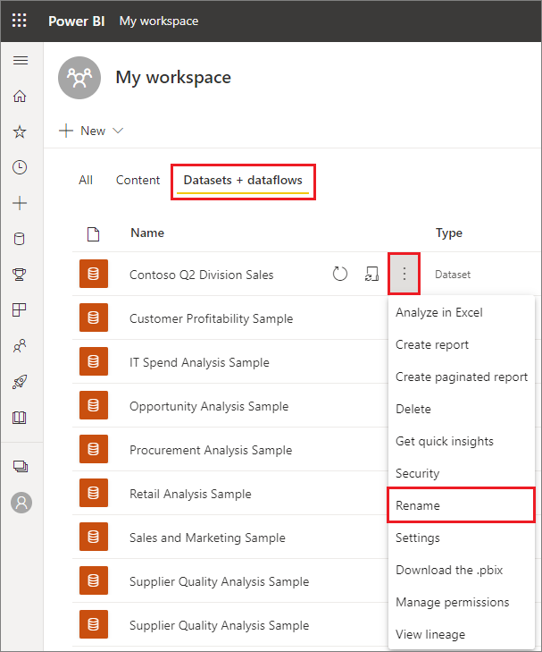
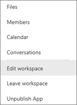
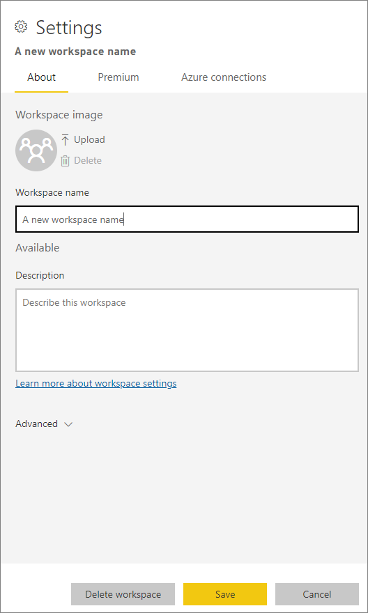

# Rename almost anything in Power BI service
This article teaches you how to rename a dashboard, report, report page, workbook, dataset, app, and workspace in Power BI service.

**Can I change the name?**

| Content type | I'm the author or creator | Shared with me |
| --- | --- | --- |
| Dashboard in a workspace |Yes |No |
| Report in a workspace |Yes |No |
| Workbook in a workspace |Yes |No |
| Dataset in a workspace |Yes |No |
| workspace |Yes, if you are the owner or have Admin permissions |No |
| Published apps |Not from the App screen, but the app name can be changed from the workspace and re-published with a new name if you have Admin permissions |No |
| App content (dashboard, report, workbook, dataset) |Not from the App screen, but the app's content can be renamed from the workspace and re-published with a new name if you have Admin permissions |No |
| Content in **Shared with me** |No |No |

## Rename a dashboard, report, or workbook
1. Start in a workspace and select the **Dashboards**, **Reports**, or **Workbooks** tab. Hover over the item to rename, and select the gear icon . If there is no gear icon, you do not have permissions to rename.
   
   
2. On the Settings page, type the new name and select **Save**.
   
   

## Rename a dataset
1. Start in a workspace and select the **Datasets** tab.
   
   
2. Hover over the item to rename, select **More options** (...), and choose **Rename**.  
   
      
   
   > [!NOTE]
   > The options in the dropdown will vary.
   > 
   > 
3. On the Settings page, type a new name and select **Save**.
   
     

## Rename a workspace
Anyone with Admin permissions can rename a workspace.

1. Start in the workspace you'd like to rename.
2. In the top-right corner, select **More options** (...) and choose **Edit workspace**. If you don't see this option, then you don't have permissions to rename this workspace. 
   
    
3. Type a new workspace name and select **Save**.
   
   

## Rename a page in a report
Don't like the name of a page in your Power BI report?  A new name is just a click away. Pages can be renamed in [report Editing view ](service-interact-with-a-report-in-editing-view.md).

1. Open the report in [Editing View](../consumer/end-user-reading-view.md).
2. Locate the report page tabs at the bottom of the Power BI window.
   
    
3. Open the report page that you'd like to rename by selecting the tab.
4. Double-click the name on the tab to highlight it.  
   
    
5. Type a new report page name and select ENTER.
   
    

## Considerations and troubleshooting
* If the item to be renamed has been shared with you, or is part of an app, you won't see the gear icon and you won't have access to Settings.
* On the **Datasets** tab, if you don't see **More options** (...), expand your browser window.

More questions? [Try the Power BI Community](https://community.powerbi.com/)
