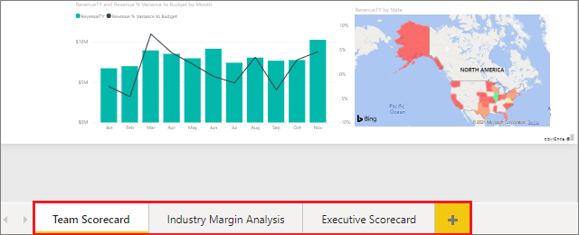

# Rename almost anything in Power BI service

[!INCLUDE [applies-no-desktop-yes-service](../includes/applies-no-desktop-yes-service.md)]

This article teaches you how to rename a dashboard, report, report page, workbook, semantic model, app, and workspace in Power BI service.

**Can I change the name?**

| Content type | I'm the author or creator | Shared with me |
| --- | --- | --- |
| Dashboard in a workspace |Yes |No |
| Report in a workspace |Yes |No |
| Workbook in a workspace |Yes |No |
| Semantic model in a workspace |Yes |No |
| workspace |Yes, if you're the owner or have Admin permissions |No |
| Published apps |Not from the App screen, but the app name can be changed from the workspace and republished with a new name if you have Admin permissions |No |
| App content (dashboard, report, workbook, semantic model) |Not from the App screen, but the app's content can be renamed from the workspace and republished with a new name if you have Admin permissions |No |
| Content in **Shared with me** |No |No |

## Rename a dashboard, report, or workbook

1. In a workspace, hover over the item to rename, select **More options** (...), and then select **Settings**.

   :::image type="content" source="media/service-rename/power-bi-workspace-dashboards-2.png" alt-text="Screenshot of My workspace in the Power BI service.":::
2. On the Settings page, type the new name and select **Save**.

   :::image type="content" source="media/service-rename/power-bi-rename-dashboard-3.png" alt-text="Screenshot of the Settings for Getting Started in Power BI dialog.":::

## Rename a semantic model

1. Start in a workspace and select the **Semantic models + dataflows** tab.

2. Hover over the item to rename, select **More options** (...), and choose **Rename**.

      :::image type="content" source="media/service-rename/power-bi-rename-datasets-2.png" alt-text="Screenshot of My workspace in the Power BI service, highlighting Semantic models and dataflows.":::

   > [!NOTE]
   > The options in the dropdown will vary.
   >
   >
3. On the Rename page, type a new name and select **Save**.

     :::image type="content" source="media/service-rename/power-bi-rename-2.png" alt-text="Screenshot of the Rename Financial Sample dialog.":::

## Rename a workspace

Anyone with Admin permissions can rename a workspace.

1. Start in the list of workspaces.
2. Next to the workspace you'd like to rename, select **More options** (...), and select **Workspace settings**. If you don't see this option, then you don't have permissions to rename the workspace.

    :::image type="content" source="media/service-rename/power-bi-edit-workspace-2.png" alt-text="Screenshot that shows Workspace settings in the Workspaces list.":::

3. Type a new workspace name and select **Save**.

   :::image type="content" source="media/service-rename/power-bi-workspace-rename-2.png" alt-text="Screenshot of the Settings menu in the Power BI service.":::

## Rename a page in a report

Don't like the name of a page in your Power BI report? A new name is just a click away. Pages can be renamed in [report Editing view](service-interact-with-a-report-in-editing-view.md).

1. Open the report in [Editing View](../consumer/end-user-reading-view.md).
2. Locate the report page tabs at the bottom of the Power BI window.

    
3. Open the report page that you'd like to rename by selecting the tab.
4. Double-click the name on the tab to highlight it.

    
5. Type a new report page name and select ENTER.

    

## Considerations and troubleshooting

* If the item to be renamed has been shared with you, or is part of an app, you won't see the gear icon and you won't have access to Settings.
* On the **Semantic models** tab, if you don't see **More options** (...), expand your browser window.

More questions? [Ask the Power BI Community](https://community.powerbi.com/)
