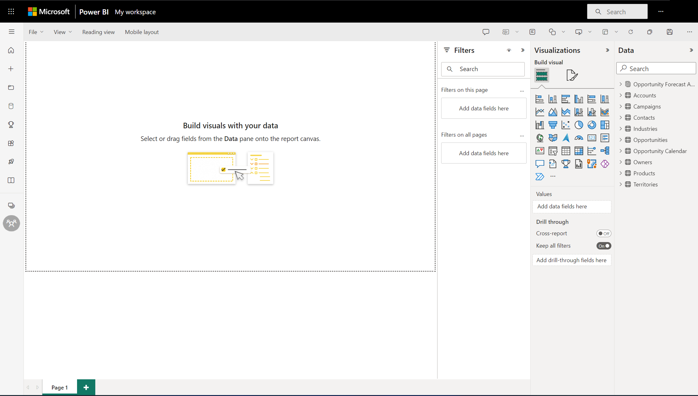
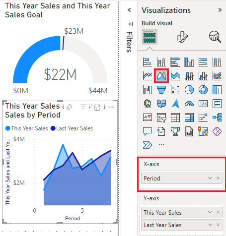

# Create a report from an Excel file in the Power BI service
You've read [Reports in Power BI](../consumer/end-user-reports.md) and now you want to create your own. There are different ways to create a report. In this article, we start by creating a basic report in the Power BI service from an Excel file. Once you understand the basics of creating a report, check out the [Next steps](#next-steps) at the end for more advanced report topics.  

## Prerequisites
- [Sign up for the Power BI service](../fundamentals/service-self-service-signup-for-power-bi.md). 
- [Download the Retail Analysis sample Excel file](https://go.microsoft.com/fwlink/?LinkId=529778) and save it to your computer or to OneDrive for Business.

## Import the Excel file
This method of creating a report starts with a file and a blank report canvas. You can follow along in the Retail Analysis sample Excel file.

1. In the navigation pane, select **My Workspace**.
   
   :::image type="content" source="media/service-report-create-new/power-bi-select-my-workspace.png" alt-text="Screenshot of selecting My Workspace.":::
2. From the bottom of the nav pane, select **Get data**.
   
   
3. Select **Files** and navigate to the location where you saved the Retail Analysis sample.
   
    
4. For this exercise, select **Import**.
   
   
5. Select **Open**.

   Once the Excel file is imported, it's listed as a *dataset* in the workspace list.

1. Select **More options (...)** next to the dataset, and select **Create report**.
   
   :::image type="content" source="media/service-report-create-new/power-bi-dataset-create-report.png" alt-text="Screenshot of selecting Create report.":::
6. The report editor opens. 
   
   

> [!TIP]
> Select the menu icon to hide the navigation pane, to give you more room.
> 
> :::image type="content" source="../media/power-bi-hide-navigation-pane.png" alt-text="Screenshot of Select the menu icon to hide the navigation pane.":::

## Add a Radial Gauge to the report
Now that our dataset is imported, let's start answering some questions.  Our Chief Marketing Officer (CMO) wants to know how close we are to meeting this year's sales goals. A Gauge is a [good visualization choice](../visuals/power-bi-report-visualizations.md) for displaying this type of information.

1. In the Fields pane, select **Sales** > **This Year Sales** > **Value**.
   
    
2. Convert the visual to a Gauge by selecting the Gauge template  from the **Visualizations** pane.
   
    
3. Drag **Sales** > **This Year Sales** > **Goal** to the **Target value** well. Looks like we're very close to our goal.
   
    
4. Now would be a good time to save your report.
   
   

## Add an area chart and slicer to the report
Our CMO has some additional questions for us to answer. They'd like to know how sales this year compare to last year. And, they'd like to see the findings by district.

1. First, let's make some room on our canvas. Select the Gauge and move it into the top-right corner. Then grab and drag one of the corners and make it smaller.
2. Deselect the gauge. In the Fields pane, select **Sales** > **This Year Sales** > **Value** and select **Sales** > **Last Year Sales**.
   
    
3. Convert the visual to an Area chart by selecting the Area chart template  from the **Visualizations** pane.
4. Select **Time** > **Period** to add it to the **Axis** well.
   
    
5. To sort the visualization by time period, select the ellipses and choose **Sort by Period**.
6. Now let's add the slicer. Select an empty area on the canvas and choose the Slicer  template. We now have an empty slicer on our canvas.
   
        
7. From the Fields pane, select **District** > **District**. Move and resize the slicer.
   
      
8. Use the slicer to look for patterns and insights by District.
   
     

Continue exploring your data and adding visualizations. When you find especially interesting insights, [pin them to a dashboard](service-dashboard-pin-tile-from-report.md).

## Next steps

* [Pin visualizations to a dashboard](service-dashboard-pin-tile-from-report.md)
* [Change report settings in the Power BI service](power-bi-report-settings.md)
* More questions? [Try the Power BI Community](https://community.powerbi.com/)
