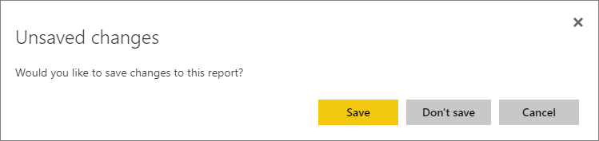
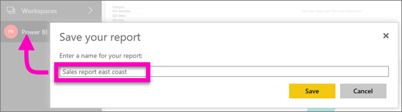

# Save a report in Power BI service and Power BI Desktop
After you make changes to a report in Power BI, you can save it, save it with a new name, or just close it without saving your changes. Say you open the report, create a visualization, and pin it to your dashboard. If you close it now without saving your changes, the tile remains on the dashboard, but the visualization isn't saved in the report. When you click that tile on the dashboard, the report opens, but the visualization doesn't exist in the report.

> [!TIP]
> Pay attention to which workspace is active so you can find the saved report. The report is saved to the active workspace.
> 
> 

### To save a report:
1. If you attempt to navigate away from a report, and the report has changes, Power BI will display a prompt.
   
   
2. Another way to save the report is to select **File** > **Save** or **Save As**. If you are in [Reading view](../consumer/end-user-reading-view.md) you will only see the option to Save As. 
   
   
3. If this is a new report (Save), or a new version of an existing report (Save as), give it a descriptive name.  **The report will be added to the active workspace**.
   
    

### Next steps
Read more about [reports in Power BI](../consumer/end-user-reports.md)

[Basic concepts for designers in the Power BI service](../fundamentals/service-basic-concepts.md)

More questions? [Try the Power BI Community](https://community.powerbi.com/)
