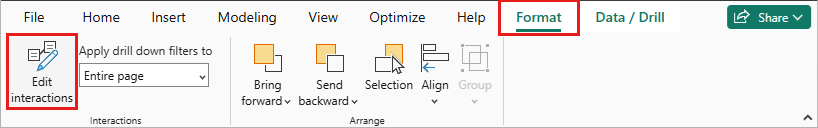
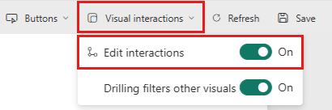
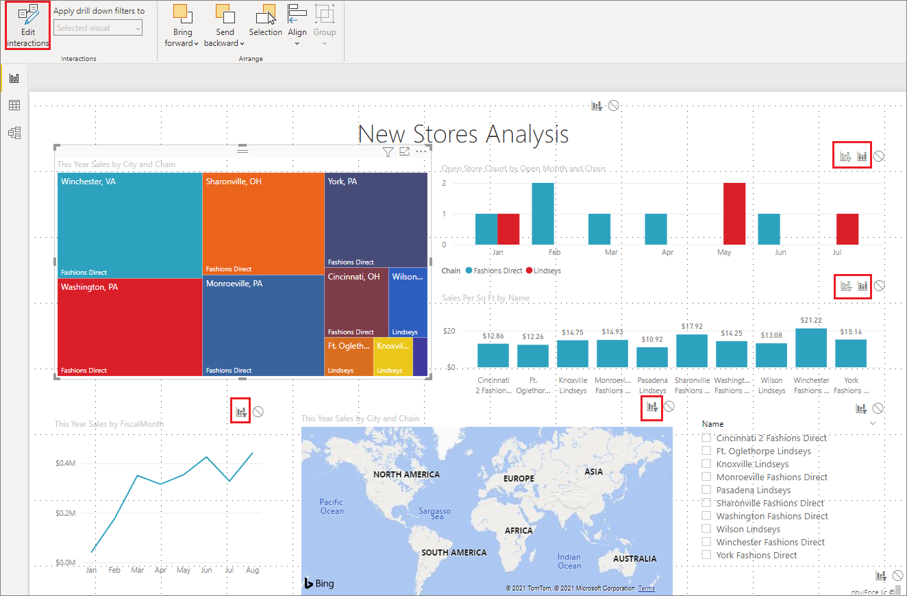
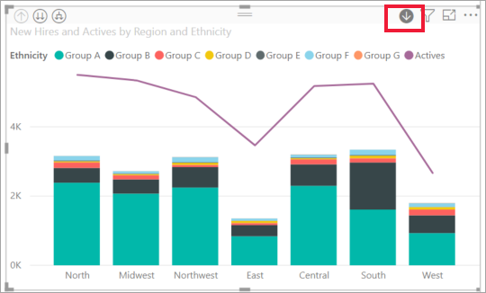
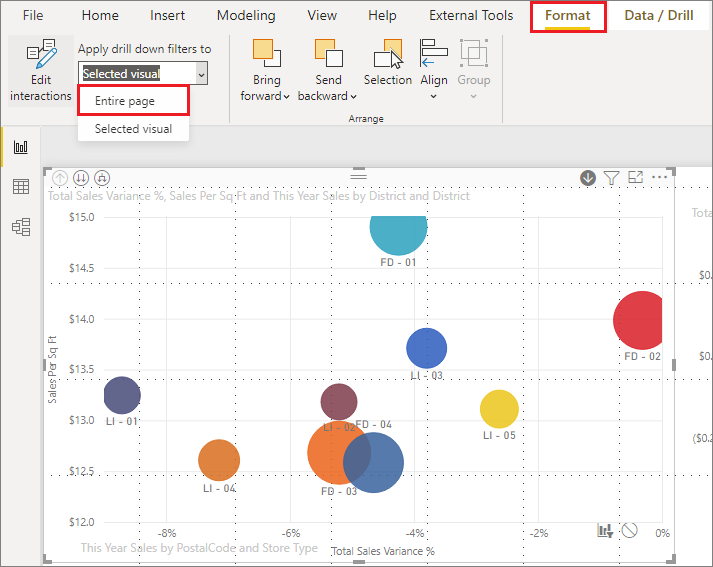

# Change how visuals interact in a Power BI report

[!INCLUDE [applies-yes-desktop-yes-service](../includes/applies-yes-desktop-yes-service.md)]

If you have edit permissions for a report, you can use **Visual interactions** to change how visualizations on a report page impact each other.

## Introduction to visual interactions
By default, visualizations on a report page cross-filter and cross-highlight the other visualizations on the page.
For example, selecting a state on a map visualization highlights the column chart and filters the line chart to display only data that applies to that one state.
See [Filters and highlighting in Power BI reports](power-bi-reports-filters-and-highlighting.md). If you have a visualization that supports [drilling](../consumer/end-user-drill.md), by default, drilling one visualization has no impact on the other visualizations on the report page. Both of these default behaviors can be overridden, and interactions can be set, on a per-visualization basis.

This article shows how to use **visual interactions** in Power BI Desktop. The process is the same in the Power BI service [Editing view](service-interact-with-a-report-in-editing-view.md). If you only have Reading view access, or the report has been shared with you, you can't change the visual interactions settings.

The terms *cross-filter* and *cross-highlight* distinguish the behavior described here from what happens when you use the **Filters** pane to *filter* visualizations.  

> [!NOTE]
> This video uses older versions of Power BI Desktop and the Power BI service.
>
>

> [!VIDEO https://www.youtube.com/embed/N_xYsCbyHPw?list=PL1N57mwBHtN0JFoKSR0n-tBkUJHeMP2cP]

## Enable the visual interaction controls
If you have edit permissions to a report, you can turn on the visual interaction controls and then customize how the visualizations on your  report page filter and highlight each other.

1. Select a visualization to make it active.  
2. Display the **Visual Interactions** options.

   # [Power BI Desktop](#tab/powerbi-desktop)
   In Power BI Desktop, select **Format** > **Edit interactions**.

   

   # [Power BI service](#tab/powerbi-service)
   In the Power BI service, open the report in Editing view and select the dropdown from the report menu bar.

   

3. Power BI adds filter and highlight icons to all of the other visualizations on the report page.

   

   The tree map is cross-filtering the line chart and the map. The tree map is also cross-highlighting the column chart. You can now change how the selected visualization interacts with the other visualizations on the report page.

## Change the interaction behavior
Get familiar with how your visualizations interact by selecting each visualization on your report page, one at a time. Select a data point or a bar or a shape and watch the impact on the other visualizations. If the behavior you see isn't what you'd prefer, you can change the interactions. These changes are saved with the report, so you and your report consumers will have the same visual interaction experience.

Start by selecting a visualization to make it active.  Notice that all the other visualizations on the page now display interaction icons. The bolded icon is the one that is being applied. Next, determine what impact you'd like the **selected visualization** to have on the others. You can repeat this for all other visualizations on the report page.

Options for selected visualizations:
   
   * If you want the selected visualization to cross-filter one of the other visualizations on the page, select the **filter** icon in the upper right corner of that visualization :::image type="icon" source="media/service-reports-visual-interactions/power-bi-filter-icon.png":::. You can only cross-filter line charts, scatter charts, and maps. You can't cross-highlight them.
   * If you want the selected visualization to cross-highlight one of the other visualizations on the page, select the **highlight** icon :::image type="icon" source="media/service-reports-visual-interactions/power-bi-highlight-icon.png":::.
   * If you want the selected visualization to have no impact on one of the other visualizations on the page, select the **no impact** icon :::image type="icon" source="media/service-reports-visual-interactions/power-bi-no-impact.png":::.

## Change the interactions of drillable visualizations
For both Power BI Desktop and Power BI service, [certain Power BI visualizations can be drilled](../consumer/end-user-drill.md). By default, when you drill a visualization, it has no impact on the other visualizations on the report page. However, that behavior can be changed.

> [!TIP]
> Try it yourself using the [Human Resources sample PBIX file](https://download.microsoft.com/download/6/9/5/69503155-05A5-483E-829A-F7B5F3DD5D27/Human%20Resources%20Sample%20PBIX.pbix). There's a column chart with a drill-down feature on the **New hires** tab.
>

# [Power BI Desktop](#tab/powerbi-desktop)

1. In Power BI Desktop, select a drillable visual to make it active.
 
1. Turn on the drill-down feature by selecting the drill-down icon.

    

1. From the menu bar, select **Format**, select the drop-down caret under **Apply drill down filters to**, and select **Entire page**.

   

1. Now when you drill down (and up) in a visualization, the other visualizations on the report page change to reflect your current drilling selection.

1. If the behavior you see isn't what you want, you can change the interactions, as described previously.

# [Power BI service](#tab/powerbi-service)

1. In the Power BI service, select a drillable visual to make it active.
 
1. Turn on the drill-down feature by selecting the drill-down icon.

    

1. Select the **Visual interactions** dropdown menu and set **Drilling filters other visuals** to **On**.

    :::image type="content" source="media/service-reports-visual-interactions/drilling-filters-other-visuals.png" alt-text="Screenshot of Power BI service that shows Drilling filters other visuals set to On.":::

1. Now when you drill down (and up) in a visualization, the other visualizations on the report page change to reflect your current drilling selection.

1. If the behavior you see isn't what you want, you can change the interactions, as described previously.
---

## Considerations and troubleshooting
If you build a matrix with fields from different tables, then try to cross-highlight by selecting multiple items at different levels of the hierarchy, you get errors on the other visuals.

## Related content

* [Filtering and highlighting in Power BI reports](power-bi-reports-filters-and-highlighting.md)
