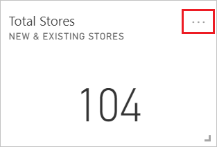
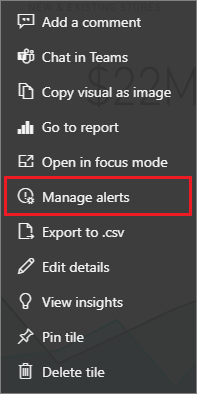
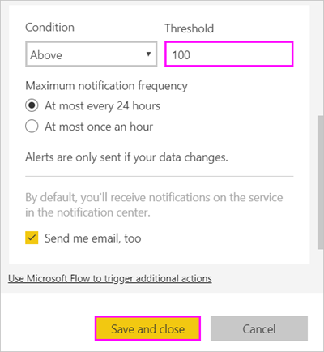
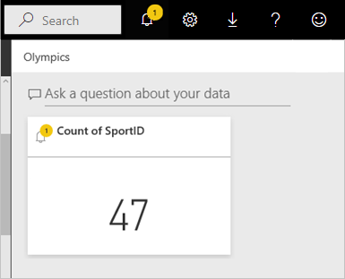
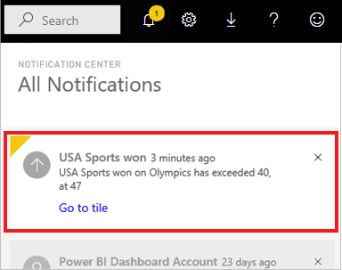
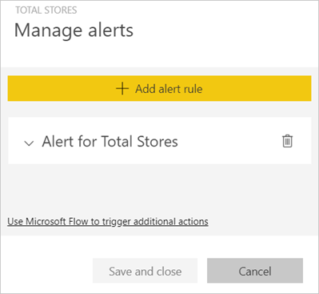
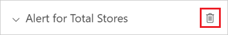
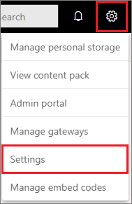
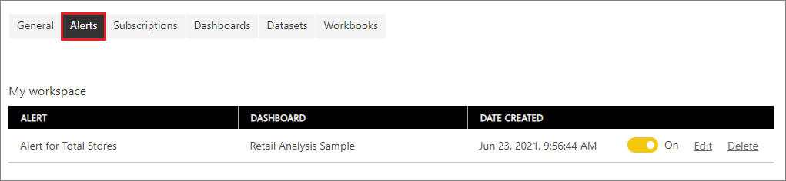

# Data alerts in the Power BI service

[!INCLUDE [applies-no-desktop-yes-service](../includes/applies-no-desktop-yes-service.md)]

Set alerts to notify you when data in your dashboards changes beyond the limits you set.

You can set alerts on tiles in your My Workspace. You can also set alerts if someone shares a dashboard that's in a [Premium capacity](../enterprise/service-premium-what-is.md). If you have a Power BI Pro license, you can set alerts on tiles in any other workspace, too. Alerts can only be set on tiles pinned from report visuals, and only on gauges, KPIs, and cards. Alerts can be set on visuals created from streaming datasets that you pin from a report to a dashboard. Alerts can't be set on streaming tiles created directly on the dashboard by using **Add tile** > **Custom streaming data**.

Only you can see the alerts you set, even if you share your dashboard. Similarly, the dashboard owner can't see alerts you set on your view of their dashboard. Data alerts are fully synchronized across platforms. You can set and view data alerts [in the Power BI mobile apps](../consumer/mobile/mobile-set-data-alerts-in-the-mobile-apps.md) and in the Power BI service. They aren't available for Power BI Desktop. You can automate and integrate alerts with Power Automate. If you want to try it yourself, see [Power Automate and Power BI](../collaborate-share/service-flow-integration.md).

> [!WARNING]
> Data-driven alert notifications provide information about your data. If you view your Power BI data on a mobile device and that device is lost or stolen, we recommend using the Power BI service to turn off all data-driven alert rules.

## Set data alerts in the Power BI service

Watch Amanda add some alerts to tiles on the dashboard. Then follow the step-by-step instructions after the video to try it out yourself.

> [!NOTE]  
> This video might use earlier versions of Power BI Desktop or the Power BI service.

> [!VIDEO https://www.youtube.com/embed/JbL2-HJ8clE]

This example uses a card tile from the Retail Analysis sample dashboard. [Get the Retail Analysis sample](sample-retail-analysis.md#get-the-built-in-sample-in-the-power-bi-service) if you want to follow along.

1. Start on a dashboard. From the **Total stores** tile, select the ellipses.

   

1. Select **Manage alerts** to add one or more alerts for **Total Stores**.

   

1. To start, select **+ Add alert rule**, ensure the **Active** slider is set to **On**, and give your alert a title. Titles help you easily recognize your alerts.

   

1. Scroll down and enter the alert details.  In this example, you create an alert that notifies you once a day if the number of total stores goes above 100.

   

    Alerts appear in your **Notification center**. Power BI also sends you an email about the alert if you select the checkbox.

1. Select **Save and close**.

## Receive alerts

When the tracked data reaches one of the thresholds you've set, Power BI checks the time that has passed since the last alert. If the data is past the one hour or 24-hour threshold (depending on the option you selected), you get an alert.

Next, Power BI sends an alert to your **Notification center** and, optionally, an email. Each alert contains a direct link to your data. Select the link to see the relevant tile where you can explore, share, and learn more.  

* If you set the alert to send you an email, you find something like this message in your inbox.

   

* Power BI adds a message to your **Notification center** and adds a new alert icon to the applicable tile.

   

* Your **Notification center** displays the alert details.

   

   > [!NOTE]
   > Alerts only work on refreshed data. When data refreshes, Power BI looks to see whether an alert is set for that data. If the data has reached an alert threshold, Power BI triggers an alert.

## Manage alerts

There are many ways to manage your alerts:

* From the [dashboard tile](#from-the-dashboard-tile).
* From the [Power BI **Settings** menu](#from-the-power-bi-settings-menu).
* On a tile in the [Power BI mobile apps](../consumer/mobile/mobile-set-data-alerts-in-the-mobile-apps.md).

### From the dashboard tile

1. If you need to change or remove an alert for a tile, reopen the **Manage alerts** window by selecting **Manage alerts**.

   

    Power BI displays the alerts that you set for that tile.

    

1. To modify an alert, select the arrow to the left of the alert name.

    

1. To delete an alert, select the trash can to the right of the alert name.

      

### From the Power BI settings menu

1. Select the gear icon from the Power BI menu bar and select **Settings**.

    .

1. Under **Settings**, select **Alerts**.

    

1. From here you can turn alerts on and off, open the **Manage alerts** window to make changes, or delete the alert.

## Considerations and troubleshooting

* Alerts aren't supported for card tiles with date or time measures.
* Alerts only work with numeric data types.
* Alerts only work on refreshed data. They don't work on static data.
* Because alerts are only sent if your data changes, you don't receive duplicate alerts for an unchanged value.
* Alerts only work on streaming datasets if you build a KPI, card, or gauge report visual and then pin that visual to the dashboard.
* You can create up to 250 alerts across all your models.

## Related content

* [Create a Power Automate workflow that includes a data alert](../collaborate-share/service-flow-integration.md).
* [Set data alerts on your mobile device](../consumer/mobile/mobile-set-data-alerts-in-the-mobile-apps.md).
* [What is Power BI?](../fundamentals/power-bi-overview.md)

More questions? [Try asking the Power BI Community](https://community.powerbi.com/)
