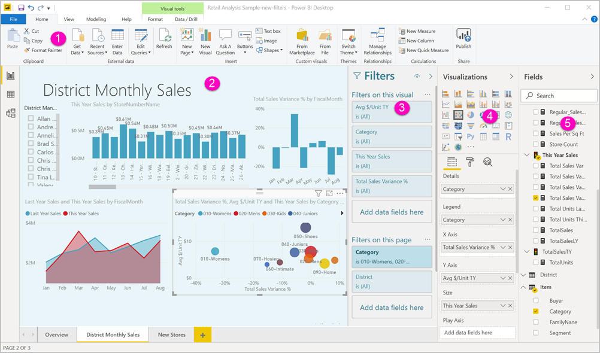
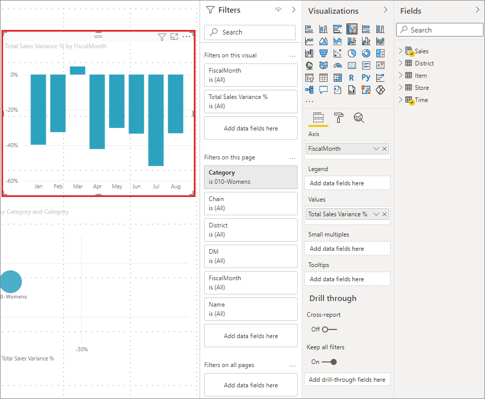
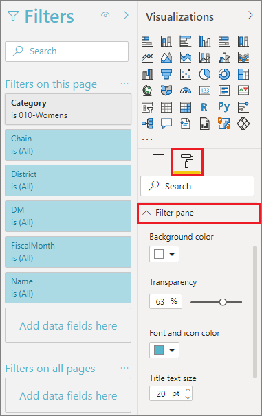
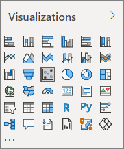
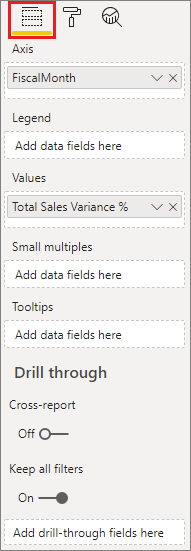
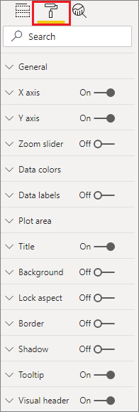
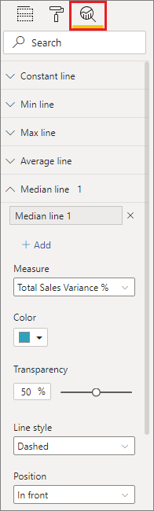
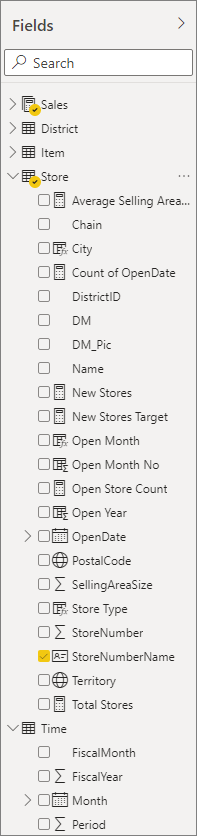

# Tour the report editor in Power BI

In Power BI Desktop and in the Power BI service, the *report editor* is where you design the reports your consumers see, with charts, tables, maps, and other visuals. It's similar in the two environments. Typically you start creating a report in Power BI Desktop. Then you publish it to the Power BI service, where you can continue modifying it. The Power BI service is also where you create the dashboards based on your reports.

After you create your dashboards and reports, you distribute them to your report consumers. Depending on how you share them, your end users can interact with them in Reading view in the Power BI service, but not edit them. Read more about [what report consumers can do in the Power BI service](../consumer/end-user-reading-view.md). 

This video shows the report editor in Power BI Desktop. This article also shows the report editor in Power BI Desktop. 

<iframe width="560" height="315" src="https://www.youtube.com/embed/IkJda4O7oGs" frameborder="0" allowfullscreen></iframe>

In the Power BI service, the report editor is only available in Editing View. To open a report in Editing view, you must be a report owner or creator, or be a contributor to the workspace that houses the report.

The Power BI report editor is divided into several main sections:  

1. The ribbon
1. Report canvas
1. Filters pane
1. Visualizations pane
1. Fields pane

## 1. The ribbon
The actions available from the ribbon are numerous, with new actions being added all the time. For information about a particular action, use the Power BI documentation table of contents, or Search box.

## 2. The report canvas
The report canvas is where your work displays. When you use the Fields, Filters, and Visualizations panes to create visuals, they are built and displayed on your report canvas. Each tab at the bottom of the canvas represents a page in the report. Select a tab to open that page. 

## The report editor panes

Three panes are visible when you first open a report: Filters, Visualizations, and Fields. The first two panes on the left, Filters and Visualizations, control what your visualizations look like: type, colors, filtering, and formatting. The last pane on the right, Fields, manages the underlying data being used in the visualizations. The content displayed in the report editor varies by selections you make in the report canvas. 

For example, when you select an individual visual such as this column chart:

**The Filters pane** displays any filters on the visual, the page, or on all pages. In this case, there are page-level filters, but no visual-level filters.

**The top of the Visualization pane** identifies the type of visual in use. In this example, a Clustered column chart. 

**The bottom of the Visualization pane** has three tabs:

 **Fields** displays the fields in the visual. You may have to scroll down to see all the details. This chart is using **FiscalMonth** and **Total Sales Variance**.

 **Format** To display the format pane for the selected visualization, select the paint roller icon.

 **Analytics** To display the Analytics pane, select the magnifying glass icon.

**The Fields pane** lists all the available tables in the data model. When you expand a table, you see the fields in that table. The yellow check mark lets you know that at least one field from that table is in a visualization.

Read on for details about each pane.

## 3. The Filters pane
Use the Filters pane to view, set, and modify persistent filters to your reports at the page, report, drillthrough, and visual-level. Yes, you can do ad-hoc filtering on report pages and visuals by selecting elements of the visuals or by using tools like slicers. Filtering in the Filters pane has the advantage that the state of the filters is saved with the report. 

The Filters pane has another powerful feature: you can filter using a field *that isn't already in one of the visuals in your report*. Let me explain. When you create a visualization, Power BI automatically adds all the fields in the visualization to the visual-level filters area of the Filters pane. If you want to set a visual, page, drillthrough, or report filter using a field that isn't currently used in the visualization, you just drag it to one of the Filters buckets.

The new filter experience offers more flexibility. For example, you can format filters to look like the report itself. You can also lock filters or hide them from your report consumers. 

Read more about [formatting the Filters pane in the new filter experience](power-bi-report-filter.md).

## 4. The Visualizations pane

The visualizations pane has four sections itself. We'll start at the top of the pane.

Here's where you select a visualization type. The small icons show the different types of visualizations you can create. In the image above, the scatter chart is selected. If you start building a visualization by selecting fields without selecting a visualization type first, Power BI picks the visualization type for you. You can keep Power BI's selection, or change the type by selecting a different icon.

You can download custom visualizations to Power BI Desktop. Their icons will show up in this pane, too. 

### Manage the fields in a visualization

The buckets (sometimes called *wells*) in this pane vary depending on the type of visualization you've selected.  For example, if you've selected a bar chart, you see Axis, Legend, and Values. When you select a field or drag it onto the canvas, Power BI adds that field to one of the buckets.  You can also drag fields from the Fields list directly into the buckets.  Some buckets are limited to certain types of data.  For example, **Values** won't accept non-numeric fields. So if you drag a **Category** field into the **Values** bucket, Power BI changes it to **Count of Category**.

For more information, see [Add visualizations to a Power BI report](../visuals/power-bi-report-add-visualizations-i.md).

This part of the pane also has options to control [drillthrough](desktop-drillthrough.md) and filter behavior.

### Format your visuals
Select the paint roller icon to display the Format pane. The options available depend on the type of visualization selected.

The formatting possibilities are extensive.  To learn more, explore on your own, or visit these articles:

* [Customizing  visualization title, background, and legend](../visuals/power-bi-visualization-customize-title-background-and-legend.md)
* [Color formatting](../visuals/service-getting-started-with-color-formatting-and-axis-properties.md)
* [Customizing X-axis and Y-axis properties](../visuals/power-bi-visualization-customize-x-axis-and-y-axis.md)

### Add analytics to your visualizations
Select the magnifying glass icon to display the Analytics pane. The options available depend on the type of visualization selected.

With the Analytics pane in the Power BI service, you can add dynamic reference lines to visualizations, and provide focus for important trends or insights. To learn more, see  [Analytics pane in Power BI Desktop](../transform-model/desktop-analytics-pane.md).

## 5. The Fields pane
The Fields pane displays the tables, folders, and fields in your data that are available for you to use to create visualizations.

:::row:::
    :::column:::
        <ul><li>Drag a field onto the page to start a new visualization.  You can also drag a field onto an existing visualization to add the field to that visualization.  </li> <li>When you add a checkmark next to a field, Power BI adds that field to the active (or new) visualization. And it also decides which bucket to place that field into.  For example, should the field be used a legend, axis, or value? Power BI makes a best-guess and you can move it from that bucket to another if necessary.   </li><li>Either way, each selected field is added to the Visualizations pane in the report editor.</li></ul>
    :::column-end:::
    :::column:::
        
    :::column-end:::
:::row-end:::

In Power BI Desktop, you also have options to show/hide fields, add calculations, etc.

## The field icons

Power BI uses a number of different icons to indicate the types of fields in a report. When you can recognize them, you understand better how they act in different visuals. See the [Field list icons section of Using the Field list in Power BI Desktop](../transform-model/desktop-field-list.md#field-list-changes) for a complete list.

## Next steps
[Create a report](service-report-create-new.md)

More about reports in the [Power BI service](service-report-create-new.md), [Power BI Desktop](desktop-report-view.md), and [Power BI mobile apps](../consumer/mobile/mobile-apps-view-phone-report.md).

[Basic concepts for Power BI designers](../fundamentals/service-basic-concepts.md)

More questions? [Try the Power BI Community](https://community.powerbi.com/)
