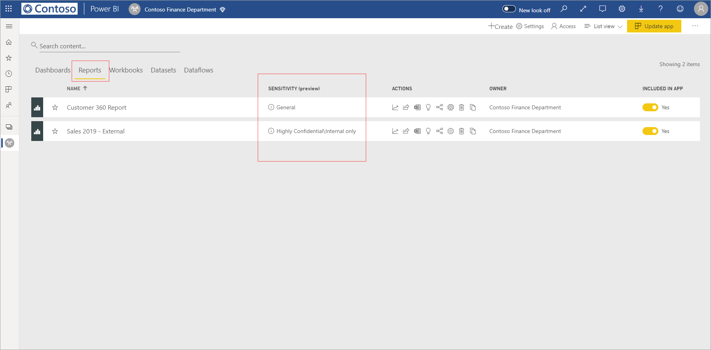
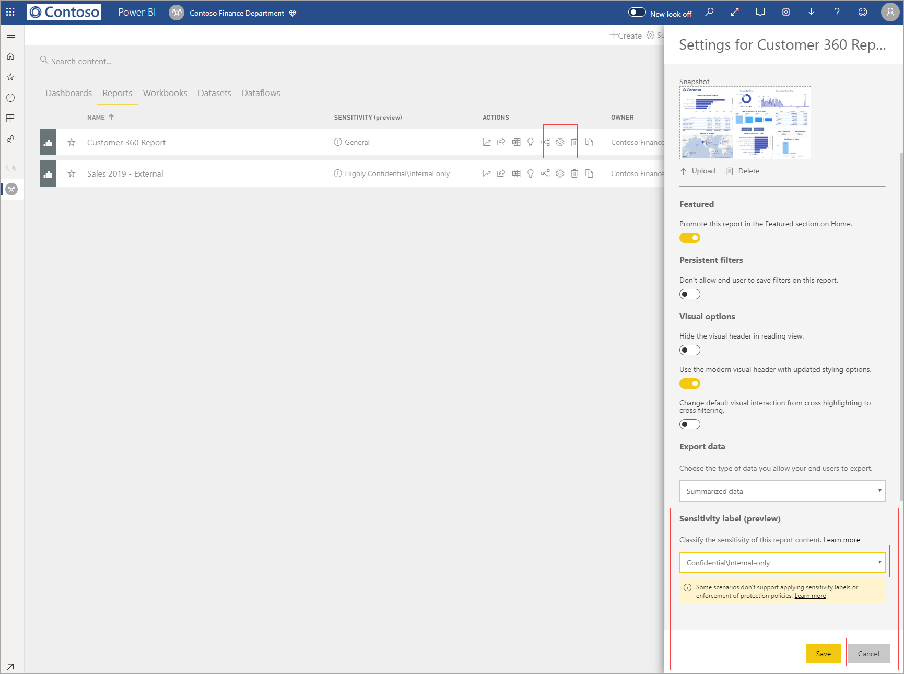
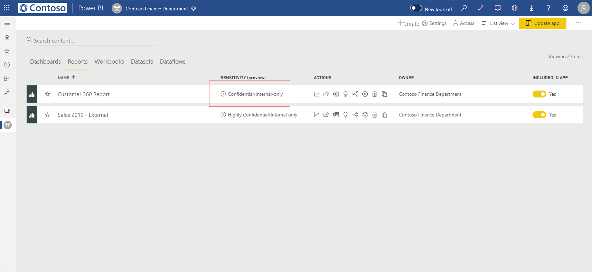
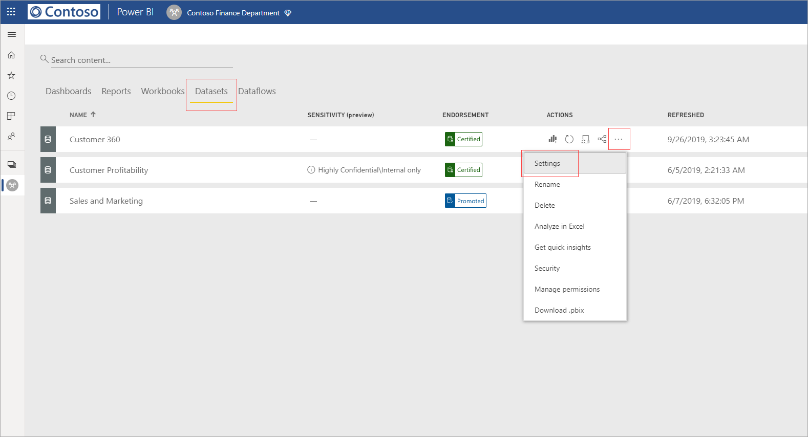
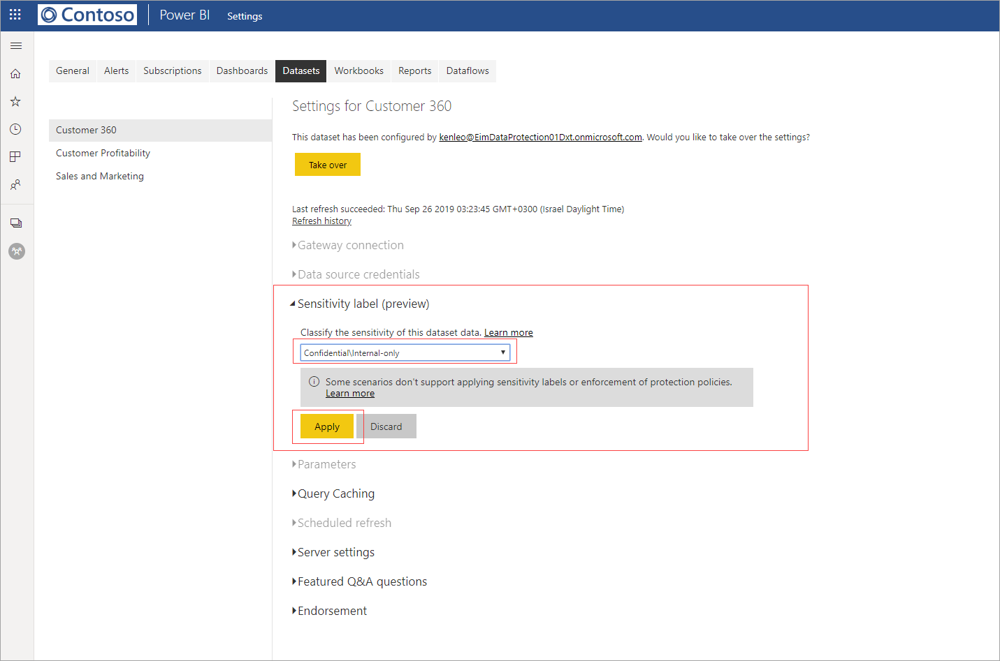
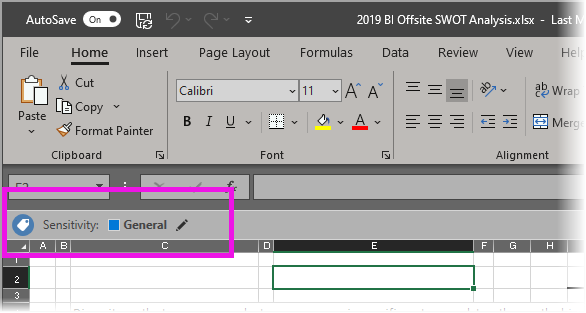

# Apply data sensitivity labels in Power BI (preview)

When sensitivity labels are enabled in the Power BI service, you can protect your dashboards, reports, datasets, and dataflows against unauthorized access and leakage by applying data sensitivity labels to them. Labeling your data correctly with data sensitivity labels ensures that only authorized people can access your data.

When data protection is enabled, sensitivity labels appear in the sensitivity column in the list view of dashboards, reports, datasets, and dataflows.

> [!NOTE]
> Applying sensitivity labels to Power BI dashboards, reports, datasets, and dataflows, requires certain licenses and permissions. See [Applying sensitivity labels](#applying-sensitivity-labels) for details.

## Applying sensitivity labels

In order to apply sensitivity labels in Power BI, you and your organization must have the following requirements in place:

* Your organization must have defined sensitivity labels in either the [Microsoft 365 security center](https://security.microsoft.com/) or the [Microsoft 365 compliance center](https://compliance.microsoft.com/).
* You must belong to a security group that has permissions to apply data sensitivity labels, as described in the article titled [Enable data sensitivity labels in Power BI (preview)](../admin/service-security-enable-data-sensitivity-labels.md#enable-data-sensitivity-labels).
* You must have a Power BI Pro license and edit permissions on the resources you wish to label. 
* You must have an Azure Information Protection Premium P1 or Premium P2 license. Microsoft Azure Information Protection can be purchased either standalone or through one of the Microsoft licensing suites. See [Azure Information Protection pricing](https://azure.microsoft.com/pricing/details/information-protection/) for detail.

To apply or change a sensitivity label on a report, click the report settings icon on the workspace list item and then go to the data sensitivity section in the settings side pane. Choose the appropriate sensitivity label and save the settings.

The updated sensitivity label appears in the sensitivity column. 

Applying or changing a sensitivity label on a dashboard follows the same process as described for reports. 

You can also set sensitivity labels on datasets and dataflows. The following image shows how to set a sensitivity label on a dataset; the steps for dataflows are similar.

To set a sensitivity label on a dataset, select the datasets tab, click the three dots on the dataset you want to apply a label to, and choose **Settings**.

On the settings page for the dataset, open the sensitivity label section, choose the desired sensitivity label, and click **Apply**.

Applying or changing a sensitivity label on a dataflow follows the same process as described for datasets.

## Data protection in exported files

When you [export data from a report](https://docs.microsoft.com/power-bi/consumer/end-user-export) that has a sensitivity label, the sensitivity label is inherited by the generated file (Excel, PowerPoint, and PDF; CSV is not supported). The sensitivity label will be visible in the file, and access to the file will be restricted to those who have sufficient permissions.

## Considerations and limitations

Applying data sensitivity labels has the following considerations:

* Applying and viewing Microsoft Information Protection sensitivity labels in Power BI requires an Azure Information Protection Premium P1 or Premium P2 license. Microsoft Azure Information Protection can be purchased either standalone or through one of the Microsoft licensing suites. See [Azure Information Protection pricing](https://azure.microsoft.com/pricing/details/information-protection/) for detail.
* Sensitivity labels can be applied only on dashboards, reports, datasets and dataflows.
* Label and protection controls enforcement on exported files is supported only for Excel, PowerPoint and PDF files. Label and protection are not enforced when data is exported to .CSV files, Subscribe to email, Embed visuals and print.
* A user who exports a file from Power BI has permissions to access and edit that file according to the sensitivity label settings. The user who exports the data does not get owner permissions to the file. 
* Sensitivity labels are currently not available for [paginated reports]( https://docs.microsoft.com/power-bi/paginated-reports-report-builder-power-bi) and workbooks. 
* You cannot currently delete a label from a Power BI asset once it has been applied.
* Sensitivity labels on Power BI assets are visible only in the workspace list and lineage views; labels are not currently visible in the favorites, shared with me, recents, or app views. Note, however, that a label applied to a Power BI asset, even if not visible, will always persist on data exported to Excel, PowerPoint, and PDF files.
* The sensitivity label *file Encryption setting*, configured in either the [Microsoft 365 security center](https://security.microsoft.com/) or the [Microsoft 365 compliance center](https://compliance.microsoft.com/), applies only on files that are *exported from* Power BI; it is not enforced *within* Power BI.
* [HYOK protection](https://docs.microsoft.com/azure/information-protection/configure-adrms-restrictions) is not supported for labels applied in Power BI.
* Viewing and applying labels in Office apps has [licensing requirements](https://docs.microsoft.com/microsoft-365/compliance/sensitivity-labels-office-apps#subscription-and-licensing-requirements-for-sensitivity-labels).
* Sensitivity labels are only supported for tenants in the global (public) cloud. Sensitivity labels are not supported for tenants in other clouds.

## Next steps

This article described how to apply data sensitivity labels in Power BI. The following articles provide more details about data protection in Power BI. 

* [Overview of data protection in Power BI](../admin/service-security-data-protection-overview.md)
* [Enable data sensitivity labels in Power BI](../admin/service-security-enable-data-sensitivity-labels.md)
* [Using Microsoft Cloud App Security controls in Power BI](../admin/service-security-using-microsoft-cloud-app-security-controls.md)