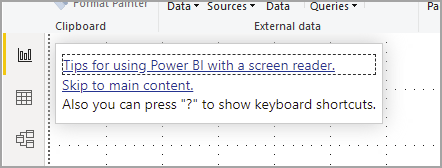
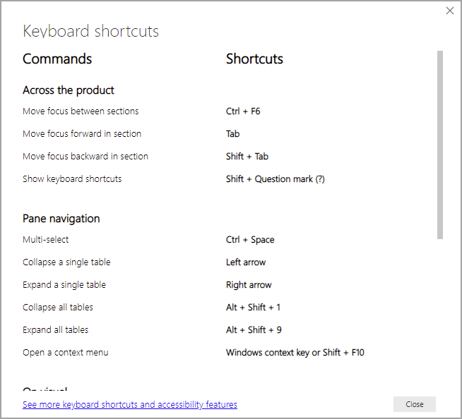
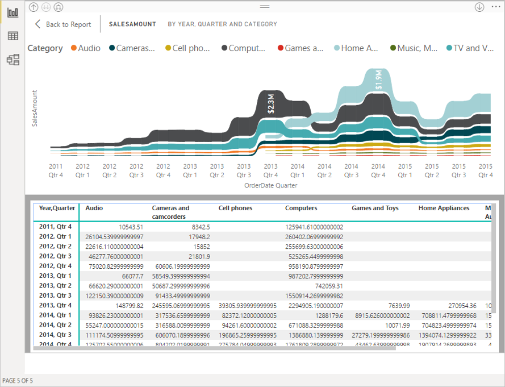

# Consuming reports in Power BI with accessibility tools
Power BI has many built-in features to help people with disabilities more easily consume and interact with Power BI reports. These tools help users get the same information from a report as those who don’t use assistive technology.

There are a couple terms to know as you read through this article:

* **Focus** is where your mouse is on the page. Focus is usually indicated by a blue border surrounding an object.
* **Canvas** is the page area of your report.

The following sections describe the accessibility tools available for consuming Power BI reports.

## Keyboard navigation

When you launch Power BI Desktop or the Power BI service, as soon as you press **Tab**, a tooltip appears in the upper-right hang corner. The link titled **Tips for using Power BI with a screen reader** directs you to this article, providing information on how to consume a report with accessibility tools. Clicking on the **Skip to main content** link takes you to the report canvas.

Pressing **?** opens a dialog with the most frequently used keyboard shortcuts in Power BI. To see a full list of keyboard shortcuts available in Power BI, you can navigate to the link at the bottom of the dialog, which takes you to the Power BI  documentation on [keyboard shortcuts](desktop-accessibility-keyboard-shortcuts.md).

You can switch focus between the report page tabs, or objects on a given report page using **Ctrl + F6**. When focus is on a loaded report page, use the **Tab** key to shift focus to each object on the page, which includes all textboxes, images, shapes, and charts. 

In general, using **Enter** to select or enter, and using **Esc** to exit are common commands in Power BI.

### Keyboard navigation for visuals

Many Power BI report creators are building reports that contain a lot of data. As you move through a visual, it can be annoying to tab through every element in a visual. Keyboard navigation for visuals has been designed as a hierarchy, with three levels. Those three levels are described in the following paragraphs.

To navigate through the first level, when you navigate to a visual press **Ctrl + right arrow** to enter that visual. Once you enter that visual, you can press **Tab** to cycle through the main areas of the visual. Those main areas you can cycle through are the data plot area, the axis categories (if applicable to the visual), and the legend (if the visual has one).

The following .gif shows how a user cycles through the first level of a visual:

The second level of the hierarchy is entering one of the main areas (data plot area, x-axis categories, legend) of the visual. As you consume a report, you can move into one of these main areas and cycle through the data points or categories in that section of the visual. Once you decide which area you’d like to explore further, you can press **Enter** to cycle through that specific area.

If you’d like to select all the data points in a series, navigate to the legend and press **Enter**. Once in the legend, you can press **Tab** to navigate through the different categories in the legend. Press **Enter** to select a specific series.

If you’d like to select specific data points, navigate to the data plot area and press **Enter**. Once in the data plot area you can press **Tab** to navigate through the data points. If your visual has multiple series, you can press the **Up arrow** or **Down arrow** to jump to the data points in a different series.

If you’d like to select all the data points in a categorical axis, navigate to the axis labels and press **Enter**. Once in the axis labels, you can press **Tab** to navigate through the label names. Press **Enter** to select a label name.

If you’ve navigated into a layer, you can press **Esc** to come out of that layer. The following .gif shows how a user can enter and exit the levels of a visual and select data points, x-axis category labels, jump to a different series, and select all the data points in a series.

If you find yourself unable to navigate to an object or visual while using a keyboard, it may be because the report author has decided to hide that object from the tab order. Report authors commonly hide decorative objects from the tab order. If you find that you cannot tab through a report in a logical manner, you should contact the report author. Report authors can set the tab order for objects and visuals.

### Keyboard navigation for slicers

Slicers also have accessibility functionality built in. When you select a slicer, to adjust the value of a slicer use **Ctrl + Right arrow** to move through the various controls within the slicer. For example, when you initially press **Ctrl + Right arrow**, the focus is on the eraser. Then, pressing the **spacebar** is equivalent to clicking the eraser button, which erases all values on the slicer.

You can move through the controls in a slicer by pressing **Tab**. Pressing **Tab** when on the eraser moves to the drop-down button. Another **Tab** then moves to the first slicer value (if there are multiple values for the slicer, such as a range).

### Switching pages

When focus is on report page tabs, use the **Tab** or **Arrow** keys to move focus from one report page to the next. The screen reader reads out the title of the report page, and whether it's currently selected. To load the report page currently under focus, use the **Enter** key or **spacebar**.

### Accessing the visual header
As you navigate between visuals, you can press **Alt + Shift + F10** to move focus to the visual header. The visual header contains various options including sorting, exporting the data behind the chart, and Focus mode. The icons you see in the visual header will depend on the options the report author has decided to show.

## Screen reader

When viewing a report it's best to leave scan mode off. Power BI should be treated more like an application and less like a document, so it’s been set up with custom navigation to make it easier to navigate. When using a screen reader with Power BI Desktop, you should also make sure your screen reader is open before you open Power BI Desktop.

When navigating around objects, the screen reader reads the type of object and the object's title (if it has one). The screen reader also reads a description of that object (alt text) if it's provided by the report author.

### Show data
You can press **Alt + Shift + F11** to present an accessible version of the **Show data** window. This window lets you explore the data used in the visual in an HTML table, using the same keyboard shortcuts you normally use with your screen reader.

The **Show data** feature is an HTML table that is only accessible to a screen reader through this keyboard shortcut. If you open **Show data** from the option in the visual header, a table that is *not* screen reader compatible is displayed.  When using **Show data** through keyboard shortcuts, turn on scan mode to take advantage of all the hot keys your screen reader provides.

To exit the **Show Data** view and return to a report, press **Esc**.

## High contrast modes

The Power BI service attempts to detect the high contrast settings selected for Windows. The effectiveness and accuracy of that detection depends on the browser showing the Power BI service. If you want to set the theme manually in the Power BI service, you can select **View > High contrast colors** and then select the theme you would like to apply to the report.

## Next steps

The collection of articles for Power BI accessibility are the following:

* [Overview of accessibility in Power BI](desktop-accessibility-overview.md) 
* [Creating accessible Power BI reports](desktop-accessibility-creating-reports.md) 
* [Creating Power BI reports with accessibility tools](desktop-accessibility-creating-tools.md)
* [Accessibility keyboard shortcuts for Power BI reports](desktop-accessibility-keyboard-shortcuts.md)
* [Report accessibility checklist](desktop-accessibility-creating-reports.md#report-accessibility-checklist)

