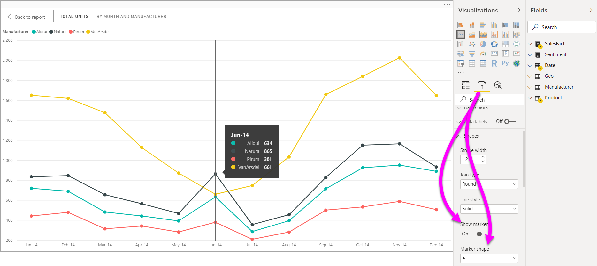
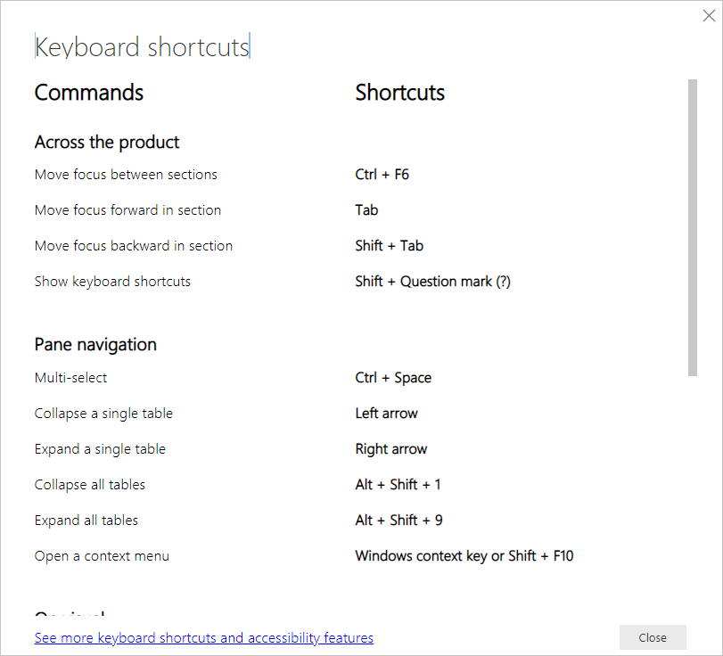
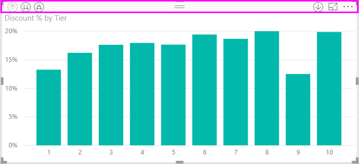
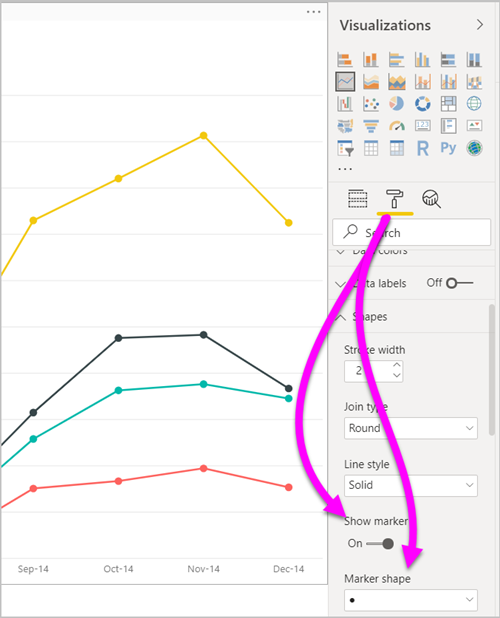
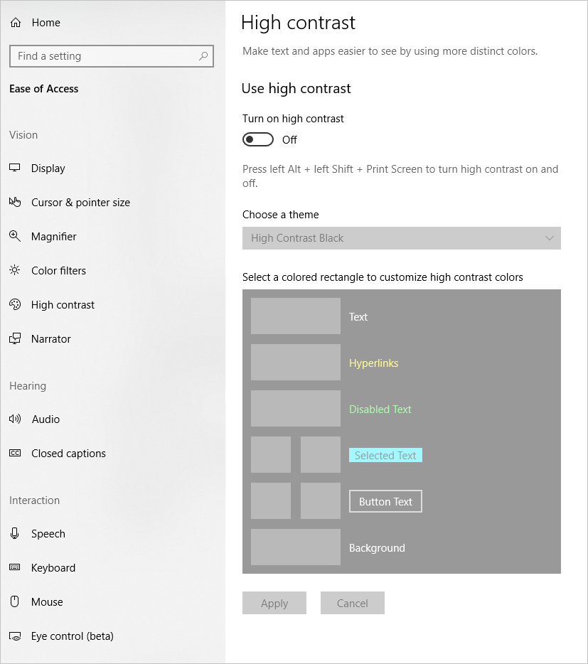
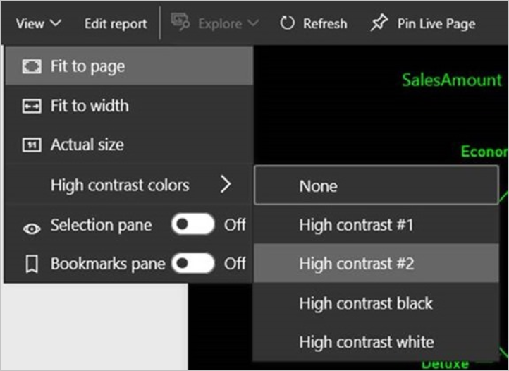

# Accessibility in Power BI Desktop reports
Power BI has features that enable people with disabilities to more easily consume and interact with Power BI reports. These features include the ability to consume a report using the keyboard or a screen reader, tabbing to focus on various objects on a page, and thoughtful use of markers in visualizations.

## Consuming a Power BI Desktop report with a keyboard or screen reader
Beginning with the September 2017 release of **Power BI Desktop**, you can press **Shift + ?** to show a window that describes the accessibility keyboard shortcuts available in **Power BI Desktop**.

With the accessibility enhancements, you can consume a Power BI report with a keyboard or a screen reader with the following techniques:

> [!NOTE]
> When viewing a report, generally you should have scan mode off.

You can switch focus between the report page tabs, or objects on a given report page, using **Ctrl + F6**.

* When focus is on report page tabs, use the **Tab** or **Arrow** keys to move focus from one report page to the next. The screen reader reads out the title of the report page, and whether it's currently selected. To load the report page currently under focus, use the **Enter** key or spacebar.
* When focus is on a loaded report page, use the **Tab** key to shift focus to each object on the page, which includes all textboxes, images, shapes, and charts. The screen reader reads the type of object and the object's title (if it has one). The screen reader also reads a description of that object if it's provided by the report author. 

As you navigate between visuals, you can press **Alt + Shift + F10** to move focus to the visual header. The visual header contains various options including sorting, exporting the data behind the chart, and Focus mode. 

You can press **Alt + Shift + F11** to present an accessible version of the **Show data** window. This window lets you explore the data used in the visual in an HTML table, using the same keyboard shortcuts you normally use with your screen reader. 

> [!NOTE]
> The **Show data** feature is only accessible to a screen reader through this keyboard shortcut. If you open **Show data** through the option in the visual header, it won't be accessible to a screen reader. When using **Show data**, turn on scan mode to take advantage of all the hot keys your screen reader provides.

Beginning with the July 2018 release of **Power BI Desktop**, slicers also have accessibility functionality built in. When you select a slicer, to adjust the value of a slicer use **Ctrl + Right arrow** (Control key plus the Right arrow key) to move through the various controls within the slicer. For example, when you initially press **Ctrl + Right arrow**, the focus is on the eraser. Then, pressing the spacebar is equivalent to clicking the eraser button, which erases all values on the slicer. 

You can move through the controls in a slicer by pressing the **Tab** key. Pressing the **Tab** key when on the eraser moves to the drop-down button. Another **Tab** then moves to the first slicer value (if there are multiple values for the slicer, such as a range). 

These accessibility additions let users fully consume Power BI reports using a screen reader and keyboard navigation.

## Tips for creating accessible reports
The following tips can help you create **Power BI Desktop** reports that are more accessible.

### General tips for accessible reports

* For **Line**, **Area**, and **Combo** visuals, and for **Scatter** and **Bubble** visuals, turn on the **Show markers** toggle and use a different **Marker shape** for each line.
  
  * To turn the **Show markers** toggle on, select the **Format** section in the **Visualizations** pane and expand the **Shapes** section. Scroll down to find the **Show markers** toggle and turn it to **On**.
  * To customize individual lines, find the **Customize series** toggle and turn it to **On**. Then, select the name of each line (or area, if using an **Area** chart) from the drop-down box in that **Shapes** section. Below the drop-down, you can then adjust many aspects of the marker used for the selected line, including its shape, color, and size.
  
    
  
  * Using a different **Marker shape** for each line makes it easier for report consumers to differentiate lines (or areas) from each other.
* As a follow on to the previous bullet, don't rely on color to convey information. When using shapes on line and scatter charts, don't rely on conditional formatting to provide insights in tables and matrices. 
* Pick an intentional sort order for each visual on your report. When screen reader users navigate the data behind the chart, it picks up the same sort order as the visual.
* Select a theme that is high contrast and color-blind friendly from the theme gallery. Import it using the [**Theming** preview feature](desktop-report-themes.md).
* For every object on a report, provide alt text. Doing so ensures that your report consumers understand what you are trying to communicate with a visual. It even helps if they can't see the visual, image, shape, or textbox. You can provide alt text for any object on a **Power BI Desktop** report by selecting the object (such as a visual, shape, and so on) and in the **Visualizations** pane, select the **Format** section. Then, expand **General**, scroll to the bottom, and fill in the **Alt Text** textbox.
  
  
* Make sure your reports have sufficient contrast between text and any background colors. There are several tools such as [Color Contrast Analyser](https://developer.paciellogroup.com/resources/contrastanalyser/) you can use to check your report colors. 
* Use text sizes and fonts that are easily readable. Small text size, or fonts that might be difficult to read, are unhelpful for accessibility.
* Include a title, axis labels, and data labels in all visuals.
* Use meaningful titles for all report pages.
* Avoid decorative shapes and images in your report if possible, as they're included in the tab order of the report. If you need to include decorative objects in your report, update the object's alt text to let screen reader users know that it is for decoration.

### Arranging items in Field buckets
Beginning with the October 2018 release of **Power BI Desktop**, you can navigate the **Fields** well with a keyboard and it interacts with screen readers. 

To improve the process of creating reports with screen readers, a context menu is available. The menu allows moving fields in the well up or down in the **Fields** list. The menu also allows moving the field to other wells, such as **Legend** or **Value** or others.

## High contrast support for reports

When you use high contrast modes in Windows, those settings and the palette you select are also applied to reports in **Power BI Desktop**. 

**Power BI Desktop** automatically detects which high contrast theme Windows is using and applies those settings to your reports. Those high contrast colors follow the report when published to the Power BI service, or elsewhere.

The Power BI service also attempts to detect the high contrast settings selected for Windows. The effectiveness and accuracy of that detection depends on the browser showing the Power BI service. If you want to set the theme manually in the Power BI service, you can select **View** > **High contrast colors** and then select the theme you would like to apply to the report.

## Considerations and limitations
There are a few known issues and limitations with the accessibility features. Descriptions of those issues and limitations are in the following list:

* When using screen readers with **Power BI Desktop**, you'll have the best experience if you open your screen reader before opening any files in **Power BI Desktop**.
* If you're using Narrator, there are some limitations around navigating **Show data** as an HTML table.

## Keyboard shortcuts
Keyboard shortcuts are helpful for moving around in Power BI reports using a keyboard. The following tables describe the shortcuts available in a Power BI report. In addition to using these keyboard shortcuts in **Power BI Desktop**, these shortcuts work in the following experiences as well:

* **Q&A Explorer** dialog
* **Getting Started** dialog
* **File** menu and **About** dialog
* **Warning** bar
* **File Restore** dialog
* **Frowns** dialog

In our continued effort to improve accessibility, the previous list of experiences also support screen readers and high contrast settings.

### Frequently used shortcuts
| To do this action           | Press                |
| :------------------- | :------------------- |
| Move focus between sections  | **Ctrl + F6** |
| Move focus forward in section | **Tab**         |
| Move focus backward in section | **Shift + Tab** |
| Select or clear selection of an object | **Enter** or **spacebar** |
| Multi-select objects | **Ctrl + spacebar** |

### On visual
| To do this action           | Press                |
| :------------------- | :------------------- |
| Move focus to visual menu | **Alt + Shift + F10** |
| Show data | **Alt + Shift + F11**  |
| Enter a visual | **Ctrl + Right arrow** |
| Enter a layer | **Enter** |
| Exit a layer or visual | **Esc** |
| Select or clear selection of a data point | **Enter** or **spacebar** |
| Multi-select | **Ctrl + Enter** or **Ctrl + spacebar** |
| Right click | <ul><li>Windows keyboard: **Windows context key + F10**. The Windows context key is between the Left Alt key and the Left Arrow Key</li><li>Other keyboard: **Shift + F10**</li></ul> |
| Clear selection | **Ctrl + Shift + C** |

### Table & matrix navigation
| To do this action          | Press                |
| :------------------- | :------------------- |
| Move focus up / down one cell (across all cells in all areas)  | **Up arrow key** / **Down arrow key** |
| Move focus left / right one cell (across all cells in all areas)  | **Left arrow key** / **Right arrow key** |

### Pane navigation
| To do this action           | Press                |
| :------------------- | :------------------- |
| Multi-select | **Ctrl + spacebar** |
| Collapse a single table | **Left arrow key** |
| Expand a single table | **Right arrow key** |
| Collapse all tables | **Alt + Shift + 1** |
| Expand all tables | **Alt + Shift + 9** |
| Open a context menu | <ul><li>Windows keyboard: **Windows context key + F10**.  The Windows context key is between the Left Alt key and the Left Arrow Key</li><li>Other keyboard: **Shift + F10**</li></ul> |

### Slicer
| To do this action         | Press                |
| :------------------- | :------------------- |
| Interact with a slicer | **Ctrl + Right arrow key** |

### Selection pane
| To do this action           | Press                |
| :------------------- | :------------------- |
| Activate selection pane | **F6** |
| Move an object up in the layering | **Ctrl + Shift + F** |
| Move an object down in the layering | **Ctrl + Shift + B** |
| Hide / show (toggle) an object | **Ctrl + Shift + S** |

### DAX editor
| To do this action          | Press                |
| :------------------- | :------------------- |
| Move line up / down | **Alt + Up arrow key** / **Down arrow key** |
| Copy line up / down | **Shift + Alt + Up arrow key** / **Down arrow key** |
| Insert line below | **Ctrl + Enter** |
| Insert line above | **Ctrl + Shift + Enter** |
| Jump to matching bracket | **Ctrl + Shift +** \ |
| Indent line / Extend line into the margin | **Ctrl + ]** / **[** |
| Insert cursor | **Alt + Click** |
| Select current line | **Ctrl + I** |
| Select all occurrences of current selection | **Ctrl + Shift + L** |
| Select all occurrences of current word | **Ctrl + F2** |

### Enter data
| To do this action           | Press                |
| :------------------- | :------------------- |
| Exit editable grid | **Ctrl + Tab** |

## Next steps
* [Use Report Themes in Power BI Desktop (Preview)](desktop-report-themes.md)

