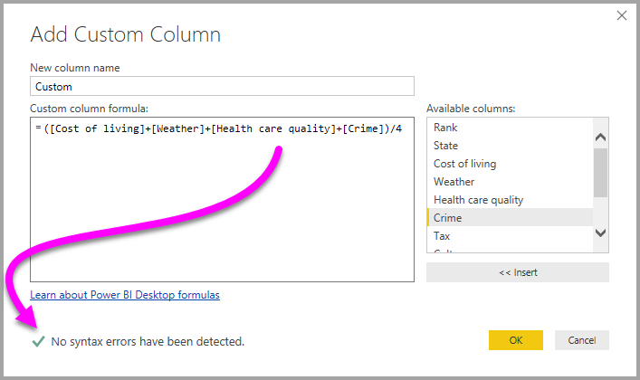
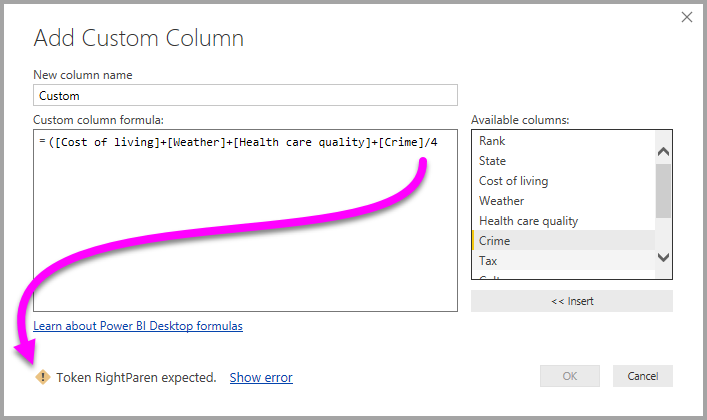
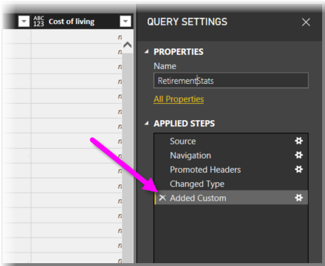
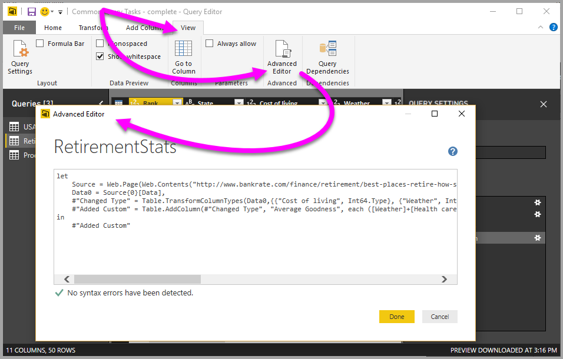

# Add a custom column in Power BI Desktop
You can easily add a new custom column of data to your model using **Query Editor** in **Power BI Desktop**. You can create and rename your custom column using easy buttons to create [M formulas](https://msdn.microsoft.com/library/mt270235.aspx) that define your custom column. The M formula has a [comprehensive function reference content set](https://msdn.microsoft.com/library/mt779182.aspx). 

Creating a custom column is another **Applied Step** to the query you create in **Query Editor**, which means it can be changed, moved earlier or later, or modified at any time.

## Use Query Editor to add a new custom column
To create a new custom column, launch **Query Editor**. You can do this by selecting **Edit Queries** from the **Home** ribbon in **Power BI Desktop**.

Once **Query Editor** is launched and you have some data loaded, you can add a custom column by selecting the **Add Column** tab on the ribbon, and then selecting **Custom Column**.

The **Add Custom Column** window appears, which is described in the following section.

## The Add Custom Column window
In the **Add Custom Column** window, you see the list of available fields in the pane on the right, the name of your custom column on the top (you can rename it just by typing a new name in that text box), and the [**M** formula](https://msdn.microsoft.com/library/mt779182.aspx) that you create (or write) based on inserting fields from the right, adding operators, and otherwise building the formula on which your new custom column is defined. 

## Create formulas for your custom column
You can select a field from the **Available columns:** list on the right, and select **<< Insert** to add them to the custom column formula. You can simply double-click on a column in the list to add it, too.

As you type the formula and build your column, in the bottom of the window, you'll see an indicator telling you, in real time (as you type), whether any syntax errors are detected. If all is good, you'll see a green checkmark.

But, if you have some sort of error in your syntax, you get a yellow warning icon, along with the error detected, and a link that puts the cursor (in your formula) where the error is detected.

When you select **OK**, your custom column is added to the model, and the **Added Custom** step is added to your query's **Applied Steps**.

If you double-click the **Added Custom** step in the **Applied Steps** pane, the **Add Custom Column** window appears again, with the custom column formula you created already loaded, and ready for you to modify if necessary.

## Using the Advanced Editor for Custom Columns
You can also create a custom column (and modify any step of your query, for that matter) using the **Advanced Editor**. In **Query Editor** select the **View** tab and then select **Advanced Editor** to display the **Advanced Editor**.

The **Advanced Editor** gives you full control over your query.

## Next steps
There are other ways to create a custom column, including creating a column based on examples you provide to **Query Editor**. See the following article for more information on creating custom columns from examples:

* [Add a column from an example in Power BI Desktop](desktop-add-column-from-example.md)
* [Introduction to M formula language](https://msdn.microsoft.com/library/mt270235.aspx)
* [M function reference](https://msdn.microsoft.com/library/mt779182.aspx)  

