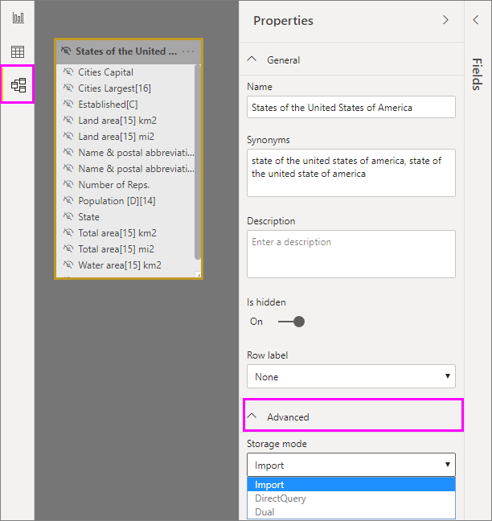
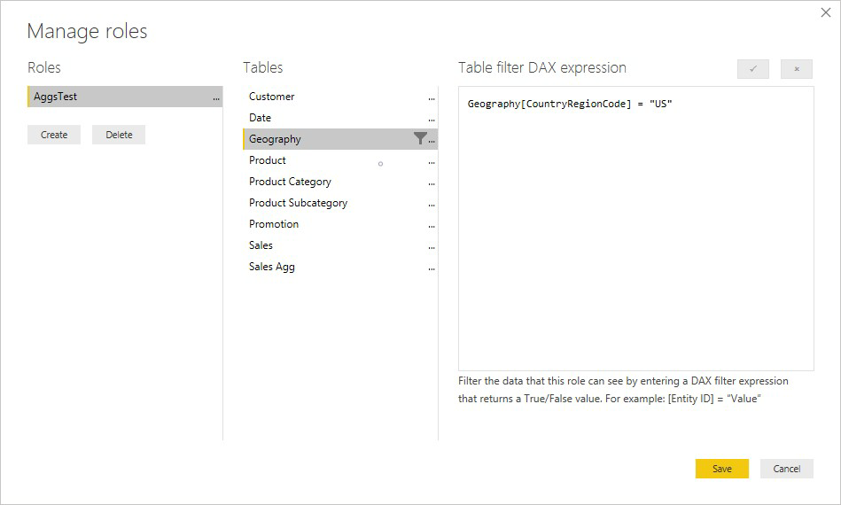

# Manage aggregations in Power BI Desktop

*Aggregations* in Power BI let you reduce table sizes so you can use fast, in-memory cache storage. Aggregations enable interactive analysis over big data in ways that aren't possible otherwise, and can dramatically reduce the cost of unlocking large datasets for decision making.

Some advantages of using aggregations include:

- **Better query performance over big data**. Every interaction with Power BI visuals submits DAX queries to the dataset. Caching aggregated data uses a fraction of the resources required for detail data, letting you unlock big data that would otherwise be inaccessible.
- **Optimized data refresh**. Smaller cache sizes reduce refresh times and get data to users faster.
- **Balanced architectures**. The Power BI in-memory cache handles aggregated queries, limiting queries sent in DirectQuery mode and helping you meet concurrency limits. The remaining detail-level queries tend to be filtered, transactional-level queries, which data warehouses and big-data systems normally handle well.

You can use aggregations with data sources that represent dimensional models, such as data warehouses and data marts, or with Hadoop-based big-data sources. This article describes typical modeling differences in Power BI for each type of data source.

## Storage modes
Aggregation works with table-level storage modes. Power BI tables can use *DirectQuery*, *Import*, or *Dual* storage modes. All Power BI *Import* and non-multidimensional *DirectQuery* data sources work with aggregations. 

In *DirectQuery* mode, every query hits the dataset directly. *Import* mode caches query data in memory to speed up queries, but for large tables it can consume too much memory and management overhead. Aggregated tables are smaller, so they can use Import mode effectively.

To set the storage mode of aggregated tables to Import, select the aggregated table in Power BI Desktop **Model** view. In the **Properties** pane, expand **Advanced**, drop down the selection under **Storage mode**, and select **Import**. 

For more information about table storage modes, see [Manage storage mode in Power BI Desktop](desktop-storage-mode.md).

## The Manage aggregations dialog
To use aggregations, set up a new table that has the fields you want to use. In the **Fields** pane of any Power BI Desktop view, right-click the table, and select **Manage aggregations**.

The **Manage aggregations** dialog shows a row for each column in the table, where you can specify the aggregation behavior. In the following example, queries to the **Sales** table are internally redirected to the **Sales Agg** table. Aggregated tables are hidden, so consumers of the report don't even need to know the **Sales Agg** table exists.

The following table shows the aggregations for the **Sales Agg** table.

### Summarization function

The **Summarization** drop-down in the **Manage aggregations** dialog offers the following values:
- Count
- GroupBy
- Max
- Min
- Sum
- Count table rows

### Validations

The **Manage aggregations** dialog enforces the following notable validations:

- The **Detail column** must have the same datatype as the **Aggregation column**, except for the Count and Count table rows **Summarization** functions. Count and Count table rows are only available for integer aggregation columns, and don't require a matching datatype.
- Chained aggregations covering three or more tables aren't allowed. For example, it isn't possible to set up aggregations on **Table A** referring to a **Table B** that has aggregations referring to a **Table C**.
- Duplicate aggregations, where two entries use the same **Summarization** function and refer to the same **Detail table** and **Detail column**, aren't allowed.
- The **Detail table** must be DirectQuery storage mode, not Import.

Most of the validations are enforced by disabling dropdown values and showing explanatory text in the tooltip, as shown in the following image.

### Aggregation tables aren't addressable

Users with read-only access to the dataset can't query aggregation tables. This avoids security concerns when used with *row-level security (RLS)*. Consumers and queries refer to the detail table, not the aggregation table, and don't need to know about the aggregation table.

For this reason, the aggregation table should be hidden. If it isn't, the **Manage aggregations** dialog will set it to hidden when you select **Apply all**.

## Aggregation based on relationships

Dimensional models typically use aggregations based on relationships. Power BI datasets from data warehouses and data marts resemble star/snowflake schemas, with relationships between dimension tables and fact tables.

In the following model from a single data source, the tables are using *DirectQuery* storage mode. 

The **Sales** fact table contains billions of rows. Setting the storage mode of **Sales** to *Import* for caching would consume considerable memory and management overhead.

Instead, you create the **Sales Agg** aggregation table. In the **Sales Agg** table, the number of rows equals the sum of **SalesAmount** grouped by **CustomerKey**, **DateKey**, and **ProductSubcategoryKey**. The **Sales Agg** table is at a higher granularity than **Sales**, so instead of billions, it might contain millions of rows, which are much easier to manage.

If the following dimension tables are the most commonly used for the queries with high business value, they're the tables that can filter **Sales Agg**, using *one-to-many* or *many-to-one* relationships.

- Geography
- Customer
- Date
- Product Subcategory
- Product Category

The following image shows this model.

> [!NOTE]
> The **Sales Agg** table is just another table, so it has the flexibility of being loaded in a variety of ways. For example, aggregation can be performed in the source database using ETL/ELT processes, or by the [M expression](/powerquery-m/power-query-m-function-reference) for the table. The aggregated table can use Import storage mode with or without [incremental refresh in Power BI Premium](service-premium-incremental-refresh.md), or it can use DirectQuery and be optimized for fast queries using [columnstore indexes](/sql/relational-databases/indexes/columnstore-indexes-overview). This flexibility enables balanced architectures that spread query load to avoid bottlenecks.

Changing the storage mode of the aggregated **Sales Agg** table to **Import** opens a dialog box saying that the related dimension tables can be set to storage mode *Dual*. 

Setting the related dimension tables to Dual lets them act as either Import or DirectQuery, depending on the subquery. In the example:

- Queries that aggregate metrics from the Import-mode **Sales Agg** table, and group by attribute(s) from the related Dual tables, can be returned from the in-memory cache.
- Queries that aggregate metrics from the DirectQuery **Sales** table, and group by attribute(s) from the related Dual tables, can be returned in DirectQuery mode. The query logic, including the GroupBy operation, will be passed down to the source database.

For more information about Dual storage mode, see [Manage storage mode in Power BI Desktop](desktop-storage-mode.md).

### Strong vs. weak relationships

Aggregation hits based on relationships require strong relationships.

Strong relationships include the following storage mode combinations, where both tables are from a single source:

| Table on the *many* sides | Table on the *1* side |
| ------------- |----------------------| 
| Dual          | Dual                 | 
| Import        | Import or Dual       | 
| DirectQuery   | DirectQuery or Dual  | 

The only case where a *cross-source* relationship is considered strong is if both tables are set to Import. Many-to-many relationships are always considered weak.

For *cross-source* aggregation hits that don't depend on relationships, see [Aggregations based on GroupBy columns](#aggregations-based-on-group-by-columns). 

### GroupBy columns

In this example, the three GroupBy entries are optional. They don't affect aggregation behavior, except for DISTINCTCOUNT, and are included primarily for readability. Without these GroupBy entries, the aggregations would still get hit, based on the relationships. This is different from the big data example later in this article, where the GroupBy entries are necessary.

### Inactive relationships
Grouping by a foreign key column used by an inactive relationship and relying on the USERELATIONSHIP function for aggregation hits isn't supported.

### RLS for relationship-based aggregations
To work correctly, row-level security (RLS) expressions should filter both the aggregation table and the detail table. In the following example, an RLS expression on the **Geography** table will work, because Geography is on the filtering side of relationships to both the **Sales** table and the **Sales Agg** table. Both queries that hit the aggregation table and those that don't will have RLS successfully applied.

An RLS expresson on the **Product** table filters only the detail **Sales** table, not the aggregated **Sales Agg** table, which isn't recommended. User queries from this role won't benefit from aggregation hits. Since the aggregation table is another representation of the data in the detail table, it would be insecure to answer queries from the aggregation table if the RLS filter can't be applied.

An RLS expression that filters only the **Sales Agg** aggregation table and not the **Sales** detail table isn't allowed.

The same RLS rules apply to aggregations based on GroupBy columns. An RLS expression applied to the detail table can be used to filter the aggregation table, because all the GroupBy columns in the aggregation table are covered by the detail table. On the other hand, an RLS filter on the aggregation table can't be applied to the detail table, so is disallowed.

### Relationship-based aggregation query examples

The following query hits the aggregation, because columns in the **Date** table are at the granularity that can hit the aggregation. The **SalesAmount** column uses the **Sum** aggregation.

The following query doesn't hit the aggregation. Despite requesting the sum of **SalesAmount**, the query is performing a GroupBy operation on a column in the **Product** table, which isn't at the granularity that can hit the aggregation. If you observe the relationships in the model, a product subcategory can have multiple **Product** rows. The query wouldn't be able to determine which product to aggregate to. In this case, the query reverts to DirectQuery and submits a SQL query to the data source.

Aggregations aren't just for simple calculations that perform a straightforward sum. Complex calculations can also benefit. Conceptually, a complex calculation is broken down into subqueries for each SUM, MIN, MAX, and COUNT, and each subquery is evaluated to determine if it can hit the aggregation. This logic doesn't hold true in all cases due to query-plan optimization, but in general it should apply. The following example hits the aggregation:

The COUNTROWS function can benefit from aggregations. The following query hits the aggregation because there is a **Count** table rows aggregation defined for the **Sales** table.

The AVERAGE function can benefit from aggregations. The following query hits the aggregation because AVERAGE internally gets folded to a SUM divided by a COUNT. Since the **UnitPrice** column has aggregations defined for both SUM and COUNT, the aggregation is hit.

In some cases, the DISTINCTCOUNT function can benefit from aggregations. The following query hits the aggregation because there is a GroupBy entry for **CustomerKey**, which maintains the distinctness of **CustomerKey** in the aggregation table. This technique might still hit the performance threshold where more than two to five million distinct values can affect query performance. However, it can be useful in scenarios where there are billions of rows in the detail table, but two to five million distinct values in the column. In this case, the DISTINCTCOUNT can perform faster than scanning the table with billions of rows, even if it were cached into memory.

## Aggregation based on GroupBy columns 

Hadoop-based big data models have different characteristics than dimensional models. To avoid joins between large tables, big data models often don't rely on relationships. Instead, dimension attributes are denormalized to fact tables. You can unlock such big data models for interactive analysis by using *aggregations based on GroupBy columns*.

The following table contains the **Movement** numeric column to be aggregated. All the other columns are attributes to group by. The table contains IoT data and a massive number of rows. The storage mode is DirectQuery. Queries on the data source that aggregate across the whole dataset are slow because of the sheer volume. 

To enable interactive analysis on this dataset, you can add an aggregation table that groups by most of the attributes, but excludes the high-cardinality attributes like longitude and latitude. This dramatically reduces the number of rows, and is small enough to comfortably fit into an in-memory cache. You can set the storage mode of **Driver Activity Agg** to Import.

Next, define the aggregation mappings for the **Driver Activity Agg** table in the **Manage aggregations** dialog. 

The following table shows the aggregations for the **Driver Activity Agg** table.

### GroupBy columns

In aggregations based on GroupBy columns, the **GroupBy** entries are *not optional*. Without them, the aggregations won't get hit. This is different from using aggregations based on relationships for dimensional models.

### GroupBy aggregation query examples

The following query hits the aggregation, because the **Activity Date** column is covered by the aggregation table. The COUNTROWS function uses the **Count table rows** aggregation.

Especially for models that contain filter attributes in fact tables, it's a good idea to use Count table rows aggregations. Power BI may submit queries to the dataset using COUNTROWS in cases where it is not explicitly requested by the user. For example, the filter dialog shows the count of rows for each value.

## Combined aggregation techniques

You can combine the relationships and GroupBy columns techniques for aggregations. Aggregations based on relationships may require the denormalized dimension tables to be split into multiple tables. If this is costly or impractical for certain dimension tables, you can replicate the necessary attributes in the aggregation table for those dimensions, and use relationships for others.

For example, the following model replicates **Month**, **Quarter**, **Semester**, and **Year** in the **Sales Agg** table. There is no relationship between **Sales Agg** and the **Date** table, but there are relationships to **Customer** and **Product Subcategory**. The storage mode of **Sales Agg** is Import.

The following table shows the entries set in the **Manage aggregations** dialog for the **Sales Agg** table. The GroupBy entries where **Date** is the detail table are mandatory, to hit aggregations for queries that group by the **Date** attributes. As in the previous example, the **GroupBy** entries for **CustomerKey** and **ProductSubcategoryKey** don't affect aggregation hits, except for DISTINCTCOUNT, because of the presence of relationships.

### Combined aggregation query examples

The following query hits the aggregation, because the aggregation table covers **CalendarMonth**, and **CategoryName** is accessible via one-to-many relationships. **SalesAmount** uses the **SUM** aggregation.

The following query doesn't hit the aggregation, because the aggregation table doesn't cover **CalendarDay**.

The following time-intelligence query doesn't hit the aggregation, because the DATESYTD function generates a table of **CalendarDay** values, and the aggregation table doesn't cover **CalendarDay**.

## Aggregation precedence

Aggregation precedence allows multiple aggregation tables to be considered by a single subquery.

The following example is a [composite model](desktop-composite-models.md) containing multiple sources:

- The **Driver Activity Agg2** Import table is at a high granularity, because the group-by attributes are few and low cardinality. The number of rows could be as low as thousands, so it can easily fit into an in-memory cache. These attributes happen to be used by a high-profile executive dashboard, so queries referring to them should be as fast as possible.
- The **Driver Activity Agg** table is an intermediate aggregation table in DirectQuery mode. It contains over a billion rows in Azure SQL Data Warehouse and is optimized at the source using columnstore indexes.
- The **Driver Activity** DirectQuery table contains over a trillion rows of IoT data sourced from a big-data system. It serves drillthrough queries to view individual IoT readings in controlled filter contexts.

> [!NOTE]
> DirectQuery aggregation tables that use a different data source from the detail table are only supported if the aggregation table is from a SQL Server, Azure SQL, or Azure SQL Data Warehouse source.
The memory footprint of this model is relatively small, but it unlocks a huge dataset. It represents a balanced architecture because it spreads the query load across components of the architecture, utilizing them based on their strengths.

The **Manage aggregations** dialog for **Driver Activity Agg2** sets the **Precedence** field to *10*, which is higher than for **Driver Activity Agg**. The higher precedence setting means queries that use aggregations will consider **Driver Activity Agg2** first. Subqueries that aren't at the granularity that can be answered by **Driver Activity Agg2** will consider **Driver Activity Agg** instead. Detail queries that cannot be answered by either aggregation table will be directed to **Driver Activity**.

The table specified in the **Detail Table** column is **Driver Activity**, not **Driver Activity Agg**, because chained aggregations are not allowed.

The following table shows the aggregations for the **Driver Activity Agg2** table.

## Detect whether queries hit or miss aggregations

SQL Profiler can detect whether queries are returned from the in-memory cache storage engine, or pushed to the data source by DirectQuery. You can use the same process to detect whether aggregations are being hit. For more information, see [Queries that hit or miss the cache](desktop-storage-mode.md#queries-that-hit-or-miss-the-cache). 

SQL Profiler also provides the `Query Processing\Aggregate Table Rewrite Query` extended event.

The following JSON snippet shows an example of the output of the event when an aggregation is used.

- **matchingResult** shows that the subquery used an aggregation.
- **dataRequest** shows the GroupBy column(s) and aggregated column(s) the subquery used.
- **mapping** shows the columns in the aggregation table that were mapped to.

## Keep caches in sync

Aggregations that combine DirectQuery, Import, and/or Dual storage modes may return different data unless the in-memory cache is kept in sync with the source data. For example, query execution won't attempt to mask data issues by filtering DirectQuery results to match cached values. There are established techniques to handle such issues at the source, if necessary. Performance optimizations should be used only in ways that don't compromise your ability to meet business requirements. It's your responsibility to know your data flows and design accordingly. 

## Next steps

For more information about composite models, see:

- [Composite models in Power BI Desktop](desktop-composite-models.md)
- [Many-to-many relationships in Power BI Desktop](desktop-many-to-many-relationships.md)
- [Storage Mode in Power BI Desktop](desktop-storage-mode.md)

For more information about DirectQuery, see:

- [Using DirectQuery in Power BI](desktop-directquery-about.md)
- [Data sources supported by DirectQuery in Power BI](desktop-directquery-data-sources.md)
