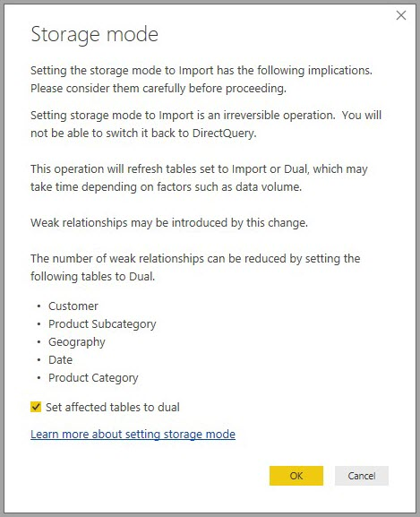

# Aggregations in Power BI Desktop

Using **aggregations** in Power BI enables interactive analysis over big data in ways that previously weren't possible. **Aggregations** can dramatically reduce the cost of unlocking large datasets for decision making.

The following list provides advantages to using **aggregations**:

* **Query performance over big data** - as users interact with visuals on Power BI reports, DAX queries are submitted to the dataset. Boost query speeds by caching data at the aggregated level, using a fraction of the resources required at the detail level. Unlock big data in a way that would otherwise be impossible.
* **Data refresh optimization** - reduce cache sizes and refresh times by caching data at the aggregated level. Speed up the time to make data available for users.
* **Achieve balanced architectures** - allow the Power BI in-memory cache to handle aggregated queries, which it does effectively. Limit queries sent to the data source in DirectQuery mode, helping stay within concurrency limits. Queries that do get through tend to be filtered, transactional-level queries, which data warehouses and big-data systems normally handle well.

### Table-level storage
Table-level storage is normally used with the aggregations feature. See the [storage mode in Power BI Desktop](desktop-storage-mode.md) article for more information.

### Data source types
Aggregations are used with data sources representing dimensional models, such as a data warehouses, data marts, and Hadoop-based big-data sources. This article describes typical modeling differences in Power BI for each type of data source.

All Power BI Import and (non-multidimensional) DirectQuery sources work with aggregations.

## Aggregations based on relationships

**Aggregations** based on relationships are typically used with dimensional models. Power BI datasets that source from data warehouses and data marts resemble star/snowflake schemas with relationships between dimension tables and fact tables.

Consider the following model, which is from a single data source. Let’s say all the tables are using DirectQuery to start with. The **Sales** fact table contains billions of rows. Setting the storage mode of **Sales** to **Import** for caching would consume considerable memory and management overhead.

Instead, we create the **Sales Agg** table as an aggregation table. It's at a higher granularity than **Sales**, so it'll contain far fewer rows. The number of rows should equal the sum of **SalesAmount** grouped by **CustomerKey**, **DateKey**, and **ProductSubcategoryKey**. Instead of billions, it might be millions of rows, which are much easier to manage.

Let's assume that the following dimension tables are the most commonly used for the queries with high business value. They're the tables that can filter **Sales Agg** using *one-to-many* (or *many-to-one*) relationships.

* Geography
* Customer
* Date
* Product Subcategory
* Product Category

The following image shows this model.

> [!NOTE]
> The **Sales Agg** table is just another table, so it has the flexibility of being loaded in a variety of ways. For example, aggregation can be performed in the source database using ETL/ELT processes, or by the [M expression](https://msdn.microsoft.com/query-bi/m/power-query-m-reference) for the table. It can use Import storage mode with or without [incremental refresh in Power BI Premium](service-premium-incremental-refresh.md), or it can be DirectQuery and optimized for fast queries using [columnstore indexes](https://docs.microsoft.com/sql/relational-databases/indexes/columnstore-indexes-overview). This flexibility enables balanced architectures that spread query load to avoid bottlenecks.

### Storage mode 
Let's continue with the example we're using. We set the storage mode of **Sales Agg** to **Import** to speed up queries.

When we do so, the following dialog appears, letting us know that the related dimension tables can be set to storage mode **Dual**. 

Setting them to **Dual** allows the related dimension tables to act as either Import or DirectQuery depending on the subquery.

* Queries that aggregate metrics from the **Sales Agg** table, which is Import, and group by attribute(s) from the related Dual tables can be returned from the in-memory cache.
* Queries that aggregate metrics in the **Sales** table, which is DirectQuery, and group by attribute(s) from the related Dual tables can be returned in DirectQuery mode. The query logic including the group by operation will be passed down to the source database.

For more information on the **Dual** storage mode, see the [storage mode](desktop-storage-mode.md) article.

### Strong vs. weak relationships
Aggregations hits based on relationships require strong relationships.

Strong relationships include the following combinations where both tables are from a *single source*.

| Table on the *many sides | Table on the *1* side |
| ------------- |----------------------| 
| Dual          | Dual                 | 
| Import        | Import or Dual       | 
| DirectQuery   | DirectQuery or Dual  | 

The only case where a *cross-source* relationship is considered strong is if both tables are Import. Many-to-many relationships are always considered weak.

For *cross-source* aggregation hits that don't depend on relationships, see section below on aggregations based on group-by columns.

### Aggregation tables are not addressable
Users with read-only access to the dataset cannot query aggregation tables. This avoids security concerns when used with RLS. Consumers and queries refer to the detail table, not the aggregation table; they don't even need to know the aggregation table exists.

For this reason, the **Sales Agg** table should be hidden. If it is not, the Manage aggregations dialog will set it to hidden upon clicking the Apply all button.

### Manage aggregations dialog
Next we define the aggregations. Select the **Manage aggregations** context menu for the **Sales Agg** table, by right-clicking on the table.

The **Manage aggregations** dialog is displayed. It shows a row for each column in the **Sales Agg** table, where we can specify the aggregation behavior. Queries submitted to the Power BI dataset that refers to the **Sales** table are internally redirected to the **Sales Agg** table. Consumers of the dataset don't need to know the **Sales Agg** table even exists.

The following table shows the aggregations for the **Sales Agg** table.

#### Summarization function

The Summarization drop-down offers the following values for selection.
* Count
* GroupBy
* Max
* Min
* Sum
* Count table rows

#### Validations

The following notable validations are enforced by the dialog:

* The detail column selected must have the same datatype as the aggregation column except for the Count and Count table rows summarization functions. Count and Count table rows are only offered for integer aggregation columns, and don't require a matching datatype.
* Chained aggregations covering three or more tables aren't allowed. For example, it is not possible to set up aggregations on **Table A** referring to **Table B** that has aggregations referring to **Table C**.
* Duplicate aggregations where two entries use the same summarization function and refer to the same detail table/column aren't allowed.
* Detail table must be DirectQuery, not Import.

Most such validations are enforced by disabling dropdown values and showing explanatory text in the tooltip, as shown in the following image.

### Group by columns

In this example, the three GroupBy entries are optional; they do not affect aggregation behavior (except for the DISTINCTCOUNT example query, shown in the upcoming image). They are included primarily for readability purposes. Without these GroupBy entries, the aggregations would still get hit based on the relationships. This is different behavior from using aggregations without relationships, which is covered by the big data example that follows later in this article.

### Inactive relationships
Grouping by a foreign key column used by an inactive relationship and relying on the USERELATIONSHIP function for aggregation hits is not supported.

### Detecting whether aggregations are hit or missed by queries

For more information about how to detect whether queries are returned from the in-memory cache (storage engine), or DirectQuery (pushed to the data source) using SQL Profiler, see the [storage mode](desktop-storage-mode.md) article. That process can also be used to detect whether aggregations are being hit, too.

Additionally, the following extended event is provided in SQL Profiler.

    Query Processing\Aggregate Table Rewrite Query

The following JSON snippet shows an example of the output of the event when an aggregation is used.

* **matchingResult** shows that an aggregation was used for the subquery.
* **dataRequest** shows the group-by column(s) and aggregated column(s) used by the subquery.
* **mapping** shows the columns in the aggregation table that were mapped to.

### Query examples
The following query hits the aggregation, because columns in the *Date* table are at the granularity that can hit the aggregation. The **Sum** aggregation for **SalesAmount** will be used.

The following query doesn't hit the aggregation. Despite requesting the sum of **SalesAmount**, it's performing a group by operation on a column in the **Product** table, which is not at the granularity that can hit the aggregation. If you observe the relationships in the model, a product subcategory can have multiple **Product** rows; the query wouldn't be able to determine which product to aggregate to. In this case, the query reverts to DirectQuery and submits a SQL query to the data source.

Aggregations aren't just for simple calculations that perform a straightforward sum. Complex calculations can also benefit. Conceptually, a complex calculation is broken down into subqueries for each SUM, MIN, MAX and COUNT, and each subquery is evaluated to determine if the aggregation can be hit. This logic doesn't hold true in all cases due to query-plan optimization, but in general it should apply. The following example hits the aggregation:

The COUNTROWS function can benefit from aggregations. The following query hits the aggregation because there is a **Count** table rows aggregation defined for the **Sales** table.

The AVERAGE function can benefit from aggregations. The following query hits the aggregation because AVERAGE internally gets folded to a SUM divided by a COUNT. Since the **UnitPrice** column has aggregations defined for both SUM and COUNT, the aggregation is hit.

In some cases, the DISTINCTCOUNT function can benefit from aggregations. The following query hits the aggregation because there is a GroupBy entry for **CustomerKey**, which maintains the distinctness of **CustomerKey** in the aggregation table. This technique is still subject to the performance threshold where over approximately two to five million distinct values can affect query performance. However, it can be useful in scenarios where there are billions of rows in the detail table and two to five million distinct values in the column. In this case, the distinct count can perform faster than scanning the table with billions of rows, even if it were cached into memory.

### RLS
Row level security (RLS) expressions should filter both the aggregation table and the detail table to work correctly. Following the example, an RLS expression on the **Geography** table will work because Geography is on the filtering side of relationships to both the **Sales** table and the **Sales Agg** table. Queries that hit the aggregation table and those that do not will have RLS successfully applied.

An RLS expresson on the **Product** table would filter only the **Sales** table, not the **Sales Agg** table. This is not recommended. Queries submitted by users who access the dataset using this role would not benefit from aggregation hits. Since the aggregation table is another representation of the same data in the detail table, it would be insecure to answer queries from the aggregation table because the RLS filter cannot be applied.

An RLS expression on the **Sales Agg** table itself would filter only the aggregation table and not the detail table. This is disallowed.

## Aggregations based on group-by columns 

Hadoop-based big data models have different characteristics than dimensional models. To avoid joins between large tables, they often don't rely on relationships. Instead, dimension attributes are often denormalized to fact tables. Such big data models can be unlocked for interactive analysis using **aggregations** based on group-by columns.

The following table contains the **Movement** numeric column to be aggregated. All other columns are attributes to group by. It contains IoT data and a massive number of rows. The storage mode is DirectQuery. Queries on the data source that aggregate across the whole dataset are slow because of the sheer volume.

To enable interactive analysis on this dataset, we add an aggregation table that groups by most of the attributes but excludes the high cardinality attributes like longitude and latitude. This dramatically reduces the number of rows, and is small enough to comfortably fit into an in-memory cache. The storage mode of **Driver Activity Agg** is Import.

Next, we define the aggregation mappings in the **Manage aggregations** dialog. It displays a row for each column in the **Driver Activity Agg** table, where we can specify the aggregation behavior.

The following table shows the aggregations for the **Driver Activity Agg** table.

### Group by columns

In this example, the **GroupBy** entries are **not optional**; without them the aggregations wouldn't get hit. This is different behavior to using aggregations based on relationships, which is covered by the dimensional model example provided previously in this article.

### Query examples

The following query hits the aggregation because the **Activity Date** column is covered by the aggregation table. The Count table rows aggregation is used by the COUNTROWS function.

Especially for models that contain filter attributes in fact tables, it's a good idea to use Count table rows aggregations. Power BI may submit queries to the dataset using COUNTROWS in cases where it is not explicitly requested by the user. For example, the filter dialog shows the count of rows for each value.

### RLS

The same RLS rules detailed above for aggregations based on relationships, regarding whether an RLS expression can filter the aggregation table, detail table or both, also apply to aggregations based on group by columns. In the example, an RLS expression applied to the **Driver Activity** table can be used to filter the **Driver Activity Agg** table because all the group by columns in the aggregation table are covered by the detail table. An RLS filter on the **Driver Activity Agg** table on the other hand cannot be applied to the **Driver Activity** table so is disallowed.

## Aggregation precedence

Aggregation precedence allows multiple aggregation tables to be considered by a single subquery.

Consider the following example. It's a [composite model](desktop-composite-models.md) containing multiple DirectQuery sources.

* The **Driver Activity Agg2** Import table is at a high granularity because the group-by attributes are few and low cardinality. The number of rows could be as low as thousands, so it can easily fit into an in-memory cache. These attributes happen to be used by a high-profile executive dashboard, so queries referring to them should be as fast as possible.
* The **Driver Activity Agg** table is an intermediate aggregation table in DirectQuery mode. It contains over a billion rows in Azure SQL DW and is optimized at the source using columnstore indexes.
* The **Driver Activity** table is DirectQuery and contains over a trillion rows of IoT data sourced from a big-data system. It serves drillthrough queries to view individual IoT readings in controlled filter contexts.

> [!NOTE]
> DirectQuery aggregation tables that use a different data source to the detail table are only supported if the aggregation table is from a SQL Server, Azure SQL or Azure SQL DW source.

The memory footprint of this model is relatively small, but it unlocks a huge dataset. It represents a balanced architecture because it spreads the query load across components of the architecture utilizing them based on their strengths.

The **Manage aggregations** dialog for **Driver Activity Agg2** shows the *Precedence* field is 10, which is higher than that of **Driver Activity Agg**, which means it will be considered first by queries using aggregations. Subqueries that are not at the granularity that can be answered by **Driver Activity Agg2** will consider **Driver Activity Agg** instead. Detail queries that cannot be answered by either aggregation table will be directed to **Driver Activity**.

The table specified in the **Detail Table** column is **Driver Activity**, not **Driver Activity Agg** because chained aggregations are not allowed (see [validations](#validations) earlier in this article).

The following table shows the aggregations for the **Driver Activity Agg2** table.

## Aggregations based on group-by columns combined with relationships

You can even combine the two techniques for aggregations described earlier in this article. **Aggregations** based on relationships may require the denormalized dimension tables be split into multiple tables. If this is costly or impractical for certain dimension tables, the necessary attributes can be replicated in the aggregation table for certain dimension(s) and relationships used for others.

The following model replicates *Month*, *Quarter*, *Semester*, and *Year* in the **Sales Agg** table. There is no relationship between **Sales Agg** and the **Date** table. There are relationships to **Customer** and **Product Subcategory**. The storage mode of **Sales Agg** is Import.

The following table shows the entries set in the **Manage aggregations** dialog for the **Sales Agg** table. The GroupBy entries where **Date** is the detail table are mandatory to hit aggregations for queries that group by the Date attributes. As in the previous example, the GroupBy entries for CustomerKey and ProductSubcategoryKey do not affect aggregation hits because of the presence of relationships (again with the exception of DISTINCTCOUNT).

### Query examples

The following query hits the aggregation because CalendarMonth is covered by the aggregation table, and CategoryName is accessible via one-to-many relationships. The Sum aggregation for **SalesAmount** is used.

The following query doesn't hit the aggregation because CalendarDay is not covered by the aggregation table.

The following time-intelligence query will not hit the aggregation because the DATESYTD function generates a table of CalendarDay values, which is not covered by the aggregation table.

## Caches should be kept in sync

**Aggregations** that combine DirectQuery and Import and/or Dual storage mode may return different data if the in-memory cache is not kept in sync with the source data. Query execution won't attempt to mask data issues by, for example, filtering DirectQuery results to match cached values. These features are performance optimizations and should be used only in ways that do not compromise your ability to meet business requirements. It's your responsibility to know your data flows, so please design accordingly. There are established techniques to handle such issues at the source, if necessary.

## Next steps

The following articles describe more about composite models, and also describe DirectQuery in detail.

* [Composite models in Power BI Desktop](desktop-composite-models.md)
* [Many-to-many relationships in Power BI Desktop](desktop-many-to-many-relationships.md)
* [Storage Mode in Power BI Desktop](desktop-storage-mode.md)

DirectQuery articles:

* [Using DirectQuery in Power BI](desktop-directquery-about.md)
* [Data sources supported by DirectQuery in Power BI](desktop-directquery-data-sources.md)