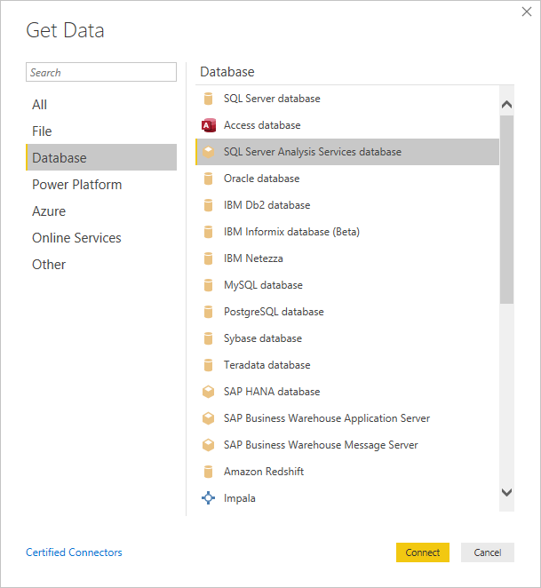
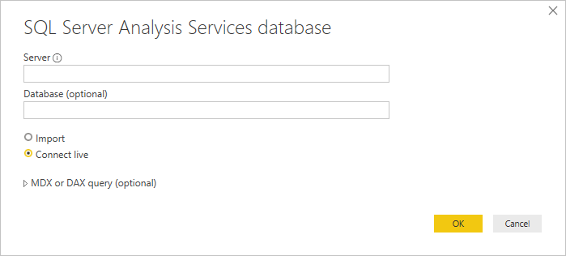
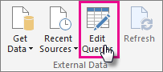

# Using Analysis Services Tabular data in Power BI Desktop
With Power BI Desktop, there are two ways you can connect to and get data from your SQL Server Analysis Services Tabular models: Explore by using a live connection or Select items and import into Power BI Desktop.

Let’s take a closer look.

**Explore by using a live connection** – When using a live connection, items in your Tabular model or perspective, like tables, columns, and measures appear in your Power BI Desktop Fields list. You can use Power BI Desktop’s advanced visualization and report tools to explore your Tabular model in new, highly interactive ways.

When connecting live, no data from the Tabular model is imported into Power BI Desktop. Each time you interact with a visualization, Power BI Desktop queries the Tabular model and calculates the results you see. You’re always looking at the latest data that is available in the Tabular model, either from the last processing time, or from Direct Query tables available in the Tabular Model. 

Keep in-mind, that Tabular models are highly secure. Items that appear in Power BI Desktop depend on your permissions for the Tabular model you’re connected to.

When you’ve created dynamic reports in Power BI Desktop, you can share them by publishing to your Power BI site. When you publish a Power BI Desktop file with a live connection to a Tabular model to your Power BI site, an On-premises data gateway must be installed and configured by an administrator. To learn more, see [On-premises data gateway](service-gateway-onprem.md).

**Select items and import into Power BI Desktop** – When you connect with this option, you can select items like tables, columns, and measures in your Tabular model or perspective and load them into a Power BI Desktop model. You can use Power BI Desktop’s advanced Query Editor to further shape what you want. You can use Power BI Desktop’s modeling features to further model the data. No live connection between Power BI Desktop and the Tabular model is maintained. You can then explore your Power BI Desktop model offline or publish to your Power BI site.

## To connect to a Tabular model
1. In Power BI Desktop, on the **Home** tab, click **Get Data**.
   
   
2. Click **SQL Server Analysis Services Database**, then click **Connect**.
   
   
3. Enter the Server name and select a connection mode. 
   
   
4. This step depends on the connection mode you selected:

* If you’re connecting live, in Navigator, select a Tabular model or perspective.
  
  
* If you chose Select items and get data, in Navigator, select a Tabular model or perspective. You can further select only particular tables or columns to load. To shape your data before loading, click Edit to open Query Editor. When you’re ready, click Load to import the data into Power BI Desktop.

  

## Frequently Asked Questions
**Question:** Do I need an On-premises data gateway?

**Answer:** It depends. If you use Power BI Desktop to connect live to a Tabular model, but have no intention on publishing to your Power BI site, you do not need a gateway. On the other hand, if you do intend on publishing to your Power BI site, a data gateway is necessary to ensure secure communication between the Power BI service and your on-premises Analysis Services server. Be sure to talk to your Analysis Services server administrator before installing a data gateway.

If you choose select items and get data, you’re importing Tabular model data right into your Power BI Desktop file, so no gateway is necessary.

**Question:** What’s the difference between connecting live to a Tabular model from the Power BI service versus connecting live from Power BI Desktop?

**Answer:** When connecting live to a Tabular model from your site in the Power BI service to an Analysis Services database on-premises in your organization, an On-premises data gateway is required to secure communications between them. When connecting live to a Tabular model from Power BI Desktop, a gateway is not required because both Power BI Desktop and the Analysis Services server you’re connecting to are both running on-premises in your organization. However, if you publish your Power BI Desktop file to your Power BI site, a gateway is required.

**Question:** If I created a live connection, can I connect to another data source in the same Power BI Desktop file?

**Answer:** No. You cannot explore live data and connect to another type of data source in the same file. If you’ve already imported data or connected to a different data source in a Power BI Desktop file, you’ll need to create a new file to explore live.

**Question:** If I created a live connection, can I edit the model or query in Power BI Desktop?

**Answer:** You can create report level measures in the Power BI Desktop, but all other query and modeling features are disabled when exploring live data.

**Question:** If I created a live connection, is it secure?

**Answer:** Yes. Your current Windows credentials are used to connect to the Analysis Services server. You cannot use Basic or stored credentials in either the Power BI service or Power BI Desktop when exploring live.

**Question:** In Navigator, I see a model and a perspective. What’s the difference?

**Answer:** A perspective is a particular view of a Tabular model. It might include only particular tables, columns, or measures depending on a unique data analysis need. A Tabular model always contains at least one perspective, which could include everything in the model. If you’re unsure which you should select, check with your administrator.

## To change the server name after initial connection
Once you create a Power BI Desktop file with an explore live connection, there might be some cases where you want to switch the connection to a different server. For example, if you created your Power BI Desktop file when connecting to a development server, and before publishing to the Power BI service, you want to switch the connection to production server.

1. Select **Edit Queries** from the Ribbon.
   
   
2. Enter the new server name.
   
   
   
   
## Troubleshooting 
The following list describes all known issues when connecting to SQL Server Analysis Services (SSAS) or Azure Analysis Services. 

* **Error : Couldn't load model schema** - This error usually occurs when the user connecting to Analysis Services does not have access to database/model.

