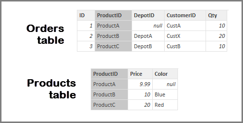
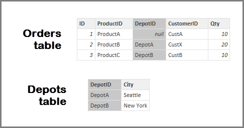
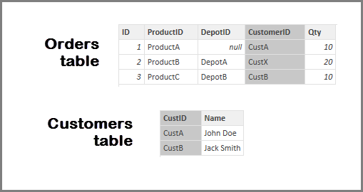

# Assume referential integrity settings in Power BI Desktop
When connecting to a data source using **DirectQuery**, you can use the **Assume Referential Integrity** selection to enable running more efficient queries against your data source. This feature has a few requirements of the underlying data, and it is only available when using **DirectQuery**.

Setting **Assume referential integrity** enables queries on the data source to use **INNER JOIN** statements rather than **OUTER JOIN**, which improves query efficiency.

## Requirements for using Assume referential integrity
This is an advanced setting, and is only enabled when connecting to data using **DirectQuery**. The following requirements are necessary for **Assume referential integrity** to work properly:

* Data in the **From** column in the relationship is never *Null* or *blank*
* For each value in the **From** column, there is a corresponding value in the **To** column

In this context, the **From** column is the *Many* in a *One-to-Many* relationship, or it is the column in the first table in a *One-to-One* relationship.

## Example of using Assume referential integrity
The following example demonstrates how **Assume referential integrity** behaves when used in data connections. The example connects to a data source that includes an **Orders** table, a **Products** table, and a **Depots** table.

1. In the following image that shows the **Orders** table and the **Products** table, note that referential integrity exists between **Orders[ProductID]** and **Products[ProductID]**. The **[ProductID]** column in the **Orders** table is never *Null*, and every value also appears in the **Products** table. As such, **Assume Referential Integrity** should be set to get more efficient queries (using this setting does not change the values shown in visuals).
   
   
2. In the next image, notice that no referential integrity exists between **Orders[DepotID]** and **Depots[DepotID]**, because the **DepotID** is *Null* for some *Orders*. As such, **Assume Referential Integrity** should *not* be set.
   
   
3. Finally, no referential integrity exists between **Orders[CustomerID]** and **Customers[CustID]** in the following tables; the **CustomerID** contains some values (in this case, *CustX*) that do not exist in the *Customers* table. As such, **Assume Referential Integrity** should *not* be set.
   
   

## Setting Assume referential integrity
To enable this feature, select the checkbox next to **Assume Referential Integrity** as shown in the following image.

When selected, the setting is validated against the data to ensure there are no *Null* or mismatched rows. *However*, for cases with a very large number of values, the validation is not a guarantee that there are no referential integrity issues.

In addition, the validation occurs at the time of editing the relationship, and does *not* reflect any subsequent changes to the data.

## What happens if you incorrectly set Assume referential integrity?
If you set **Assume Referential Integrity** when there are referential integrity issues in the data, this will not result in errors. However, it will result in apparent inconsistencies in the data. For example, in the case of the relationship to the **Depots** table described above, it would result in the following:

* A visual showing the total *Order Qty* would show a value of 40
* A visual showing the total *Order Qty by Depot City* would show a total value of only *30*, because it would not include Order ID 1, where **DepotID** is *Null*.

## Next steps
Learn more about [DirectQuery](desktop-use-directquery.md)

Get more information about [Relationships in Power BI](desktop-create-and-manage-relationships.md)

Learn more about [Relationship View in Power BI Desktop](desktop-relationship-view.md).

