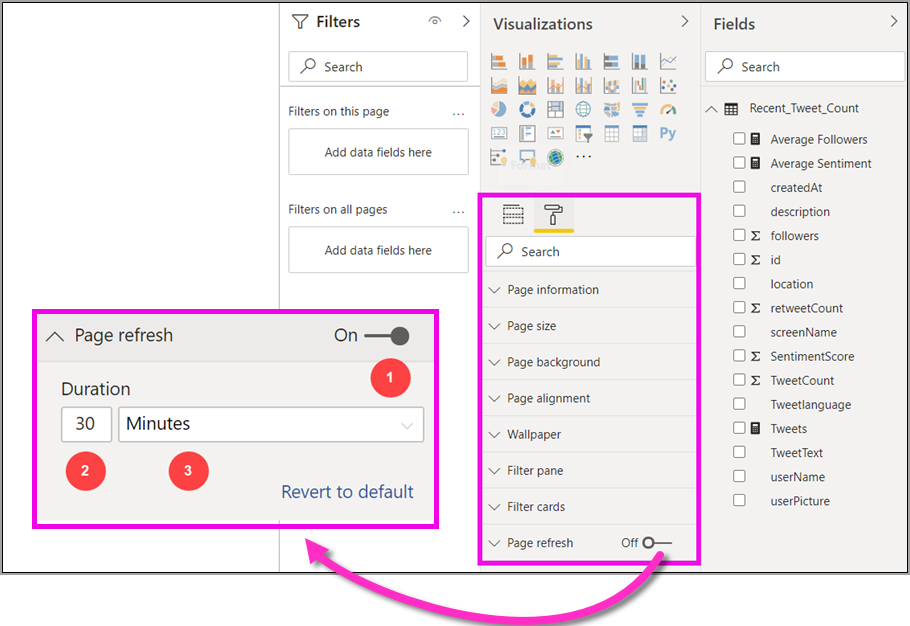
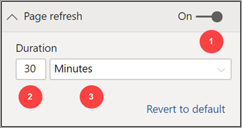
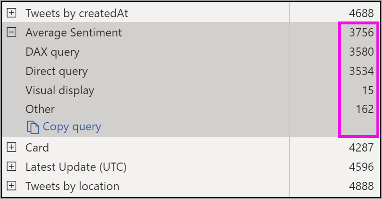
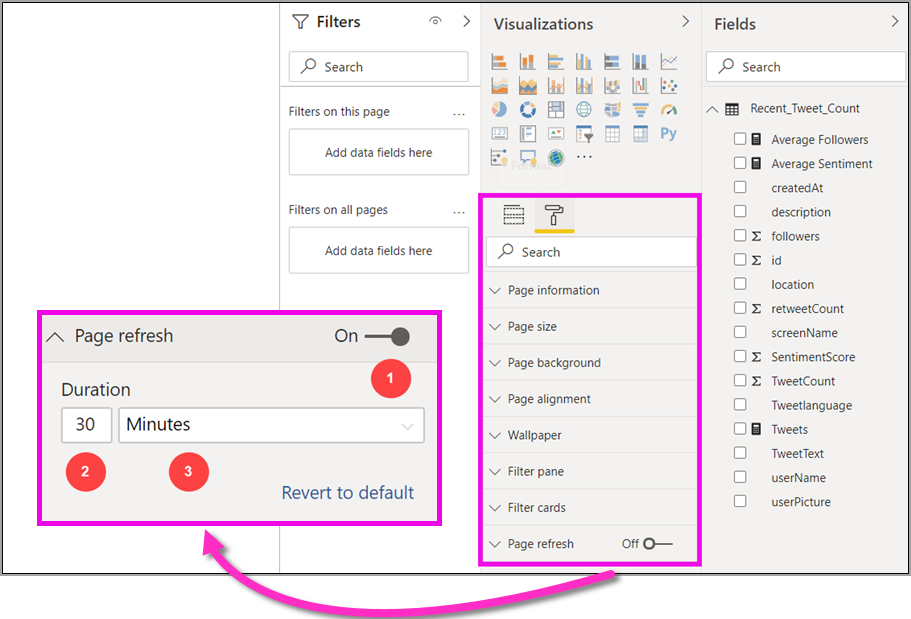

# Automatic page refresh in Power BI Desktop (preview)

When monitoring critical events, it’s important for data to be refreshed as soon as the source data gets updated. For example, in the manufacturing industry it's critical to know when a machine is malfunctioning, or close to doing so.

The automatic page refresh (APR) feature in Power BI lets your active report page query for new data, at a pre-defined cadence, for [DirectQuery sources](https://docs.microsoft.com/power-bi/desktop-directquery-about).

## Using automatic page refresh

For this preview version, you must enable the automatic page refresh feature in Power BI Desktop. Go to **File > Options and settings** then select **Options**, and select **Preview features** from the left pane. Enable the feature by selecting the checkbox beside *Automatic page refresh*. Automatic page refresh is available only for DirectQuery data sources.

To use automatic page refresh, select the report page for which you want to enable refresh. In the **Visualizations** pane, select the **Formatting** icon (a paint roller) and find **Page refresh** near the bottom of the pane. 

The following image shows the **Page refresh** card. Explanations for the numbered elements are described in the next few paragraphs:

1.	Automatic Page Refresh slider - turns page refresh on or off
2.	Page refresh interval value - number value for refresh interval
3.	Page refresh interval unit - interval unit for page refresh

Here you can turn on page refresh and select the refresh duration. The default value is 30 minutes, the minimum refresh interval is one second). Your report will begin refreshing at the interval you set. 

## Determining the page refresh interval

When automatic page refresh is enabled, Power BI Desktop is constantly sending queries to your DirectQuery source. There will be a delay between the query being sent and getting data returned, so for short refresh intervals, you should confirm that queries are successfully returning the queried data within the configured interval. If data is not returned within the interval, you create situations where visuals are updating less frequently than configured.

As a best practice, the refresh interval should at least match your expected new data arrival rate:

* If new data arrives at the source every 20 minutes, then your refresh interval cannot be less than 20 minutes. 

* If new data arrives every second, then the interval should be set to one second. 

For low refresh intervals like one second, you should also consider the type of the direct query data source, the load your queries create on it, the distance of your report viewers from the capacity’s data center, and so on. 

You can estimate this using the Performance Analyzer in Power BI Desktop, which lets you confirm if each visual query has enough time to come back with result from the source, and where time is spent. Based on the results of Performance Analyzer, you can adjust and make changes to the data source, or you can experiment with other visuals and measures in your report.

The following image shows the results of a DirectQuery in Performance Analyzer:

Let’s consider some other characteristics about this data source. 

1.	Data arrives at a rate of two seconds. 
2.	Performance analyzer shows maximum query + display time of approximately 4.9 seconds (4688 milliseconds). 
3.	The data source is configured to handle approximately 1000 concurrent queries per second. 
4.	You expect approximately 10 users to be viewing the report concurrently.

So that results in the following:

* **5 visuals x 10 users = approximately 50 queries**

This calculation results in much more load than what the data source can support. The data arrives at a rate of two seconds, so that should be your refresh rate. However, since the query takes around five seconds to complete, we should set it to more than five seconds. 

Also note that this result may differ as you publish your report to the service, since the report will use the Analysis Services instance hosted in the cloud. You may want to adjust your refresh rates accordingly. 

To account for queries and refresh timing, Power BI will only run the next refresh query when all the remaining refresh queries are complete. So even if your refresh interval is shorter than the time your queries take to process, Power BI will only refresh again once remaining queries complete. 

Next let's look at how you can potentially detect and diagnose performance problems as a capacity administrator. You can also check the **automatic page refresh FAQ** section, later in this article, for further questions and answers about performance and troubleshooting.

## Automatic page refresh in the Power BI service

You can also set automatic page refresh intervals for reports that have been authored in Power BI Desktop, and published to the Power BI service. 

Automatic page refresh for reports in the Power BI service is configured with steps similar to the configuration in Power BI Desktop. When configured in the Power BI service, automatic page refresh also supports [embedded Power BI](developer/embedding.md) content. The following image shows the **Page refresh** configuration for the Power BI service:

1.	Automatic Page Refresh slider - turns page refresh on or off
2.	Page refresh interval value - number value for refresh interval, must be a whole number
3.	Page refresh interval unit - interval unit for page refresh

### Page refresh intervals

Page refresh intervals allowed in the Power BI service are affected by the report's workspace type. This applies to all of the following reports:

* Publishing a report into a workspace that has automatic page refresh enabled
* Editing a page refresh interval already in a workspace
* Creating a report directly in the service

Power BI Desktop has no restriction for refresh interval; its refresh interval can be as frequent as every second. However, when reports are published to the Power BI service, certain restrictions do apply and are described in the following sections.

### Restrictions on refresh intervals

In the Power BI service, automatic page refresh restrictions apply based on factors such as the workspace, and whether Premium services are being used.

To clarify how this works, let's begin with some background on capacities and workspaces:

**Capacities** are a core Power BI concept representing a set of resources (storage, processor, and memory) used to host and deliver Power BI content. Capacities are either shared or dedicated. A **Shared Capacity** is shared with other Microsoft customers, while a **Dedicated Capacity** is fully committed to a single customer. Dedicated capacities are introduced in the [Managing Premium capacities](service-premium-capacity-manage.md) article.

In shared capacity, workloads run on computational resources shared with other customers. As the capacity must share resources, limitations are imposed to ensure *fair play*, such as setting a maximum model size (1 GB) and maximum daily refresh frequency (eight times per day).

Power BI **workspaces** reside within capacities and they represent security, collaboration, and deployment containers. Each Power BI user has a personal workspace known as **My Workspace**. Additional workspaces can be created to enable collaboration and deployment, and these are known as **workspaces**. By default, workspaces - including personal workspaces - are created in the **shared capacity**.

Here are some details for the two workspace scenarios:

**Shared workspaces** - For regular workspaces (workspaces that are not part of a Premium capacity), automatic page refresh has a minimum interval of 30 minutes (the lowest interval allowed).

**Premium workspaces** - Automatic page refresh availability in Premium workspaces will depend on the workload settings your premium administrator has set up for the Power BI Premium capacity. There are two variables that might affect your ability to set up automatic page refresh:

 1. *Feature on/off*: if your capacity administrator has decided to disable the feature, you won't be able to set up any type of page refresh in your published report.

 2. *Minimum refresh interval*: when enabling the feature, your capacity administrator must set up a minimum refresh interval. If your interval is lower than the minimum, the Power BI service overrides your interval to respect the minimum interval set by your capacity administrator.

The table below describes with more detail where this feature is available, and the limits for each capacity type and [storage mode](service-dataset-modes-understand.md)

| Storage Mode | Dedicated Capacity | Shared Capacity |
| --- | --- | --- |
| Direct Query | **Supported** – Yes.  **Minimum refresh interval** – 1 second  **Capacity admin override** – Yes. | **Supported** – Yes.  **Minimum refresh interval** – 30 minutes  **Capacity admin override** – No. |
| Import | **Supported** – No.  **Minimum refresh interval** – N/A.  **Capacity admin override** – N/A. | **Supported** – No.  **Minimum refresh interval** – N/A.  **Capacity admin override** – N/A. |
| Mixed Mode (DQ + others) | **Supported** – Yes.  **Minimum refresh interval** – 1 second  **Capacity admin override** – Yes. | **Supported** – Yes.  **Minimum refresh interval** – 30 minutes  **Capacity admin override** – No. |
| Live connect AS | **Supported** – No.  **Minimum refresh interval** – N/A.  **Capacity admin override** – N/A. | **Supported** – No.  **Minimum refresh interval** – N/A.  **Capacity admin override** – N/A. |
| Live connect PBI | **Supported** – No.  **Minimum refresh interval** – N/A.  **Capacity admin override** – N/A. | **Supported** – No.  **Minimum refresh interval** – N/A.  **Capacity admin override** – N/A. |

> [!NOTE]
> When publishing your automatic page refresh enabled report from Power BI Desktop to the service, you will have to provide the credentials for the DirectQuery data source in the dataset settings menu.

## Considerations and limitations

There are a few things to keep in mind when using automatic page refresh, in Power BI Desktop or in the Power BI service.

* Import, LiveConnect and Push storage modes are not supported for automatic page refresh.  
* Composite models that have at least one DirectQuery data source are supported.
* Power BI Desktop has no restriction for refresh interval which can be as frequent as every second. When reports are published to the Power BI service, certain restrictions do apply, as described earlier in this document.

### Performance diagnostics

Automatic page refresh is useful for monitoring scenarios and exploring fast changing data. However, sometimes this can put undue load on the capacity or data source.

To prevent undue load on data sources, Power BI has the following safeguards:

1. All automatic page refresh queries run at a **lower** priority to ensure that interactive queries (such as page load, and cross filtering visuals) take precedence.
2. If your query has not finished before the next refresh cycle, Power BI does not issue new refresh queries until the previous query completes. For example, if you have a refresh interval of one second, and your queries at an average take four seconds, Power BI effectively only issues a query every four seconds.

There are two areas where you could still encounter performance bottlenecks:

1. **The capacity:** The query first hits the premium capacity which will fold and evaluate the DAX query generated from the report visualizations into the source queries.
2. **The Direct Query data source:** The translated queries in the previous step are then run against the source. This would be your SQL Servers, SAP Hana sources, and so on.

Using the [Premium metrics app](service-admin-premium-monitor-capacity.md) available to admins, you can visualize how much of the capacity is being used by low priority queries.

Low priority queries consist of automatic page refresh queries, and model refresh queries. There is currently no way to distinguish between the load from automatic page refresh and Model Refresh queries.

If you notice that your capacity is getting overloaded with low priority queries, there are a few of actions you can take:

1. Request a larger premium SKU.
2. Contact the report owner, and ask to lower the refresh interval.
3. In the capacity admin portal, you can:
  1. Turn off automatic page refresh for that capacity
  2. Raise the minimum refresh interval, which will affect all reports on that capacity.

### Frequently asked questions

This section provides common questions and answers for 

1. I'm a report author. I defined my report refresh interval to 1sec on Desktop, but after publishing my report isn't refreshing in the service.

    * Check that automatic page refresh is turned on for the page. Since this setting is per page, you need to ensure it is on for each page in the report you'll like to refresh.
    * Check that you uploaded to a workspace with an attached premium capacity, if not your refresh interval will be locked at 30 mins.
    * If your report is on a premium workspace, check with your admin that they have enabled this feature for the attached capacity. In addition, ensure that the minimum refresh interval for the capacity is lower or the same as your report.

2. I'm a capacity admin. I changed my automatic page refresh interval settings, but they are not getting reflected. In other words, reports are still refreshing at a rate they shouldn't be, or not refreshing even though I turned it on.

    * Automatic page refresh setting changes made in the capacity admin UI take up to 5 mins to propagate to reports.
    * In addition to turning on automatic page refresh for the capacity you also need to turn it on for pages of a report where you want to see it.

3. My report is operating in mixed mode (DQ + Import). Not all visuals are refreshing.

    * If your visuals reference Import tables, this is expected. automatic page refresh isn't supported for Import.
    * See question 1 in this section.

4. My report was refreshing fine in the service, and then suddenly stopped.

    * Try refreshing the page to see if the issue resolves itself.
    * Check with your capacity admin, as they may have turned off the feature or raised the minimum refresh interval (See Question 2)

5. I'm a report author. My visuals are not refreshing at the cadence I stated. They are refreshing at a slower rate.

    * If your queries are taking longer to execute, your refresh interval will be delayed. automatic page refresh waits for all queries to finish running before running new ones.
    * Your capacity admin might have set a minimum refresh interval that is higher than the one you set it your report. Contact your capacity admin and ask for it to be lowered.

6. Are automatic page refresh queries served from cache?

    * No, all automatic page refresh queries by-pass any cached data.

## Next steps

For more information, see the following articles:

* [Using DirectQuery in Power BI](desktop-directquery-about.md)
* [Use Performance Analyzer to examine report element performance](desktop-performance-analyzer.md)
* [Deploying and Managing Power BI Premium Capacities](whitepaper-powerbi-premium-deployment.md)
* [Data Sources in Power BI Desktop](desktop-data-sources.md)
* [Shape and Combine Data with Power BI Desktop](desktop-shape-and-combine-data.md)
* [Connect to Excel workbooks in Power BI Desktop](desktop-connect-excel.md)   
* [Enter data directly into Power BI Desktop](desktop-enter-data-directly-into-desktop.md)   
