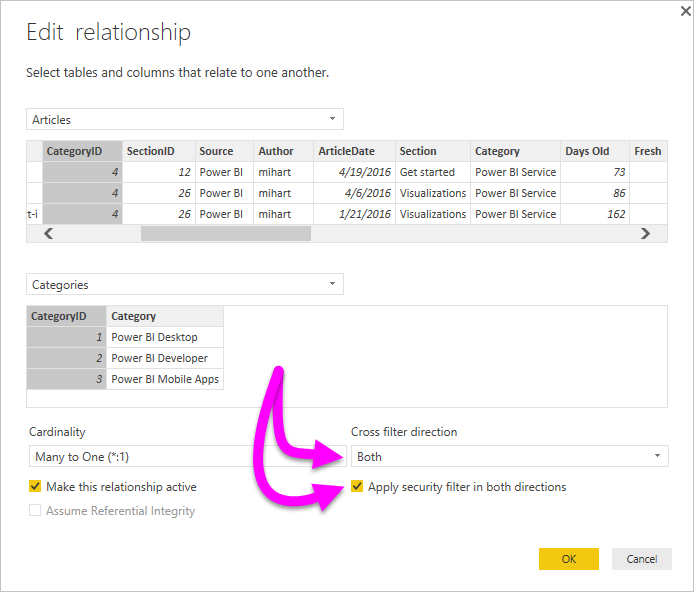

# Bidirectional cross-filtering using DirectQuery in Power BI Desktop

When filtering tables to create the appropriate view of data, report creators (and data modelers) face challenges when determining how filtering is applied to a report; the filter context of a table was held on one side of the relationship, but not the other, often requiring complex DAX formulas to get the desired results.

With bidirectional cross-filtering, report creators (and data modelers) now have more control over how filters are applied when working with related tables, enabling those filters to be applied on *both* sides of a table relationship. This is accomplished by having the filter context propagated to a second related table on the other side of a table relationship.

## Detailed whitepaper for bidirectional cross-filtering
A [detailed whitepaper](http://download.microsoft.com/download/2/7/8/2782DF95-3E0D-40CD-BFC8-749A2882E109/Bidirectional%20cross-filtering%20in%20Analysis%20Services%202016%20and%20Power%20BI.docx) is available that explains bidirectional cross-filtering in Power BI Desktop (the whitepaper also covers SQL Server Analysis Services 2016, both have the same behavior).

* Download the [Bidirectional cross-filtering for Power BI Desktop](http://download.microsoft.com/download/2/7/8/2782DF95-3E0D-40CD-BFC8-749A2882E109/Bidirectional%20cross-filtering%20in%20Analysis%20Services%202016%20and%20Power%20BI.docx) whitepaper

## Enabling bidirectional cross-filtering for DirectQuery

To enable cross-filtering, in the **Edit Relationship** dialog for a relationship, the following must be selected:

* The **Cross filter direction** must be set to **Both**
* The **Apply security filter in both directions** must also be selected

  

> [!NOTE]
> When creating cross filtering DAX formulas in Power BI Desktop, use *UserPrincipalName* (which is often the same as a user's login, such as <em>joe@contoso.com</em>) instead of *UserName*. As such, you may need to create a related table that maps *UserName* (or EmployeeID, for example) to *UserPrincipalName*.

For more information, and for examples of how bidirectional cross-filtering works, check out the [whitepaper](http://download.microsoft.com/download/2/7/8/2782DF95-3E0D-40CD-BFC8-749A2882E109/Bidirectional%20cross-filtering%20in%20Analysis%20Services%202016%20and%20Power%20BI.docx) mentioned earlier in this article.

