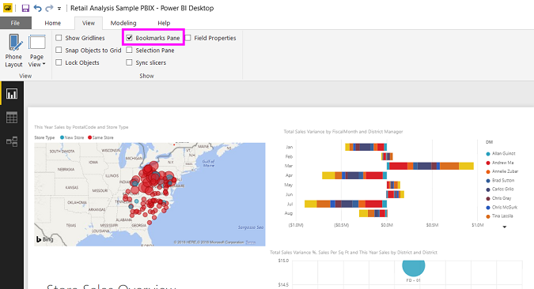
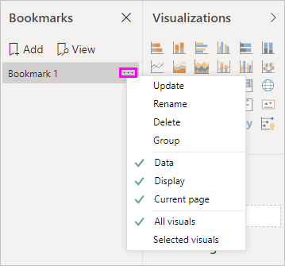
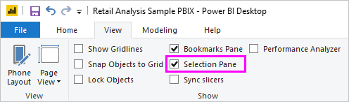
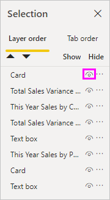
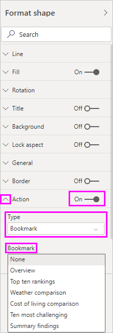
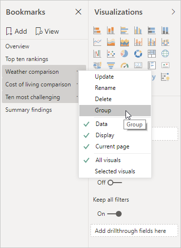
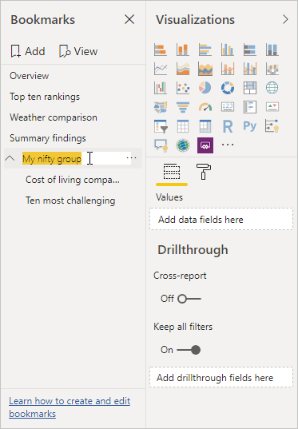
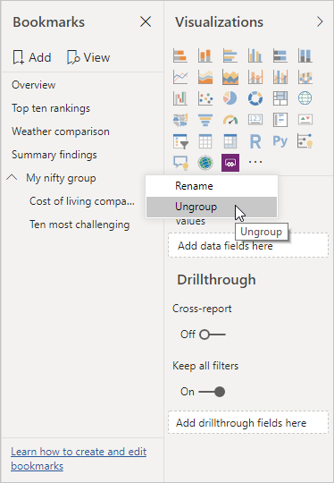
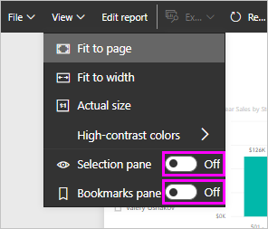

# Use bookmarks to share insights and build stories in Power BI 
Using **bookmarks** in Power BI help you capture the currently configured view of a report page, including filtering and the state of visuals, and later let you go back to that state by simply selecting the saved bookmark. 

You can also create a collection of bookmarks, arrange them in the order you want, and subsequently step through each bookmark in a presentation to highlight a series of insights, or the story you want to tell with your visuals and reports. 

There are many uses for bookmarking. You can use them to keep track of your own progress in creating reports (bookmarks are easy to add, delete, and rename) and you can create bookmarks to build a PowerPoint-like presentation that steps through bookmarks in order, thereby telling a story with your report. There may be other uses, too, based on how you think bookmarks could best be used.

### Enable the bookmarks preview (versions prior to March 2018)
Beginning with the March 2018 version of Power BI Desktop, bookmarks are generally available. 

We always suggest you upgrade to the most recent release. But, if your version of Power BI Desktop is before that release, you can try the **bookmarks** feature beginning with the **October 2017** release of **Power BI Desktop**, and for bookmark-enabled reports, in the **Power BI service** as well. To enable the preview feature, select **File > Options and Settings > Options > Preview Features**, then select the checkbox beside **Bookmarks**. 

You'll need to restart **Power BI Desktop** after you make the selection to enable the preview version of bookmarks.

## Using bookmarks
To use bookmarks, select the **View** ribbon, then select the box for **Bookmarks Pane**. 

When you create a bookmark, the following elements are saved with the bookmark:

* The current page
* Filters
* Slicers, including slicer type (for example, dropdown or list) and slicer state
* Visual selection state (such as cross-highlight filters)
* Sort order
* Drill location
* Visibility (of an object, using the **Selection** pane)
* The focus or **Spotlight** modes of any visible object

Configure a report page the way you want it to appear in the bookmark. Once your report page and visuals are arranged how you want them, select **Add** from the **Bookmarks** pane to add a bookmark. 

**Power BI Desktop** creates a bookmark and gives it a generic name. You can easily *rename*, *delete*, or *update* a bookmark by selecting the ellipses next to the bookmark's name, then selecting an action from the menu that appears.

Once you have a bookmark, you can display it by simply clicking on the bookmark in the **Bookmarks** pane. 

You can also select whether each bookmark will apply *data* properties, such as filters and slicers, the *display* properties such as spotlight and its visibility, and page changes that presents the page that was visible when the bookmark was added. These capabilities are useful when you use bookmarks to switch between visual types - in which case you would likely want to turn data properties off, so filters aren't reset as users change visual types. 

To make such changes select the ellipses next to the bookmark's name, as shown in the previous image, then select or unselect the check marks next to *Data*, *Display*, and other controls. 

## Arranging bookmarks
As you create bookmarks, you might find that the order in which you create them isn't necessarily the same order you'd like to present them to your audience. No problem, you can easily rearrange the order of bookmarks.

In the **Bookmarks** pane, simply drag-and-drop bookmarks to change their order, as shown in the following image. The yellow bar between bookmarks designates where the dragged bookmark will be placed.

The order of your bookmarks can become important when you use the **View** feature of bookmarks, as described in the next section.

## Bookmarks as a slide show
When you have a collection of bookmarks you would like to present, in order, you can select **View** from the **Bookmarks** pane to begin a slideshow.

When in **View** mode, there are a few features to notice:

1. The name of the bookmark appears in the bookmark title bar, which appears at the bottom of the canvas.
2. The bookmark title bar has arrows that let you move to the next or previous bookmark.
3. You can exit **View** mode by selecting **Exit** from the **Bookmarks** pane or by selecting the **X** found in the bookmark title bar. 

When you're in **View** mode, you can close the **Bookmarks** pane (by clicking the X on that pane) to provide more space for your presentation. And, while in **View** mode, all visuals are interactive and available for cross-highlighting, just as they would otherwise be when interacting with them. 

## Visibility - using the Selection pane
With the release of bookmarks, the new **Selection** pane is also introduced. The **Selection** pane provides a list of all objects on the current page and allows you to select the object and specify whether a given object is visible. 

You can select an object using the **Selection** pane. Also, you can toggle whether the object is currently visible by clicking the eye icon to the right of the visual. 

When a bookmark is added, the visible status of each object is also saved based on its setting in the **Selection** pane. 

It's important to note that **slicers** continue to filter a report page, regardless of whether they are visible. As such, you can create many different bookmarks, with different slicer settings, and make a single report page appear very different (and highlight different insights) in various bookmarks.

## Bookmarks for shapes and images
You can also link shapes and images to bookmarks. With this feature, when you click on an object, it will show the bookmark associated with that object. This can be especially useful when working with buttons; you can learn more by reading the article about [using buttons in Power BI](desktop-buttons.md). 

To assign a bookmark to an object, select the object, then expand the **Action** section from the **Format Shape** pane, as shown in the following image.

Once you turn the **Action** slider to **On** you can select whether the object is a back button, a bookmark, or a Q&A command. If you select bookmark, you can then select which of your bookmarks the object is linked to.

There are all sorts of interesting things you can do with object-linked bookmarking. You can create a visual table of contents on your report page, or you can provide different views (such as visual types) of the same information, just by clicking on an object.

When you are in editing mode you can use ctrl+click to follow the link, and when not in edit mode, simply click the object to follow the link. 

## Bookmark groups

Beginning with the August 2018 release of **Power BI Desktop**, you can create and use bookmark groups. A bookmark group is a collection of bookmarks that you specify, which can be shown and organized as a group. 

To create a bookmark group, hold down the CTRL key and select the bookmarks you want to include in the group, then click the ellipses beside any of the selected bookmarks, and select **Group** from the menu that appears.

**Power BI Desktop** automatically names the group *Group 1*. Fortunately, you can just double-click on the name and rename it to whatever you want.

With any bookmark group, clicking on the bookmark group's name only expands or collapses the group of bookmarks, and does not represent a bookmark by itself. 

When using the **View** feature of bookmarks, the following applies:

* If the selected bookmark is in a group when you select **View** from bookmarks, only the bookmarks *in that group* are shown in the viewing session. 

* If the selected bookmark is not in a group, or is on the top level (such as the name of a bookmark group), then all bookmarks for the entire report are played, including bookmarks in any group. 

To ungroup bookmarks, just select any bookmark in a group, click the ellipses, and then select **Ungroup** from the menu that appears. 

Note that selecting **Ungroup** for any bookmark from a group takes all bookmarks out of the group (it deletes the group, but not the bookmarks themselves). So to remove a single bookmark from a group, you need to **Ungroup** any member from that group, which deletes the grouping, then select the members you want in the new group (using CTRL and clicking each bookmark), and select **Group** again. 

## Using Spotlight
Another feature released with bookmarks is **Spotlight**. With **Spotlight** you can draw attention to a specific chart, for example, when presenting your bookmarks in **View** mode.

Let's compare **Spotlight** to **focus** mode to see how they differ.

1. In **focus** mode, you can have one visual fill the entire canvas by selecting the **focus mode** icon.
2. Using **Spotlight**, you can highlight one visual in its original size, by making all other visuals on the page fade to near transparency. 

When the visual in the previous image has its **focus** icon clicked, the page looks like the following:

In contrast, when **Spotlight** is selected from the visual's ellipses menu, the page looks like what you seen here:

If either mode is selected when a bookmark is added, that mode (focus or Spotlight) is retained in the bookmark.

## Bookmarks in the Power BI service
When you publish a report to the **Power BI service** with at least one bookmark, you can view and interact with those bookmarks in the **Power BI service**. When bookmarks are available in a report, you can select **View > Selection pane** or **View > Bookmarks pane** to show each of those panes.

In the **Power BI service** the **Bookmarks pane** operates just as it does in **Power BI Desktop**, including the ability to select **View** to show your bookmarks in order, like a slide show.

Note that you must use the gray bookmark title bar to navigate through the bookmarks, and not the black arrows (the black arrows move you through report pages, not bookmarks).

## Limitations and considerations
In this release of the **bookmarks**, there are a few limitations and considerations to keep in mind.

* Most custom visuals should work well with bookmarking. If you run into trouble with bookmarking and a custom visual, contact the creator of that custom visual and ask them to add support for bookmarks to their visual. 
* If you add a visual on a report page after creating a bookmark, the visual will be displayed in its default state. This also means that if you introduce a slicer into a page where you previously created bookmarks, the slicer will behave in its default state.
* Moving around visuals after a bookmark has been created will be reflected in the bookmark. 

## Next steps
For more information about features that are similar or interact with bookmarks, take a look at the following articles:

* [Use drillthrough in Power BI Desktop](desktop-drillthrough.md)
* [Display a dashboard tile or report visual in Focus mode](consumer/end-user-focus.md)

