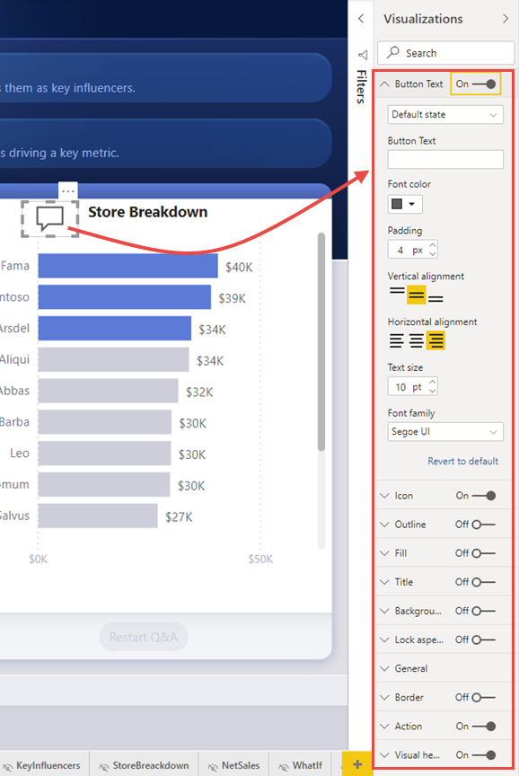
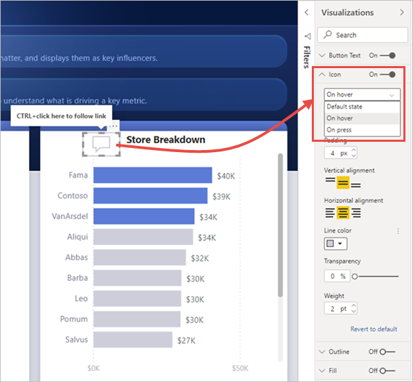
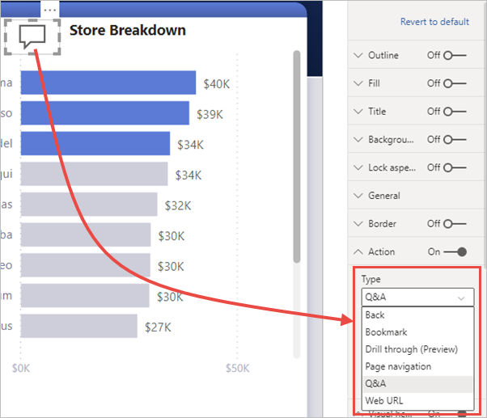

# Use buttons in Power BI
Using **buttons** in Power BI lets you create reports that behave similar to apps, and thereby, create an engaging environment so users can hover, click, and further interact with Power BI content. You can add buttons to reports in **Power BI Desktop**. When you share or publish reports to the Power BI service, they provide an app-like experience for your users.

Buttons that you create in **Power BI Desktop** are available for use in reports that are published in the **Power BI service**.

## Create buttons in reports
To create a button in a **Power BI Desktop** report, on the **Insert** ribbon, select **Buttons** and a drop-down menu appears, where you can select the button you want from a collection of options, as shown in the following image. 

When you create a button and select it on the report canvas, the **Visualizations** pane shows you the many ways you can customize the button to fit your requirements. For example, you can turn **Button Text** on or off, by toggling the slider in that card of the **Visualizations** pane. You can also change the button icon, the button fill, the title, and the action that's taken when users select the button in a report, among other properties.

## Set button properties when idle, hovered over, or selected

Buttons in Power BI have three states: default (how they appear when not hovered over or selected), when hovered over, or when selected (often referred to as being *clicked*). Many of the cards in the **Visualizations** pane can be modified individually based on those three states, providing plenty of flexibility for customizing your buttons.

The following cards in the **Visualizations** pane let you adjust formatting or behavior of a button based on its three states:

* Button Text
* Icon
* Outline
* Fill

To select how the button should appear for each state, expand one of those cards and select the drop-down that appears at the top of the card. In the following image, you see the **Icon** card expanded, with the drop-down selected to show the three states.

## Select the action for a button

You can select which action is taken when a user selects a button in Power BI. You can access the options for button actions from the **Action** card in the **Visualizations** pane.

The options for button actions are:

* Back
* Bookmark
* Drill through (preview)
* Page navigation
* Q&A
* Web URL

Selecting **Back** returns the user to the previous page of the report. This is useful for drill-through pages.

Selecting **Bookmark** presents the report page that's associated with a bookmark that is defined for the current report. Learn more about [bookmarks in Power BI](desktop-bookmarks.md). 

Selecting **Drill through (preview)** creates a button that navigates the user to a drill-through page filtered to their selection. Learn more about [drill through in Power BI Desktop](desktop-drillthrough.md)

Selecting **Page navigation** creates a button that navigates the user to a different page within the report without using bookmarks.

Selecting **Q&A** from the drop-down presents a **Q&A Explorer** window. 

Certain buttons have a default action selected automatically. For example, the **Q&A** button type automatically selects **Q&A** as the default action. You can learn more about **Q&A Explorer** by checking out [this blog post](https://powerbi.microsoft.com/blog/power-bi-desktop-april-2018-feature-summary/#Q&AExplorer).

You can try or test the buttons you create for your report by using *CTRL+CLICK* on the button you want to use. 

## Next steps
For more information about features that are similar or interact with buttons, take a look at the following articles:

* [Use drill through in Power BI Desktop](desktop-drillthrough.md)
* [Use bookmarks to share insights and build stories in Power BI](desktop-bookmarks.md)

