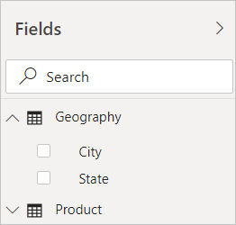

# Using calculated columns in Power BI Desktop
With calculated columns, you can add new data to a table already in your model. But instead of querying and loading values into your new column from a data source, you create a Data Analysis Expressions (DAX) formula that defines the column’s values. In Power BI Desktop, calculated columns are created by using the New Column feature in Report View.

Unlike custom columns created as part of a query by using Add Custom Column in Query Editor, calculated columns created in Report View or Data View are based on data you’ve already loaded into the model. For example, you might choose to concatenate values from two different columns in two different but related tables, perform addition, or extract substrings.

Calculated columns you create appear in the Fields list just like any other field, but they’ll have a special icon showing its values are the result of a formula. You can name your columns whatever you want, and add them to a report visualization just like other fields.

Calculated columns calculate results by using [Data Analysis Expressions](https://msdn.microsoft.com/library/gg413422.aspx) (DAX), a formula language meant to work with relational data like in Power BI Desktop. DAX includes a library of over 200 functions, operators, and constructs, providing immense flexibility in creating formulas to calculate results for just about any data analysis need. To learn more about DAX, see the Learn more section at the end of this article.

DAX formulas are similar to Excel formulas. In fact, DAX has many of the same functions as Excel. DAX functions, however, are meant to work over data interactively sliced or filtered in a report, like in Power BI Desktop. Unlike Excel, where you can have a different formula for each row in a table, when you create a DAX formula for a new column, it will calculate a result for every row in the table. Column values are recalculated as necessary, like when the underlying data is refreshed and values have changed.

## Let’s look at an example
Jeff is a shipping manager at Contoso. He wants to create a report showing the number of shipments to different cities. He has a Geography table with separate fields for city and state. But, Jeff wants his reports to show City, State as a single value on the same row. Right now, Jeff’s Geography table doesn’t have the field he wants.

But with a calculated column, Jeff can simply put together, or concatenate, the cities from the City column with the states from the State column.

Jeff right clicks on the Geography table and then clicks New Column. He then enters the following DAX formula into the formula bar:

This formula simply creates a new column named CityState, and for each row in the Geography table, it takes values from the City column, adds a comma and a space, and then concatenates values from the State column.

Now Jeff has the field he wants.

He can add it to his report canvas along with the number of shipments. Very quickly and with minimal effort, Jeff now has a City, State field he can add to just about any type of visualization. Jeff sees that when he creates a map visualization, Power BI Desktop even knows how to read the City, State values in his new column.

## Learn more
We’ve only provided a quick introduction to calculated columns here. Be sure to see the [Tutorial: Create calculated columns in Power BI Desktop](desktop-tutorial-create-calculated-columns.md) tutorial, where you can download a sample file and get step-by-step lessons on how to create more columns. 

To learn more about DAX, see [DAX basics in Power BI Desktop](desktop-quickstart-learn-dax-basics.md).

To learn more about columns you create as part of a query, see the Create custom columns section in [Common query tasks in Power BI Desktop.](desktop-common-query-tasks.md)  

