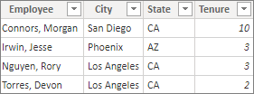
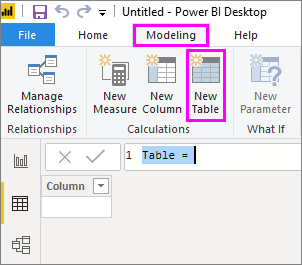
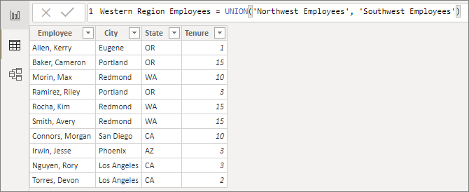
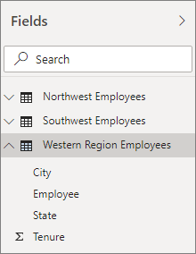

# Using calculated tables in Power BI Desktop
With calculated tables, you can add a new table to the model. But instead of querying and loading values into your new table's columns from a data source, you create a Data Analysis Expressions (DAX) formula that defines the table’s values. In Power BI Desktop, calculated tables are created by using the New Table feature in Report View or Data View.

Most of the time, you import data into your model from an external data source. However, calculated tables provide certain advantages. Calculated tables are generally best for intermediate calculations and data you want stored as part of the model rather than calculated on the fly or as part of a query.

Unlike tables created as part of a query, calculated tables created in Report View or Data View are based on data you’ve already loaded into the model. For example, you might choose to union or cross join two tables.

Just like normal tables, calculated tables can have relationships with other tables. The columns in your calculated table have data types, formatting, and can belong to a data category. You can name your columns whatever you want, and add them to a report visualization just like other fields. Calculated tables are re-calculated if any of the tables it pulls data from are refreshed or updated in any way.

Calculated tables calculate results by using [Data Analysis Expressions](https://msdn.microsoft.com/library/gg413422.aspx) (DAX), a formula language meant to work with relational data like in Power BI Desktop. DAX includes a library of over 200 functions, operators, and constructs, providing immense flexibility in creating formulas to calculate results for just about any data analysis need.

## Let’s look at an example
Jeff, a project manager at Contoso, has a table with employees in the Northwest and another table with employees in the Southwest. Jeff wants to put the two tables together into a single table.

**NorthwestEmployees**

 

**SoutwestEmployees**

 

Putting these two tables together with a calculated table is quite easy. While Jeff can create a calculated table in either Report View or Data View, it’s a bit easier to do it in Data View because he can immediately see his new calculated table.

In **Data View**, on the **Modeling** tab, Jeff clicks **New Table**. A formula bar appears.

 

Jeff then enters the following formula:

 

A new table named Western Region Employees is created.

 

Jeff’s new Western Region Employees table appears just like any other
table in the Fields list. He can create relationships to other tables,
add calculated columns and measures, and add any of its fields to
reports just like any other table.

 

## Functions for calculated tables
Calculated tables can be defined by any DAX expression that returns a
table, including a simple reference to another table. For example:

 

You can use calculated tables with DAX to solve many analytical
problems. We’ve only provided a quick introduction to calculated tables
here. As you start working with calculated tables, here are some of the
more common DAX table functions you might find useful:

* DISTINCT
* VALUES
* CROSSJOIN
* UNION
* NATURALINNERJOIN
* NATURALLEFTOUTERJOIN
* INTERSECT
* CALENDAR
* CALENDARAUTO

See the [DAX Function Reference](https://msdn.microsoft.com/ee634396.aspx) for these and
other table returning DAX functions.

