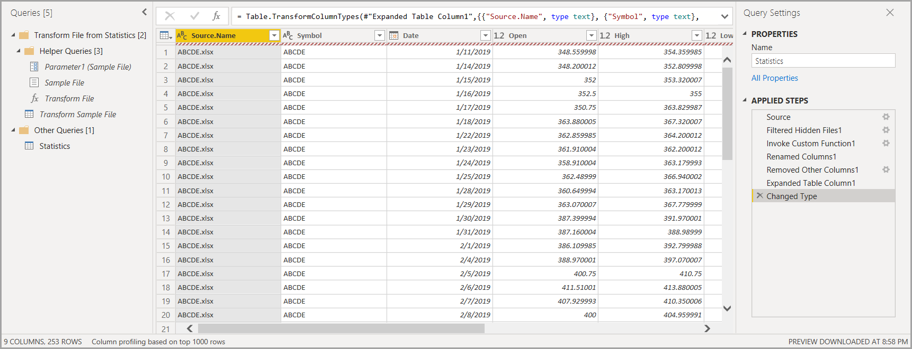

# Combine files (binaries) in Power BI Desktop
One powerful approach to importing data into **Power BI Desktop** is to combine multiple files, which have the same schema, into a single logical table. This convenient and popular approach has been made more convenient and more expansive, as described in this article.

To start the process of combining files from the same folder, select **Get Data > File > Folder**.

## Combine files behavior
You can **combine files (binaries)** by selecting **combine files**, either from the **Home** ribbon tab in **Query Editor**, or from the column itself.

The **combine files** transform behaves as follows:

* The **combine files** transform analyzes each input file, and determines the correct file format to use, such as *text* or *Excel workbook* or *JSON* file.
* The transform allows you to select a specific object from the first file, for example, an *Excel workbook*, to extract.
  
  
* The **combine files** then automatically performs the following queries:
  
  * Creates an example query that performs all the required extraction steps in a single file.
  * Creates a *function query* that parameterizes the file/binary input to the *exemplar query*. The exemplar query and the function query are linked, so that changes to the exemplar query are reflected in the function query.
  * Applies the *function query* to the original query with input binaries (for example, the *Folder* query) so it applies the function query for binary inputs on each row, then expands the resulting data extraction as top-level columns.
    
    

> [!NOTE]
> The scope of your selection in an Excel workbook will affect the behavior of combine binaries. For example, you can select a specific worksheet to combine that worksheet, or select the root to combine the full file. Selecting a folder combines the files found in that folder. 

With the behavior of **combine files**, you can easily combine all files within a given folder, as long as they have the same file type and structure (such as the same columns).

In addition, you can easily apply additional transformation or extraction steps by modifying the automatically created *exemplar query*, without having to worry about modifying or creating additional *function query* steps. Any changes to the *exemplar query* are automatically generated in the linked *function query*.

## Next steps
There are all sorts of data you can connect to using Power BI Desktop. For more information on data sources, check out the following resources:

* [What is Power BI Desktop?](desktop-what-is-desktop.md)
* [Data Sources in Power BI Desktop](desktop-data-sources.md)
* [Shape and Combine Data with Power BI Desktop](desktop-shape-and-combine-data.md)
* [Connect to CSV files in Power BI Desktop](desktop-connect-csv.md)   
* [Enter data directly into Power BI Desktop](desktop-enter-data-directly-into-desktop.md)   

