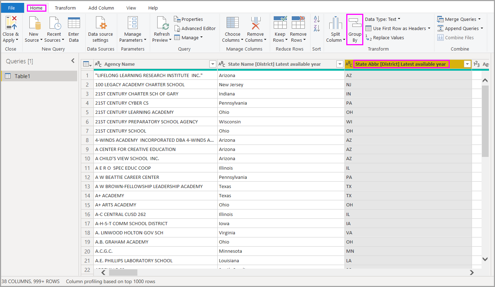
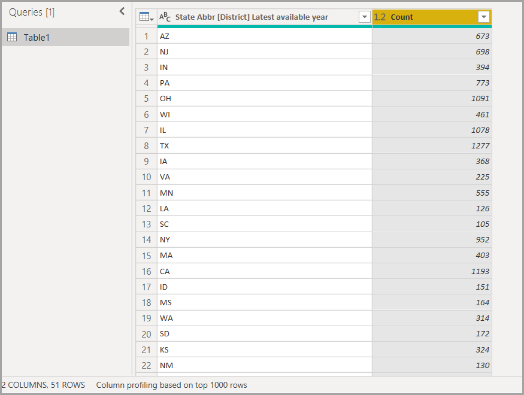
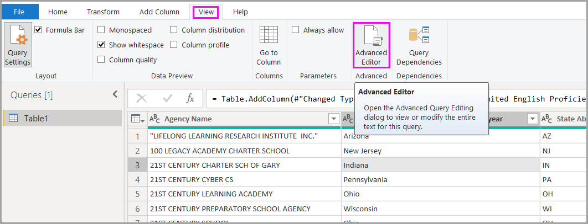

# Common query tasks in Power BI Desktop
When working in the **Query Editor** window of Power BI Desktop, there are a handful of commonly used tasks. This document demonstrates those common tasks, and provides links for additional information. 

The common query tasks demonstrated here are the following:

* Connect to data
* Shape and combine data
* Group rows
* Pivot columns
* Create custom columns
* Query formulas

We’ll use a few data connections to complete these tasks. The data is available for you to download or connect to, in case you want to step through these tasks yourself.

The first data connection is an Excel workbook, which you can download from [this link](http://download.microsoft.com/download/5/7/0/5701F78F-C3C2-450C-BCCE-AAB60C31051D/PBI_Edu_ELSi_Enrollment_v2.xlsx). The other is a Web resource (which is also used in other Power BI Desktop help content) which can be accessed from here:

[*http://www.bankrate.com/finance/retirement/best-places-retire-how-state-ranks.aspx*](http://www.bankrate.com/finance/retirement/best-places-retire-how-state-ranks.aspx)

The steps necessary to connect to both of those data sources is where the common Query tasks begin.

## Connect to data
To connect to data in Power BI Desktop, select the **Get Data** button from the **Home** tab on the ribbon. Power BI Desktop presents a menu with the most common data sources. For a complete list of data sources to which Power BI Desktop can connect, select the **More...** button at the bottom of the menu. For more information, see [Data Sources in Power BI Desktop](https://docs.microsoft.com/power-bi/desktop-data-sources).

To start with, select **Excel** and navigate to the workbook, then select it. Query inspects the workbook, then presents the data it found in the **Navigator** window.

You can select **Edit** to adjust, or *shape,* the data before loading it into Power BI Desktop. Editing a query before loading is especially useful when working with large data sets that you intend to pare down before loading. We want to do that, so we select **Edit**.

Connecting to different types of data is just as easy. We also want to connect to a Web resource. Select **Get Data \> More...** and then select **Other \> Web**.

The **From Web** window appears, where you can type in the URL of the Web page.

Select **OK**, and like before, Power BI Desktop inspects the workbook and presents the data it finds in the **Navigator** window.

Other data connections are similar. If authentication is required to make a data connection, Power BI Desktop prompts you for the appropriate credentials.

For a step-by-step demonstration of connecting to data in Power BI Desktop, see [Connect to Data in Power BI Desktop](https://docs.microsoft.com/power-bi/desktop-connect-to-data).

## Shape and combine data
You can easily shape and combine data with Query Editor. This section includes a few examples of how you can shape data. For a more complete demonstration of shaping and combining data, see **[Shape and Combine Data with Power BI Desktop](https://docs.microsoft.com/power-bi/desktop-shape-and-combine-data)**.

In the previous section we connected to two sets of data – an Excel workbook, and a Web resource. Once loaded in Query Editor we see the following, with the query from the Web page selected (taken from the available queries listed in the **Queries** pane, on the left side of the Query Editor window).

When you shape data, you transform a data source into the form and format that meets your needs. In this case, we don’t need that first column, titled *Header*, so we’ll remove it.

In **Query Editor**, many commands can be found in the ribbon, and in a context-sensitive right-click menu. For example, when you right-click on the *Header* column, the menu that appears lets you remove the column. You could also select the column and then select the **Remove Columns** button from the ribbon.

There are many other ways you could shape the data in this query; you could remove any number of rows from the top, or from the bottom; you could add columns, split columns, replace values, and perform other shaping tasks to direct Query Editor to get the data how you want it.

## Group rows
In Query Editor, you can group the values in multiple rows into a single value. This can be useful when summarizing the number of products offered, the total sales, or the count of students.

In this example, we group rows in an education enrollment data set. The data is from an Excel workbook, and has been shaped in Query Editor to get just the columns we need, rename the table, and perform a few other transforms.

Let’s find out how many Agencies (this includes school districts, and other education agencies such as regional service districts, and so on) each state has. We select the *State Abbr* column then select the **Group By** button in the **Transform** tab or the **Home** tab of the ribbon (**Group By** is available in both tabs).

The **Group By…** window appears. When Query Editor groups rows, it creates a new column into which it places the **Group By** results. You can adjust the **Group By** operation in the following ways:

1. *Group by* – this is the column to be grouped; Query Editor chooses the selected column, but you can change it in this window to be any column in the table.
2. *New column name* – Query Editor suggests a name for the new column, based on the operation it applies to the column being grouped, but you can name the new column anything you want.
3. *Operation* – here you specify the operation that Query Editor applies.
4. *Add grouping* and *Add aggregation* – these options appear after selecting the **Advanced** option. You can perform grouping operations (**Group By** actions) on multiple columns, and perform multiple aggregations, all within the **Group By** window, and all in one operation. Query Editor creates a new column (based on your selections in this window) that operates on multiple columns. 

Select the **Add grouping** or **Add aggregation** button to add more groupings or aggregations to a **Group By** operation. You can remove a grouping or aggregation by selecting the **...** icon and selecting **Delete**, so go ahead and try it and see what it looks like.
   
   

When we select **OK**, Query performs the **Group By** operation, and returns the results. Whew, look at that – Ohio, Texas, Illinois, and California now each have over a thousand agencies!

And with Query Editor, you can always remove the last shaping operation by selecting the **X** next to the step just completed. So go ahead and experiment, redo the step if you don’t like the results, until Query Editor shapes your data just the way you want it.

## Pivot columns
With Power BI Desktop, you can pivot columns, and create a table that contains aggregated values for each unique value in a column. For example, if you need to know how many different products you have in each product category, you can quickly create a table the does precisely that.

Let’s look at an example. The following **Products** table has been shaped to only show each unique product (by name), and which category each product falls under. To create a new table that shows a count of products for each category (based on the *CategoryName* column), select the column, then select **Pivot Column** from the **Transform** tab on the ribbon.

The **Pivot Column** window appears, letting you know which column’s values will be used to create new columns (1), and when you expand **Advanced options** (2), you can select the function that will be applied to the aggregated values (3).

When you select **OK**, Query displays the table according to the transform instructions provided in the **Pivot Column** window.

## Create custom columns
In Query Editor you can create custom formulas that operate on multiple columns in your table, then place the results of such formulas into a new (custom) column. Query Editor makes it easy to create custom columns.

In Query Editor, select **Custom Column** from the **Add Column** tab on the ribbon.

The following window appears. In the following example, we create a custom column called *Percent ELL* that calculates the percentage of total students that are English Language Learners (ELL).

Like any other applied step in Query Editor, if the new custom column doesn’t provide the data you’re looking for, you can simply delete the step from the **Applied Steps** section of the **Query Settings** pane by selecting the **X** next to the **Added Custom** step.

## Query formulas
You can edit the steps that Query Editor generates, and you can create custom formulas to get precise control over connecting to and shaping your data. Whenever Query Editor performs an action on data, the formula associated with the action is displayed in the **Formula Bar**. To view the **Formula Bar**, select the checkbox next to **Formula Bar** in the **View** tab of the ribbon.

Query Editor keeps all applied steps for each query as text that you can view or modify. You can view or modify the text for any query using the **Advanced Editor**, which is displayed when you select **Advanced Editor** from the **View** tab of the ribbon.

Here's a look at the **Advanced Editor**, with the query steps associated with the **USA\_StudentEnrollment** query displayed. These steps are created in the Power Query Formula Language, often referred to as **M**. For information, see [Learn about Power Query formulas](https://support.office.com/article/Learn-about-Power-Query-formulas-6bc50988-022b-4799-a709-f8aafdee2b2f). To view the language specification itself, see [Microsoft Power Query for Excel Formula Language Specification](http://go.microsoft.com/fwlink/?linkid=320633).

Power BI Desktop provides an extensive set of formula categories. For more information, and a complete reference of all Query Editor formulas, visit [Power Query Formula Categories](https://support.office.com/article/Power-Query-formula-categories-125024ec-873c-47b9-bdfd-b437f8716819).

The formula categories for Query Editor are the following:

* Number
  * Constants
  * Information
  * Conversion and formatting
  * Format
  * Rounding
  * Operations
  * Random
  * Trigonometry
  * Bytes
* Text
  * Information
  * Text comparisons
  * Extraction
  * Modification
  * Membership
  * Transformations
* Logical
* Date
* Time
* DateTime
* DateTimeZone
* Duration
* Record
  * Information
  * Transformations
  * Selection
  * Serialization
* List
  * Information
  * Selection
  * Transformation
  * Membership
  * Set operations
  * Ordering
  * Averages
  * Addition
  * Numerics
  * Generators
* Table
  * Table construction
  * Conversions
  * Information
  * Row operations
  * Column operations
  * Membership
* Values
* Arithmetic operations
* Parameter Types
* Metadata
* Accessing data
* URI
* Binary formats
  * Reading numbers
* Binary
* Lines
* Expression
* Function
* Error
* Comparer
* Splitter
* Combiner
* Replacer
* Type

## Next steps
There are all sorts of things you can do with Power BI Desktop. For more information on its capabilities, check out the following resources:

* [What is Power BI Desktop?](desktop-what-is-desktop.md)
* [Query Overview with Power BI Desktop](desktop-query-overview.md)
* [Data Sources in Power BI Desktop](desktop-data-sources.md)
* [Connect to Data in Power BI Desktop](desktop-connect-to-data.md)
* [Shape and Combine Data with Power BI Desktop](desktop-shape-and-combine-data.md)

