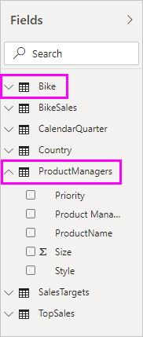

# Composite models in Power BI Desktop (Preview)

Previously in **Power BI Desktop** when you used a DirectQuery in a report, no other data connections whether DirectQuery or Import were allowed for that report. With **composite models** that restriction is removed, and a report can seamlessly include data connections from more than one DirectQuery or import data connection, in any combination you choose.

The **composite models** capability in **Power BI Desktop** consists of three related features:

* **Composite models** - allows a report to have multiple data connections, including DirectQuery connections or import, in any combination thereof.
* **Many-to-many relationships** - with **composite models** you can establish **many-to-many relationships** between tables, removing requirements for unique values in tables, and revoving prior work-arounds such as introducing new tables just to establish relationships. 
* **Storage mode** - you can now specify which visuals require a query to back-end data sources, and those that do no require it are imported even if based on DirectQuery, improving performance and reducing back-end load. Previously, even simple visuals like slicers initiated queries being sent to back-end sources. 

This collection of three related features for **composite models** are each described in separate articles:

* **Composite models** are described in detail in this article.
* **Many-to-many relationships** are described in their own article, [many-to-many relationships in Power BI Desktop (Preview)](desktop-many-to-many-relationships.md).
* **Storage mode** is desribed in its own article, [storage mode in Power BI Desktop (Preview)](desktop-storage-mode.md).

## Enabling the composite models preview feature

The **composite models** feature is in Preview, and must be enabled in **Power BI Desktop**. To enable **composite models**, select **File > Options and Settings > Options > Preview Features**, then select the **composite models** checkbox. 

You'll need to restart **Power BI Desktop** for the feature to be enabled.

## Using composite models

With **composite models**, you can connect to all sorts of different data sources when using **Power BI Desktop** or the **Power BI service**, and you can make those data connections in different ways. You can import data to Power BI, which is the most common way to get data, or you can connect directly to data in its original source repository using DirectQuery. You can learn more about DirectQuery details in the [using DirectQuery in Power BI](desktop-directquery-about.md) article.

When using DirectQuery, with **composite models** it is possible to create a Power BI model (such as a single .pbix Power BI Desktop file) that does the following:

* combines data from one or more DirectQuery sources, and/or
* combines data from DirectQuery sources and import data

For example, with **composite models** it's possible to build a model that combines sales data from an enterprise data warehouse, with data on sales targets that is in a departmental SQL Server database, along with some data imported from a spreadsheet. A model that combines data from more than one DirectQuery source, or combines DirectQuery with imported data is referred to as a *composite model*.

> [!NOTE]
> While composite models are in Preview, it is not possible to publish composite models to the Power BI service. 

You can create relationships between tables as you always have, even when those tables come from different sources, with the following restriction: any relationships that are cross-source must be defined as having a cardinality of **Many-to-Many**, regardless of their actual cardinality. The behavior of such relationships is then the same as normal for **Many-to-Many** relationships, as described in [many-to-many relationships in Power BI Desktop (Preview)](desktop-many-to-many-relationships.md). Note that within the context of composite models, all imported tables are effectively a single source, regardless of the actual underlying data source from which  they are actually imported.   

## Example of using composite models

As an example of a **composite model**, consider a report that has connected to a corporate data warehouse (in SQL Server) using DirectQuery, where the data warehouse contains data of *Sales by Country*, *Quarter*, and *Bike (Product)*, as shown in the following image.

At this point you could build simple visuals using fields from this source. For example, the following visual shows total sales amount by *ProductName*, for a selected quarter. 

But what if you had some information on the Product Manager who had been assigned to each product, along with the marketing priority, where that data is maintained in an Excel spreadsheet? You might want to see *Sales Amount* by *Product Manager*, yet having this local data added to the corporate data warehouse would likely be unfeasible, or take months at best. While it may be possible to import that sales data from the data warehouse (instead of using DirectQuery), at which point it could be combined with data imported from the spreadsheet, that approach is unreasonable given reasons that lead to using DirectQuery in the first place - such as some combination of the security rules enforced in the underlying source, the need to be able to see the latest data, and the sheer scale of the data. 

That's where **composite models** come in. Composite models give you the option of connecting to the data warehouse using DirectQuery, and then also using GetData for additional sources. In this case we establish the DirectQuery connection to the corporate data warehouse, then we use GetData and choose Excel, navigate to the spreadsheet containing our local data, and can import the sheet containing the *ProductNames*, the assigned *SalesManager* and *Priority*.  

Now in the **Fields** list we see the original *Bike* table (from SQL Server) and a new *Product Managers* table (with the data from imported from Excel). 

Similarly, looking at **Relationship View** in **Power BI Desktop**, we now see an additional table called *Product Managers*. 

We now need to relate these to the other tables in the model, which we do as we always have, by creating a relationship between the *Bike* table (in SQL Server) and the *Product Managers* table (that is imported) such as between *Bike[ProductName]* and *ProductManagers[ProductName]*. As discussed earlier in this article, all relationships going across source must have cardinality **Many-to-Many** and as such, that's the default cardinality that is selected. 

Having created this relationship, the relationship is displayed in **Relationship View** in **Power BI Desktop** just as we would expect.

With those table relationships established, we can now create visuals using any of the fields in the **Fields** list, seamlessly blending data from multiple sources. For example, the visual below shows total *Sales Amount* for each *Product Manager*. 

This example shows a common case of a *dimension* table (like *Product* or *Customer*) being extended with some extra data imported from somewhere else, it's also possible to have tables use DirectQuery connecting to different sources. So to extend our example, imagine that *SalesTargets* per *Country* and *Period* are stored in a separate departmental database. You can use **GetData** to connect to that data as you usually would, as shown in the following image. 

Then, similar to what we did earlier in this example, we can create relationships between the new table and other tables in the model, and create visuals that combine their data. Let's look again at the **Relationships View**, where we've established new relationships in our extended example scenario.

As shown in the following image, which is based on the new data and relationships we just created, the visual in the lower left corner shows total *Sales Amount* versus *Target*, with the variance calculation showing the difference, where *Sales Amount* and *Target* are coming from two different SQL Server databases. 

## Setting storage mode

Each table in a **comnposite model** has a **storage mode** that indicates whether the table is based on DirectQuery or import. **Storage mode** can be viewed and modified in the **Property** pane. To get there, select **Properties** from the **Fields** list right-click context menu. The following image shows the **storage mode** (shortened to **Storage ...** in the image, due to the width of the pane).

The **storage mode** can also be seen on the tooltip for each table.

For any **Power BI Desktop** file (a .pbix file) that contains some tables from DirectQuery and some import tables, the status bar show a **storage mode** of **Mixed**. You can click on that term in the status bar and easily switched all tables to import.

Details about **storage mode** are described in full in the [storage mode in Power BI Desktop (Preview)](desktop-storage-mode.md) article.  

## Calculated tables

Calculated tables can be added to a model that uses DirectQuery, and the DAX defining the calculated table can reference either imported or DirectQuery tables, or a combination of both. 

Calculated tables are always imported, and the data in those tables is refreshed when the table is refreshed. As such, if a calculated table references a DirectQuery table, visuals referencing the DirectQuery table always show the latest values in the underlying source, but visuals referencing the calculated table show the values at the time the calculated table was last refreshed.

## Security Implications 

Composite models have some security implications. A query sent to one data source can include data values that have been retrieved from another different source. For the example described earlier in this article, the visual that shows *Sales Amount* by *Product Manager* will result in a SQL query being sent to the **Sales** relational database, where that SQL query might contain the names of *Product Managers* and their associated *Products*. 

Because of this, information that is stored in the spreadsheet is now being included in a query sent to the relational database. If this information is confidential, then the security implications of this should be considered. In particular, you should consider the following implications:

* Any administrator of the database who can see traces or audit logs would be able to see this information, even if they did not have permissions to the data in its original source (in this case, permissions to the Excel file).

* The encryption settings for each source should be considered, to avoid information being retrieved from one source using an encrypted connection, but then inadvertently having it included in a query sent to another source using an unencrypted connection. 

**Power BI Desktop** displays a warning message when an action is taken to create a composite model, to allow confirmation that any security implications have been considered.  

For similar reasons, care must be exercised when opening a **Power BI Desktop** file sent from an untrusted source. If that file contains composite models, it means information retrieved from one source (using the credentials of the user opening the file) would be sent to another data source as part of the query (where it could possibly be seen by the malicious author of the Power BI Desktop file). Thus, when opening a Power BI Desktop file for the first time, if it contains multiple sources, a warning is displayed. This warning is similar to the warning displayed when opening a file that contains native SQL queries.  

## Performance Implications  

When using DirectQuery performance should always be considered, primarily to ensure the backend source has sufficient resources to provide a good experience for users. A good experience means visuals should refresh in 5 seconds or less. You should also adhere to the performance advice in the [using DirectQuery in Power BI](desktop-directquery-about.md) article. Using composite models adds additional performance considerations, since a single visual can result in sending queries to multiple sources, often passing the results from one query across to a second source. This situation can result in the following possible forms of execution:

* **A SQL query that includes a large number of literal values** - for example, a visual requesting total *Sales Amount* (from the SQL database) for a set of selected *Product Managers* (from the related table that was imported from a spreadsheet) would first need to find which *Products* were managed by those Product Managers, before sending a SQL query including all of the product IDs in a *WHERE* clause.

* **A SQL query that queries at a lower level of granularity, with the data then being aggregated locally** - using the same example as the previous bullet item in this list, as the number of *Products* meeting the filter on *Product Manager* becomes very large, at a certain point it becomes inefficient or unfeasible to include them all in a *WHERE* clause. Instead, it's necessary to query the relational source at the lower level of *Product*, and then locally aggregate the results. If the cardinality of *Products* exceeds a limit of 1 million, then the query will fail.

* **Multiple SQL queries, one per group by value** - when the aggregation uses **DistinctCount**, grouped by some column from another source, then if the external source does not support efficient passing of many literal values defining the grouping, it's necessary to send one SQL query per group by value. For example, a visual requesting a distinct count of *CustomerAccountNumber* (from the SQL Server table) by *Product Manager* (from the related table that was imported from a spreadsheet) would need to pass in the details from the *Product Managers* table in the query sent to SQL Server. Over other sources, for example Redshift, this is not feasible and instead there would be one SQL query sent per *Sales Manager* (up to some practical limit, at which point the query would fail). 

Each of these cases has its own implications on performance, with the exact details varying for each data source. A good rule of thumb is that while the cardinality of the columns used in the relationship joining the two sources remains low (a few thousand), then performance should not be significantly impacted. As this cardinality grows, then more consideration needs to be paid to the impact on the resulting performance. 

Additionally, the use of **many-to-many** relationships means that separate queries must be sent to the underlying source for each total/subtotal level, rather than aggregating the detailed values locally. As such, a simple table visual with totals would send two SQL queries, rather than one. 

## Limitations and considerations

There are a few limitations for this release of **composite models**.

The following multidimensional sources cannot be used with **composite models**:

* SAP HANA
* SAP Business Warehouse
* SQL Server Analysis Services
* Power BI datasets

When connecting to those multidimensional sources using DirectQuery, you cannot also connect to another DirectQuery source, nor combine with imported data.

The existing limitations of using DirectQuery still apply when using **composite models**. Many of those limitations are now per table, depending upon the **storage mode** of the table. For example, a calculated column on an imported table can refer to other tables, but a calculated column on a DirectQuery table is still restricted to refer only to columns on the same table. Other limitations apply to the model as a whole, if any of the tables within the model are DirectQuery. For example, the **QuickInsights** and **Q&A** features are not available on a model if any of the tables within it has a **storage mode** of DirectQuery. 

## Next steps

The following articles describe more about composite models, and also describe DirectQuery in detail.

* [Many-to-many relationships in Power BI Desktop (Preview)](desktop-many-to-many-relationships.md)
* [Storage Mode in Power BI Desktop (Preview)](desktop-storage-mode.md)

DirectQuery articles:

* [Using DirectQuery in Power BI](desktop-directquery-about.md)
* [Data sources supported by DirectQuery in Power BI](desktop-directquery-data-sources.md)

