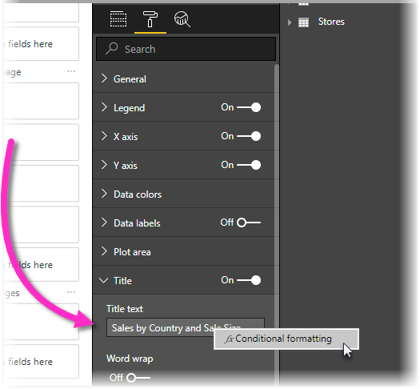

# Expression-based titles in Power BI Desktop

You can create dynamic, customized titles for your Power BI visuals. By creating DAX expressions based on fields, variables, or other programmatic elements, your visuals' titles can automatically adjust and change based on filters, selections, or other user interactions and configurations.



Creating dynamic titles, sometimes called *expression-based titles*, is straightforward. 

## Create a field for your title

The first step in creating an expression-based title is to create a field in your model to use for the title. 

There are all sorts of creative ways to have your visual title reflect what you want it to say, or what you want to express. Let's take a look at a couple examples.

For a straightforward example, you could create an expression that changes based on the filter context that the visual receives for the product's brand name. The following image shows the DAX formula for such a field.


Another example is using a dynamic title that changes based on the user's language or culture. You can create language-specific titles in a DAX measure by using the USERCULTURE() function, which returns the culture code for the user based on their Operating System or Browser settings. You could use the following DAX switch statement to select the correct translated value. 

```
SWITCH (
  USERCULTURE(),
  "de-DE", “Umsatz nach Produkt”,
  "fr-FR", “Ventes par produit”,
  “Sales by product”
)
```

Or you could retrieve the string from a lookup table that you place in your model, that contains all the translations. 

These examples are just a couple of examples you could use to create dynamic, expression-based titles for your visuals in Power BI Desktop. What you could do with your titles are limited only by your imagination, and your model.


## Select your field for your title

Once you've created the DAX expression for the field you create in your model, you need to apply it to your visual's title.

To select the field and apply it, navigate to the *Visualizations* pane. In the *Visualizations* pane, in the *Format* area, select the *Title* drop-down area to show the title options for the visual. 

When you right-click on the *Title text* box, a context menu appears that allows you to select ***fx*Conditional formatting**. When you select that menu item, a *Title text* dialog box appears. 


From that window, you can select the field that you created to use for your title.

## Limitations and considerations

There are a few limitations to the current implementation of expression-based titles for visuals. Those limitations are the following:

* Expression-based formatting isn’t currently supported on Python visuals, R visuals, or the Key Influencers visual
* The field you create for the title must be a string data type. Measures that return numbers or date/time (or any other data type) are not currently supported.

## Next steps

This article described how to create DAX expressions that turn the titles of your visuals into dynamic fields that can change as users interact with your reports. You might find the following articles useful as well.

* [Use cross-report drillthrough in Power BI Desktop](desktop-cross-report-drill-through.md)
* [Use drillthrough in Power BI Desktop](desktop-drillthrough.md)