# Conditional formatting in tables 
With conditional formatting for tables, you can specify customized cell colors based on cell values, or based on other values or fields, including using gradient colors. You can also display cell values with data bars. 

To access conditional formatting, in the **Fields** well of the **Visualizations** pane in Power BI Desktop, select the down-arrow beside the value in the **Values** well that you want to format (or right-click the field). You can only manage conditional formatting for fields in the **Values** area of the **Fields** well.

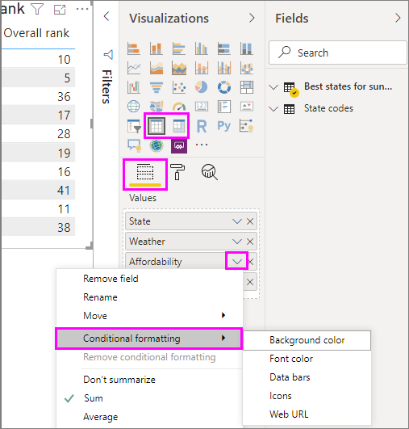

The following sections describe each of these conditional formatting options. One or more options can be combined in a single table column.

> [!NOTE]
> When applied to a table, conditional formatting overrides any custom table styles applied to the conditionally formatted cells.

To remove conditional formatting from a visualization, just right-click the field again, select **Remove conditional formatting** and then the type of formatting to remove.

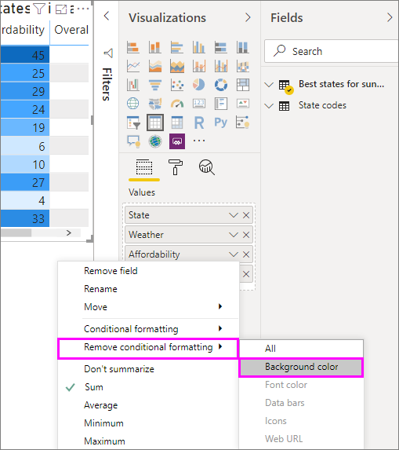

## Background color scales

Selecting **Conditional formatting** and then **Background color scales** brings up the following dialog.

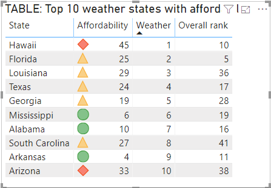

You can select a field from your data model to base the colors on, by setting **Color based on** to that field. In addition, you can specify the aggregation type for the selected field with the **Summarization** value. The field to be colored is specified in the **Apply color to** field, so you can keep track. You can apply conditional formatting to text and date fields, as long as you choose a numeric value as the basis of the formatting.

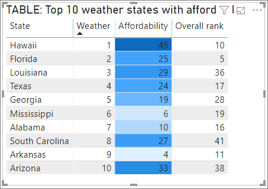

To use discrete color values for given value ranges, select **Color by rules**. To use a color spectrum, leave **Color by rules** unchecked. 

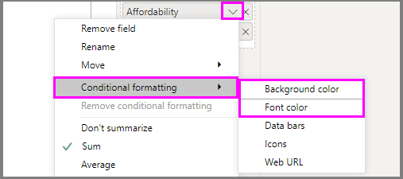

### Color by rules

When you select **Color by rules**, you can enter one or more value ranges, each with a set color.  Each value range starts with an *If value* condition, an *and* value condition, and a color.

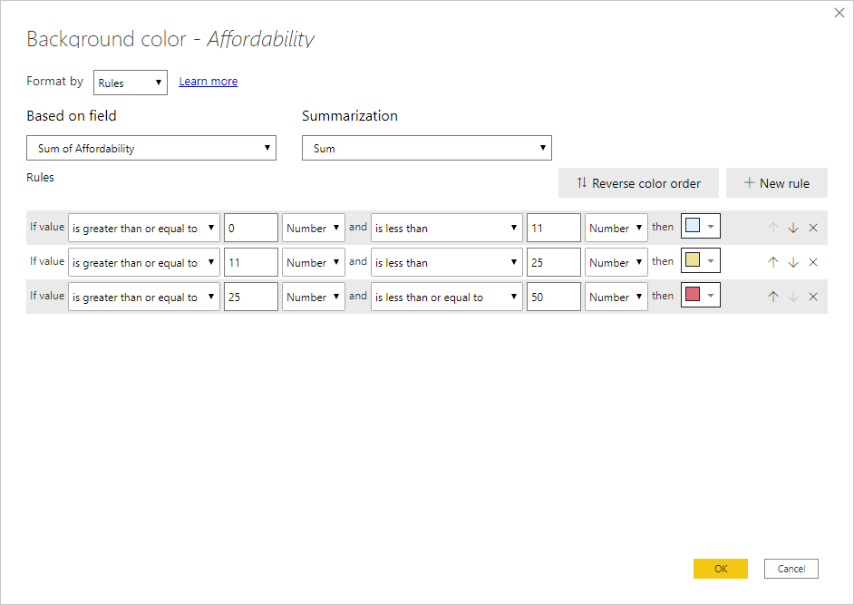

Table cells with values in each range are filled with the given color. There are three rules in the following figure.

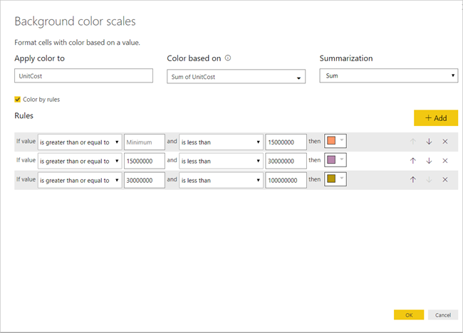

The example table now looks like this:

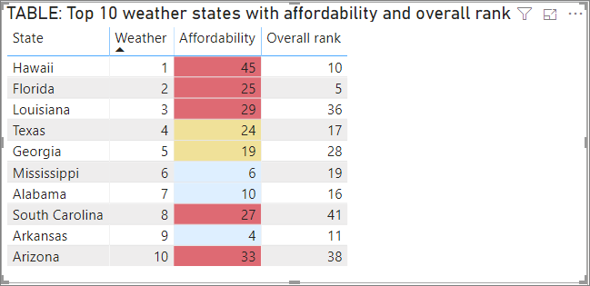

### Color minimum to maximum

You can configure the *Minimum* and *Maximum* values and their colors. If you select the **Diverging** box, you can configure an optional *Center* value as well.

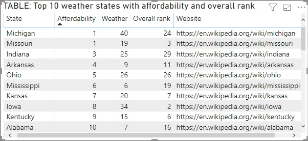

The example table now looks like this:

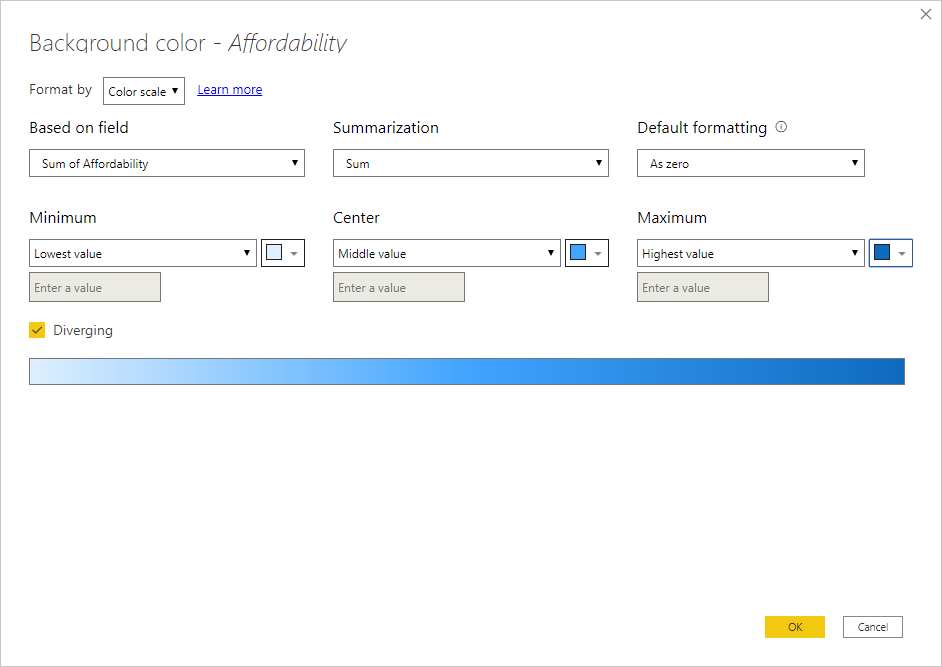

## Font color scales

Selecting **Conditional formatting** and then **Font color scales** brings up the following dialog. This dialog is similar to the **Background color scales** dialog, but changes the font color rather than the cell background color.

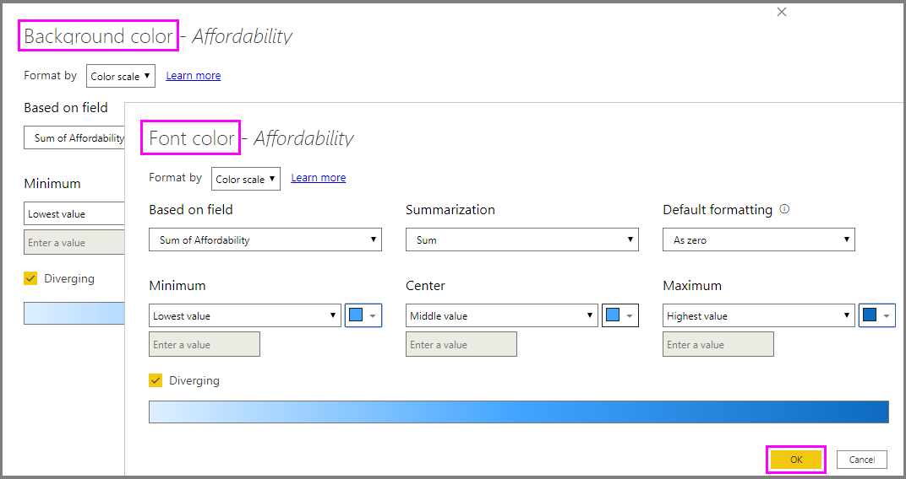

The example table now looks like this:

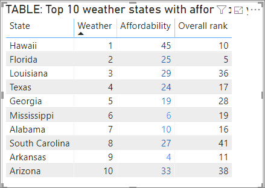

## Data bars

Selecting **Conditional formatting** and then **Data bars** brings up the following dialog. 

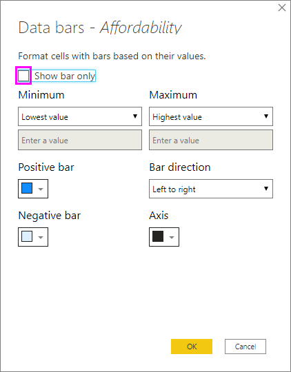

By default, the **Show bar only** option is unchecked, and so the table cell shows both the bar and the actual value.

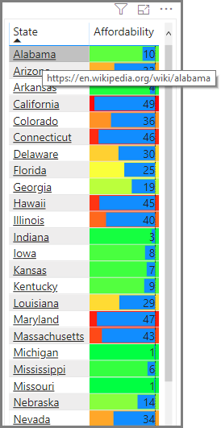

If the **Show bar only** option is checked, the table cell only shows the bar.

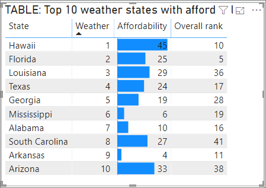

## Color formatting by field value

You can use a measure or a column that specifics a color, either using a text value or a hex code, to apply that color to the background of font color of a table or matrix visual. You can also create custom logic for a given field, and have that logic apply the desired color to the font or background.

For example, in the following table there is a color associated with each product model. 

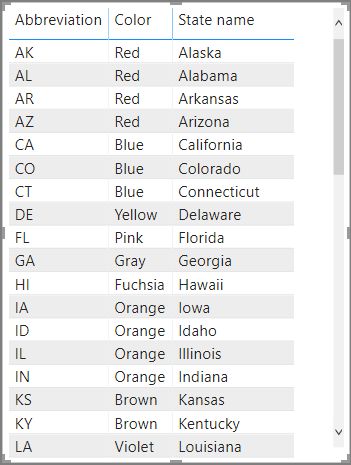

To format that cell based on its field value, select the **Conditional formatting** dialog by right-clicking the *Color* column for that visual, and in this case, select **Background color** from the menu. 

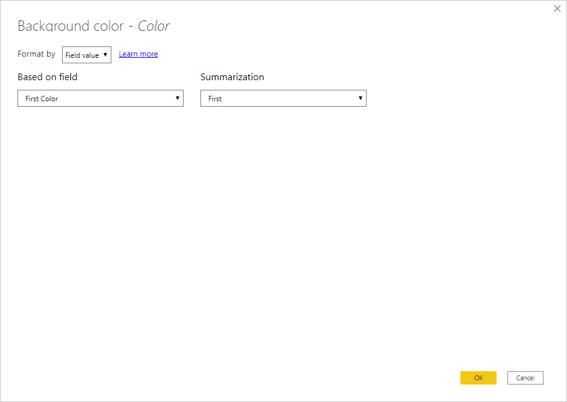

In the dialog that appears, select **Field value** in the **Format by** drop down area, as shown in the following image.

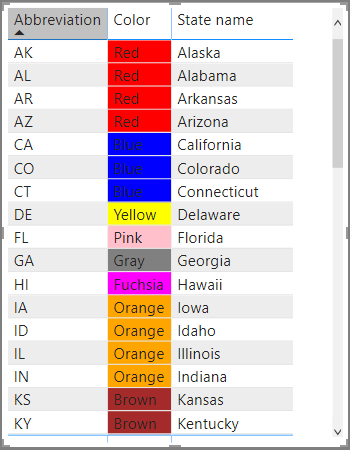

You can repeat that process for the font color, and the result in the visual will be a solid color in the **color** column, as shown in the following screen.

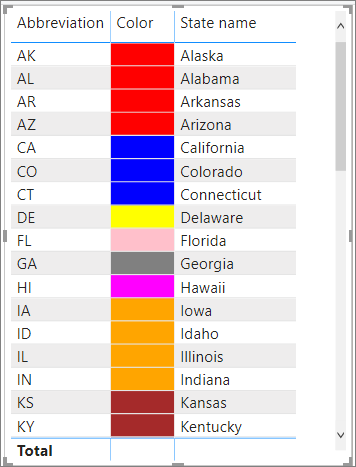

You could also create a DAX calculation based on business logic, that outputs different hex codes based on conditions you prefer. This is generally easier than creating multiple rules in the conditional formatting dialog. Consider the *ColorKPI* field in the following sample image.

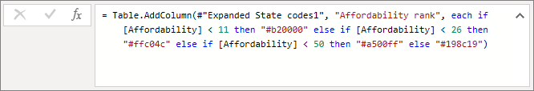

You could then set the field value for **Background color** in the following way.

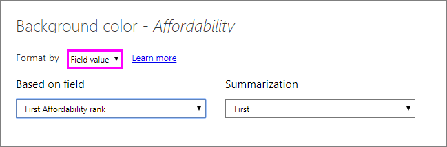

And you could then get results like the following matrix.

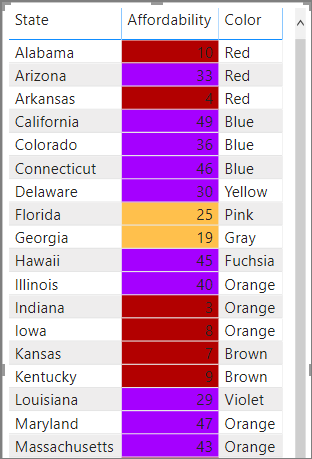

There are many more variations you could create, just by using your imagination and a bit of DAX.

You can use any of the values listed in the CSS color spec at [https://www.w3.org/TR/css-color-3/](https://www.w3.org/TR/css-color-3/) to color your visuals:
* 3, 6 or 8 digit hex codes e.g. #3E4AFF. Make sure you include the # symbol at the start of the code. "3E4AFF" is not accepted. 
* RGB or RGBA values e.g. RGBA(234, 234, 234, 0.5)
* HSL or HSLA values e.g. HSLA(123, 75%, 75%, 0.5)
* Color names e.g. Green, SkyBlue, PeachPuff 

## Next steps
For more information, see the following article:  

* [Tips and tricks for color formatting in Power BI](visuals/service-tips-and-tricks-for-color-formatting.md)  

