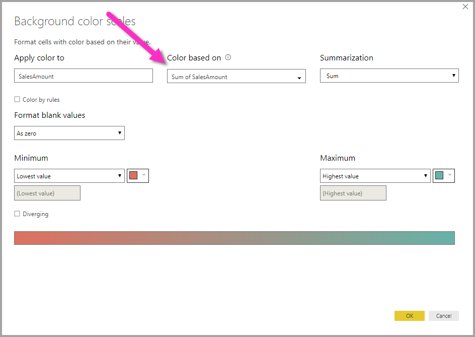

# Conditional formatting in tables
With conditional formatting for tables, you can specify customized cell background colors based on cell values, or based on other values or fields, and you can use gradient colors. To access conditional formatting, in the **Fields** well of the **Visualizations** pane in Power BI Desktop, select the down-arrow beside the value in the **Values** well that you want to format (or right-click the field). You can only manage conditional formatting for fields in the **Values** area of the **Fields** well.

In the dialog that appears, you can configure the color, as well as the *Minimum* and *Maximum* values. If you select the **Diverging** box, you can configure an optional *Center* value as well.

You can also base the color gradient on a field from your data model. In addition, you can specify the aggregation type for the selected field (the field selected is specified in the **Apply color to** field, so you can keep track).

When applied to a table, the customized formatting applied using the steps outlined above overrides any custom table styles applied to the conditionally formatted cells.

You can also apply conditional formatting to text and date fields, as long as you choose a numeric value as the basis of the formatting. 

To remove conditional formatting from a visualization, just right-click the field again, and select **Remove Conditional Formatting**.

