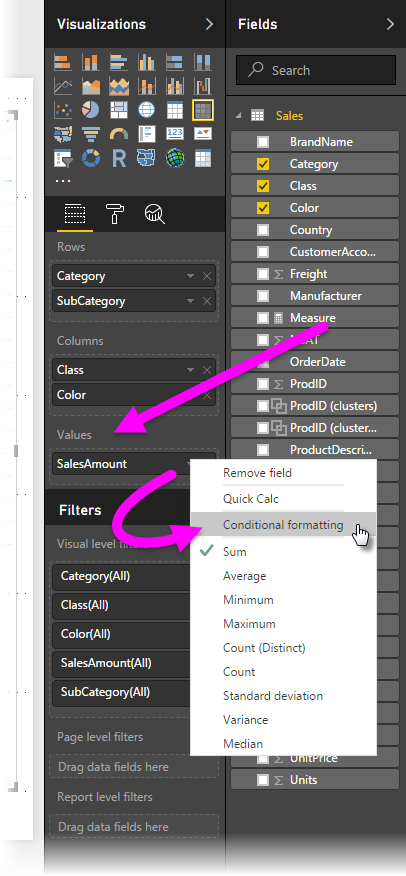
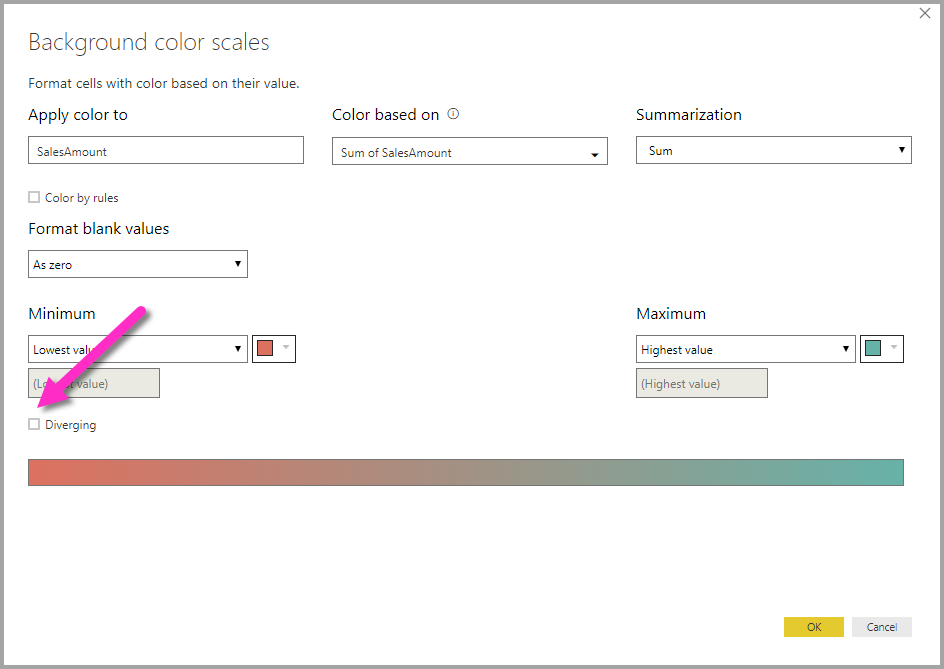

# Conditional formatting in tables
With conditional formatting for tables, you can specify customized cell background colors based on cell values, including using gradient colors. To access conditional formatting, in the **Fields** well of the **Visualizations** pane in Power BI Desktop, select the down-arrow beside the value in the **Values** well that you want to format (or right-click the field). You can only manage conditional formatting for fields in the **Values** area of the **Fields** well.

In the dialog that appears, you can configure the color, as well as the *Minimum* and *Maximum* values. If you select the **Diverging** box, you can configure an optional *Center* value as well.

When applied to a table, the customized formatting applied using the steps outlined above overrides any custom table styles applied to the conditionally formatted cells.

To remove conditional formatting from a visualization, just right-click the field again, and select **Remove Conditional Formatting**.

