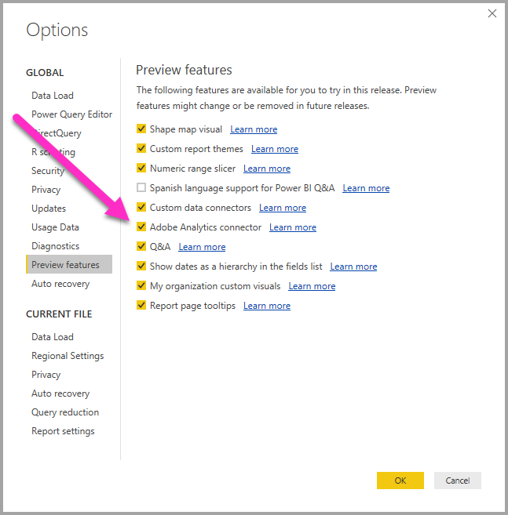

# Connect to Adobe Analytics in Power BI Desktop (preview)
In **Power BI Desktop**, you can connect to **Adobe Analytics** and use the underlying data just like any other data source in Power BI Desktop. 

## Enable the Adobe Analytics connector preview 
Since the **Adobe Analytics** connector is currently in preview, you need to enable the preview feature in order for the connector to be available in the **Get Data** window. To enable the connector preview, select **File > Options and Settings > Options > Preview Features** in Power BI Desktop, then select the checkbox beside **Bookmarks**. 

You'll need to restart **Power BI Desktop** after you make the selection to enable the Adobe Analytics connector preview.

## Connect to Adobe Analytics data
To connect to **Adobe Analytics** data, select **Get Data** from the **Home** ribbon in Power BI Desktop. Select **Online Services** from the categories on the left, and you see **Adobe Analytics connector**.

In the **Adobe Analytics** window that appears, select the **Sign in** button, and provide your credentials to sign in to your Adobe Analytics account. The Adobe sign in window appears, as shown in the following image.

When prompted, put in your username and password. Once the connection is established, you can preview and select multiple dimensions and measures within the Power BI **Navigator** dialog to create a single tabular output. You can also provide any necessary input parameters required for the selected items. 

You can **Load** the selected table, which brings the entire table into **Power BI Desktop**, or you can **Edit** the query, which opens **Query Editor** so you can filter and refine the set of data you want to use, and then load that refined set of data into **Power BI Desktop**.

## Next steps
There are all sorts of data you can connect to using Power BI Desktop. For more information on data sources, check out the following resources:

* [Getting Started with Power BI Desktop](desktop-getting-started.md)
* [Data Sources in Power BI Desktop](desktop-data-sources.md)
* [Shape and Combine Data with Power BI Desktop](desktop-shape-and-combine-data.md)
* [Connect to Excel workbooks in Power BI Desktop](desktop-connect-excel.md)   
* [Enter data directly into Power BI Desktop](desktop-enter-data-directly-into-desktop.md)   

