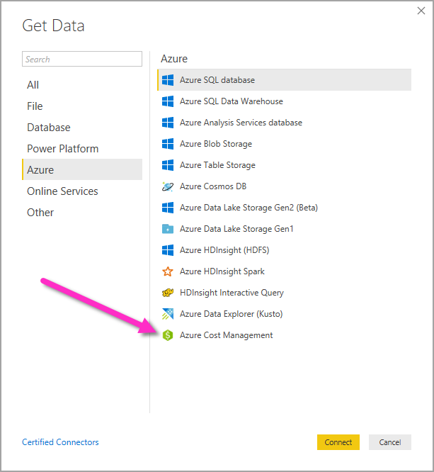
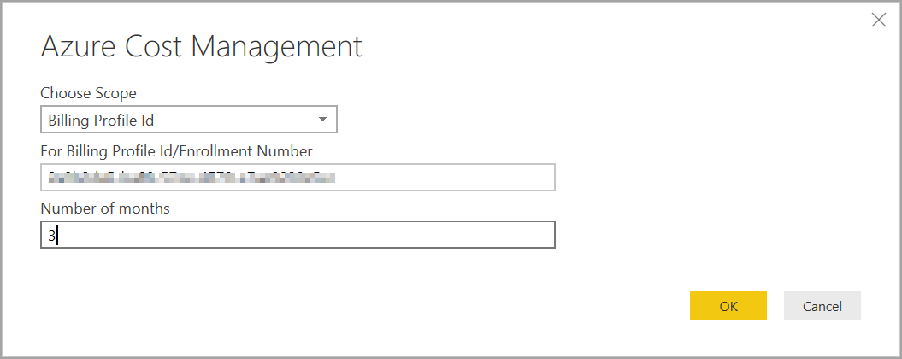
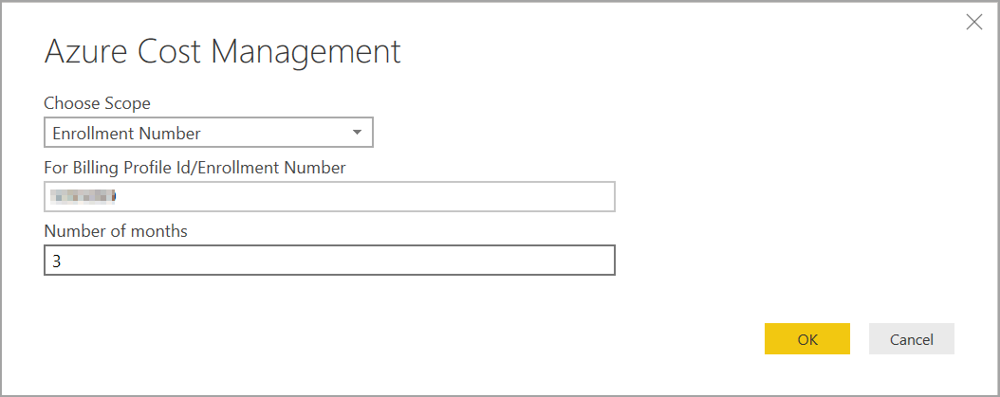
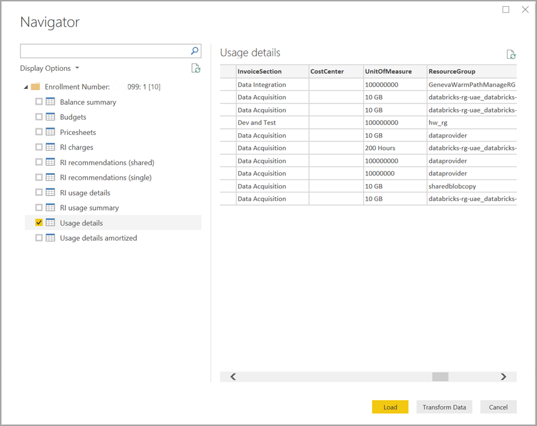

# Create visuals and reports with the Azure Cost Management connector in Power BI Desktop

You can use the Azure Cost Management connector for Power BI Desktop to make powerful, customized visualizations and reports that help you better understand your Azure spend. The Azure Cost Management connector currently supports customers with a [Microsoft Customer Agreement](https://azure.microsoft.com/pricing/purchase-options/microsoft-customer-agreement/) or an [Enterprise Agreement (EA)](https://azure.microsoft.com/pricing/enterprise-agreement/).  

The Azure Cost Management connector uses OAuth 2.0 for authentication with Azure and identifies users who are going to use the connector. Tokens generated in this process are valid for a specific period. Power BI preserves the token for the next login. OAuth 2.0, is a standard for the process that goes on behind the scenes to ensure the secure handling of these permissions. To connect, you must use an [Enterprise Administrator](https://docs.microsoft.com/azure/billing/billing-understand-ea-roles) account for Enterprise Agreements, or a [Billing account owner](https://docs.microsoft.com/azure/billing/billing-understand-mca-roles) for Microsoft Customer Agreements. 

> [!NOTE]
> This connector replaces the previously available [Azure Consumption Insights and Azure Cost Management (Beta)](desktop-connect-azure-consumption-insights.md) connectors. Any reports created with the previous connector must to be recreated using this connector.

## Connect using Azure Cost Management

To use the **Azure Cost Management connector** in Power BI Desktop, take the following steps:

1.	In the **Home** ribbon, select **Get Data**.
2.	Select **Azure** from the list of data catagories.
3.	Select **Azure Cost Management**.

    

4. In the dialog that appears, enter either your **Billing Profile ID** for **Microsoft Customer Agreements**, or your **Enrollment Number** for **Enterprise Agreements (EA)**. 

## Connect to a Microsoft Customer Agreement account 

To connect with a **Microsoft Customer Agreement** account, you can get your **Billing profile ID** from the Azure portal:

1.	In the [Azure portal](https://portal.azure.com/), navigate to **Cost Management + Billing**.
2.	Select your Billing profile. 
3.	Under **Settings** in the menu, select **Properties** in the sidebar.
4.	Under **Billing profile**, copy the **ID**. 
5.	For **Choose Scope**, select **Billing Profile ID** and paste the billing profile ID from the previous step. 
6.	Enter the number of months and select **OK**.

    

7.	When prompted, sign in with your Azure user account and password. 

## Connect to an Enterprise Agreement account

To connect with an Enterprise Agreement (EA) account, you can get your enrollment ID from the Azure portal:

1.	In the [Azure portal](https://portal.azure.com/), navigate to **Cost Management + Billing**.
2.	Select your billing account.
3.	On the **Overview** menu, copy the **Billing account ID**.
4.	For **Choose Scope**, select **Enrollment Number** and paste the billing account ID from the previous step. 
5.	Enter the number of months and then select **OK**.

    

6.	When prompted, sign in with your Azure user account and password. 

## Data available through the connector

Once you successfully authenticate, a **Navigator** window appears with the following available data tables:

| **Table** | **Description** |
| --- | --- |
| **Balance summary** | Summary of the balance for Enterprise Agreements (EA). |
| **Billing events** | Event log of new invoices, credit purchases, etc. Microsoft Customer Agreement only. |
| **Budgets** | Budget details to view actual costs or usage against existing budget targets. |
| **Charges** | A month-level summary of Azure usage, Marketplace charges, and charges billed separately. Microsoft Customer Agreement only. |
| **Credit lots** | Azure credit lot purchase details for the provided billing profile. Microsoft Customer Agreement only. |
| **Pricesheets** | Applicable meter rates for the provided billing profile or EA enrollment. |
| **RI charges** | Charges associated to your Reserved Instances over the last 24 months. |
| **RI recommendations (shared)** | Reserved Instance purchase recommendations based on all your subscription usage trends for the last 7, 30 or 60 days. |
| **RI recommendations (single)** | Reserved Instance purchase recommendations based on your single subscription usage trends for the last 7, 30 or 60 days. |
| **RI usage details** | Consumption details for your existing Reserved Instances over the last month. |
| **RI usage summary** | Daily Azure reservation usage percentage. |
| **Usage details** | A breakdown of consumed quantities and estimated charges for the given billing profile on EA enrollment. |
| **Usage details amortized** | A breakdown of consumed quantities and estimated amortized charges for the given billing profile on EA enrollment. |

You can select a table to see a preview dialog. You can select one or more tables by selecting the boxes beside their name and then select **Load**.

When you select **Load**, the data is loaded into Power BI Desktop. 

When the data you selected is loaded, the data tables and fields are shown in the **Fields** pane.

## Next steps

You can connect to many different data sources using Power BI Desktop. For more information, see the following articles:

* [What is Power BI Desktop?](desktop-what-is-desktop.md)
* [Data Sources in Power BI Desktop](desktop-data-sources.md)
* [Shape and Combine Data with Power BI Desktop](desktop-shape-and-combine-data.md)
* [Connect to Excel workbooks in Power BI Desktop](desktop-connect-excel.md)   
* [Enter data directly into Power BI Desktop](desktop-enter-data-directly-into-desktop.md)   
