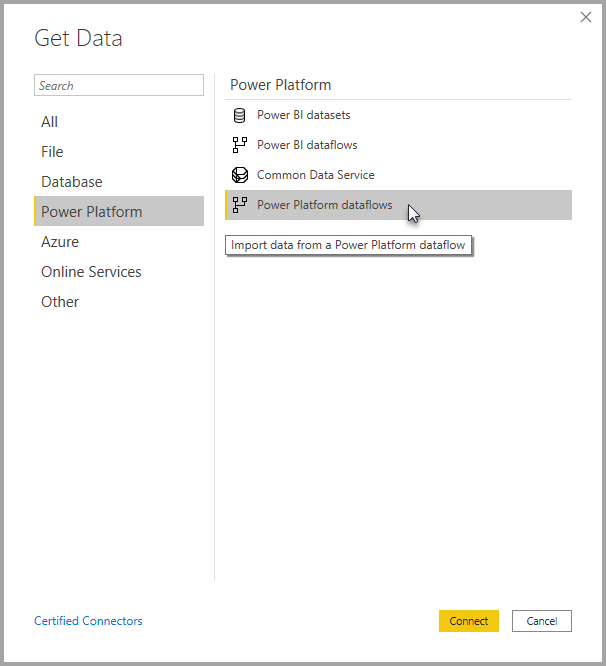

# Connect to data created by Power BI dataflows in Power BI Desktop (Beta)
In **Power BI Desktop**, you can connect to data created by **Power BI dataflows** just like any other data source in Power BI Desktop.

The **Power BI dataflows (Beta)** connector lets you connect to entities created by dataflows in the Power BI service. 

## Considerations and limitations

To use this Beta version of the **Power BI dataflows connector**, you must be running the most recent version of **Power BI Desktop**. You can always [download Power BI Desktop](desktop-get-the-desktop.md) and install it on your computer to ensure you have the most recent version.  

> [!NOTE]
> The previous version of the Power BI dataflows connector required that you download a .MEZ file and place it in a folder. Current versions of **Power BI Desktop** include the Power BI dataflows connector, so that file is no longer required and can cause conflicts with the included version of the connector. If you manually placed that .MEZ file into the folder, you *must* delete that downloaded .MEZ file from your **Documents > Power BI Desktop > Custom connectors** folder to avoid conflicts. 

## Desktop performance
**Power BI Desktop** runs locally on the computer on which it is installed. Ingestion performance of dataflows is determined by a variety of factors. Those factors include the size of the data, your computer's CPU and RAM, network bandwidth, distance form the data center, and other factors.

You can improve data ingestion performance for dataflows. For example, if the ingested data size is too large for **Power BI Desktop** to manage on your computer, you can use linked and computed entities in dataflows to aggregate the data (within dataflows) and ingest only the pre-prepared, aggregated data. 
In that manner, the processing of large data is performed online in dataflows, rather than being performed locally in your running instance of **Power BI Desktop**. That approach lets Power BI Desktop ingest smaller amounts of data, and keeps the experience with dataflows responsive and quick.

## Next steps
There are all sorts of interesting things you can do with Power BI dataflows. For more information, check out the following resources:

* [Self-service data prep with dataflows](service-dataflows-overview.md)
* [Create and use dataflows in Power BI](service-dataflows-create-use.md)
* [Using computed entities on Power BI Premium (Preview)](service-dataflows-computed-entities-premium.md)
* [Using dataflows with on-premises data sources (Preview)](service-dataflows-on-premises-gateways.md)
* [Developer resources for Power BI dataflows (Preview)](service-dataflows-developer-resources.md)

There are also articles about **Power BI Desktop** that you might find useful:

* [Data Sources in Power BI Desktop](desktop-data-sources.md)
* [Shape and Combine Data with Power BI Desktop](desktop-shape-and-combine-data.md)
* [Enter data directly into Power BI Desktop](desktop-enter-data-directly-into-desktop.md)   

