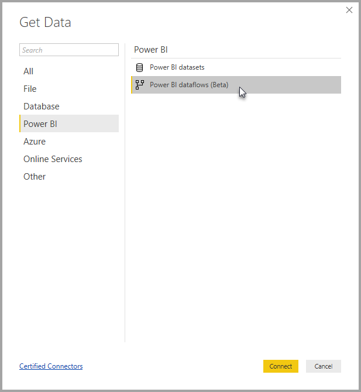

# Connect to data created by Power BI dataflows in Power BI Desktop (Preview)
In **Power BI Desktop**, you can connect to data created by **Power BI dataflows** just like any other data source in Power BI Desktop.

The **Power BI dataflows (preview)** connector lets you connect to entities created by dataflows in the Power BI service. Since dataflows are in preview, there are a few steps you must take to make the dataflows connector available on your system. 

## Download and enable the Power BI dataflows connector (preview)

You must download a copy of the **Power BI dataflows** connector, and then copy it to a specific location on your computer. In an upcoming monthly update to Power BI Desktop, the connector will be automatically included in the list of data connectors, at which time these steps will not be necessary.

You can download the **Power BI dataflows connector** at this location: [Power BI dataflows connector](https://visuals.azureedge.net/cds-analytics/PublicPreview/CDSA.mez)

Take the following steps to make the **Power BI dataflows** connector (preview) available on your computer:

1. Download a copy of the .MEZ file (the data connector file). Private preview customers will receive download information for the .MEZ file directly from Microsoft.

2. Place the downloaded data connector file into the following folder on your computer:
    **Documents > Power BI Desktop > Custom connectors folder**

3. In Power BI Desktop, select **File > Options and settings > Options** then select **Preview features** in the left pane.

    

4. Select the **Custom data connectors** box, if it’s not selected. 

5. Restart **Power BI Desktop** for the connector to appear.

## Use the Power BI dataflows connector (preview)
Once **Power BI Desktop** is restarted, the connector will show up as an available data source. To connect to a datapool, select **Get Data > Online Services > Power BI dataflows (beta)** as shown in the following image:

## Considerations and limitations

To use this preview version of the **Power BI dataflows connector**, you must be running the most recent version of **Power BI Desktop**. You can always [download Power BI Desktop](desktop-get-the-desktop.md) and install it on your computer to ensure you have the most recent version.  

Note: When the Power BI dataflows connector appears in an upcoming monthly update to **Power BI Desktop**, you *must* delete this downloaded .MEZ file from your **Documents > Power BI Desktop > Custom connectors** folder to avoid conflicts. 

## Next steps
There are all sorts of interesting things you can do with Power BI dataflows. For more information, check out the following resources:

* [Self-service data prep with dataflows](service-dataflows-overview.md)
* [Create and use dataflows in Power BI](service-dataflows-create-use.md)
* [Using computed entities on Power BI Premium (Preview)](service-dataflows-computed-entities-premium.md)
* [Using dataflows with on-premises data sources (Preview)](service-dataflows-onpremises-gateways.md)
* [Developer resources for Power BI dataflows (Preview)](service-dataflows-developer-resources.md)

There are also articles about **Power BI Desktop** that you might find useful:

* [Data Sources in Power BI Desktop](desktop-data-sources.md)
* [Shape and Combine Data with Power BI Desktop](desktop-shape-and-combine-data.md)
* [Enter data directly into Power BI Desktop](desktop-enter-data-directly-into-desktop.md)   

