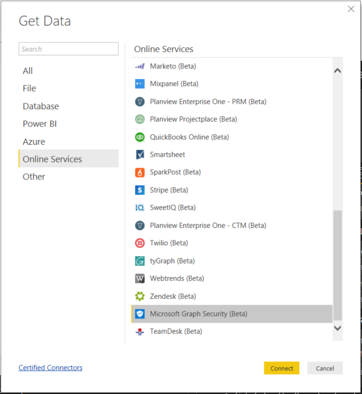
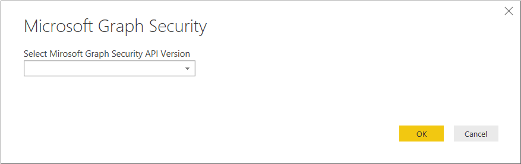
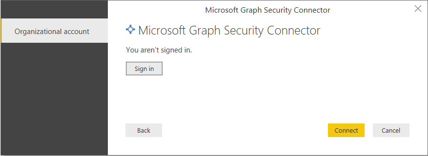
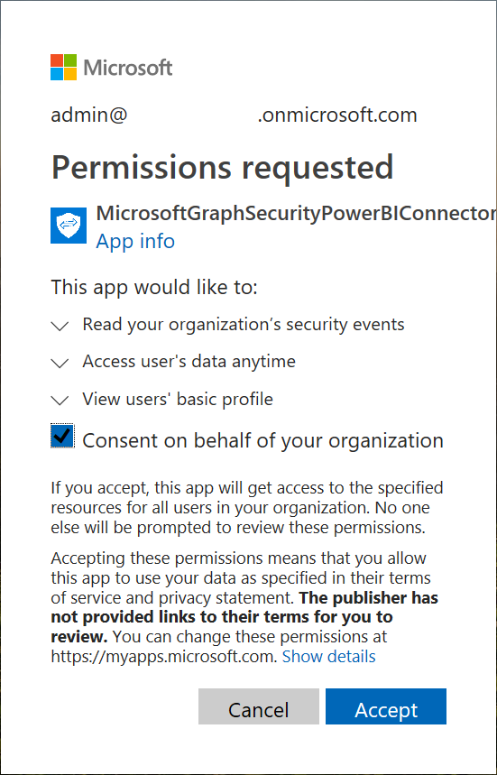
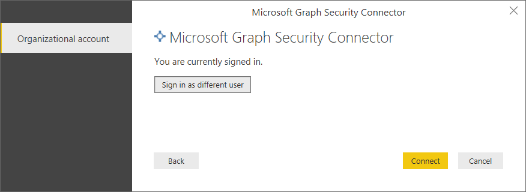
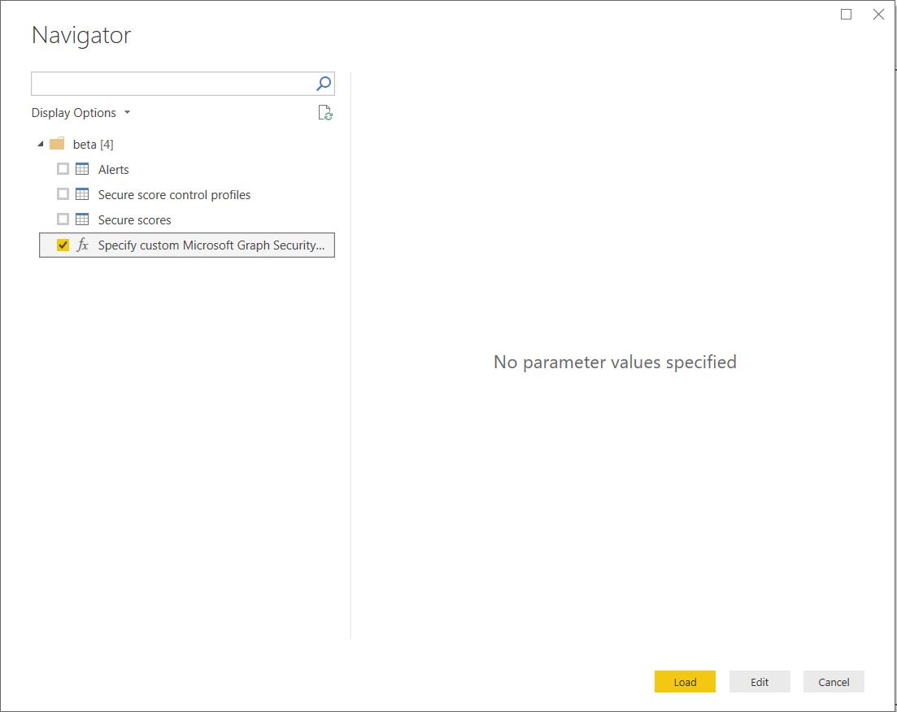
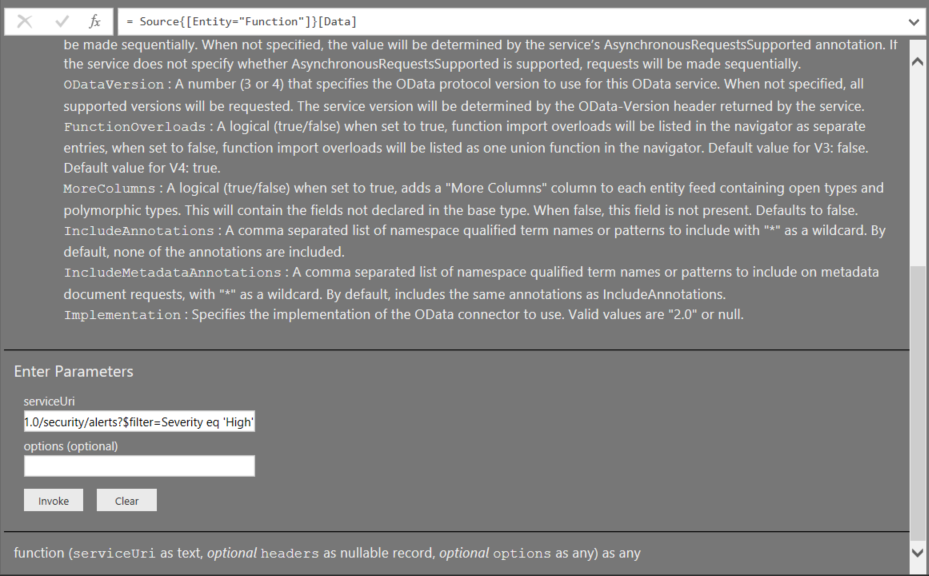
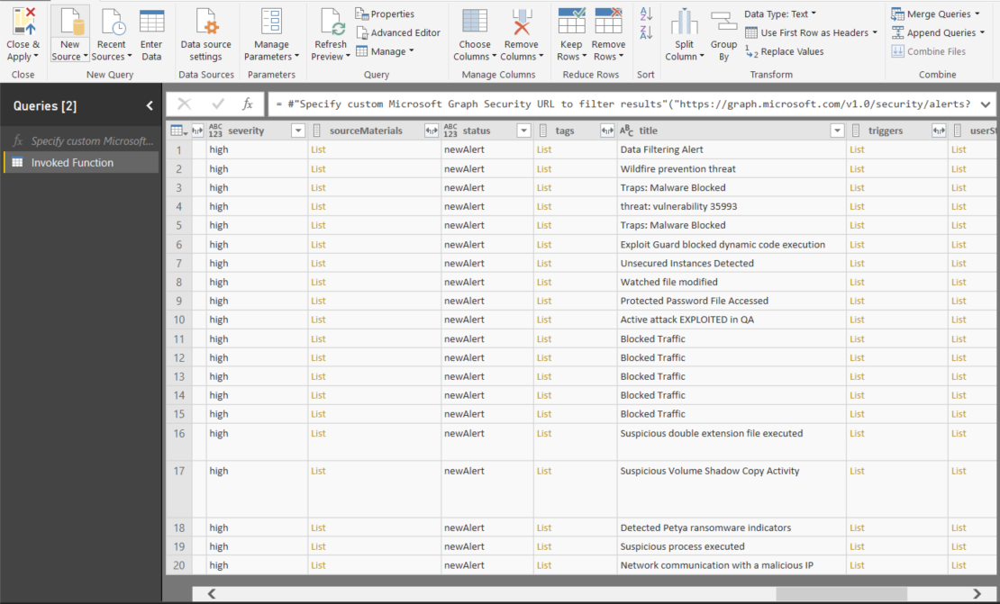

# Connect to Microsoft Graph Security in Power BI Desktop

You can use Power BI Desktop to connect with the Microsoft Graph Security API using the Microsoft Graph Security Power BI connector. This will enable you to build dashboards and reports allowing you to gain insights into your security related [alerts](https://docs.microsoft.com/graph/api/resources/alert?view=graph-rest-1.0) and [Secure Score](https://docs.microsoft.com/graph/api/resources/securescores?view=graph-rest-beta). The [Microsoft Graph Security API](https://aka.ms/graphsecuritydocs) connects [multiple security solutions](https://aka.ms/graphsecurityalerts) from Microsoft and ecosystem partners to enable easier correlation of alerts, provide access to rich contextual information, and simplify automation. This empowers organizations to quickly gain insights and take actions across their security products, while reducing the cost and complexity of building and maintaining multiple integrations.

## Prerequisites to connect with the Microsoft Graph Security connector

* To use the Microsoft Graph Security connector, you must have *explicitly given* Azure Active Directory (AD) tenant administrator consent, which is part of the 
[Microsoft Graph Security Authentication requirements](https://aka.ms/graphsecurityauth). 
This consent requires the Microsoft Graph Security Power BI connector's application ID and name, 
which you can also find in the [Azure portal](https://portal.azure.com):

   | Property | Value |
   |----------|-------|
   | **Application Name** | `MicrosoftGraphSecurityPowerBIConnector` |
   | **Application ID** | `cab163b7-247d-4cb9-be32-39b6056d4189` |
   |||

   To grant consent for the connector, your Azure AD tenant 
   administrator can follow either these steps:

   * [Grant tenant administrator consent for Azure AD applications](https://docs.microsoft.com/en-us/azure/active-directory/develop/v2-permissions-and-consent).

   * During your logic app's first run, your app can request consent 
   from your Azure AD tenant administrator through the 
   [application consent experience](https://docs.microsoft.com/azure/active-directory/develop/application-consent-experience).
   
* The user account used to sign in to connect with the Microsoft Graph Security Power BI connector must be a member of the Security Reader Limited Admin role in Azure AD (either Security Reader or Security Administrator). Follow steps in section [Assign Azure AD roles to users](https://docs.microsoft.com/en-us/graph/security-authorization#assign-azure-ad-roles-to-users). 

## Using the Microsoft Graph Security connector

Follow these steps to use the **Microsoft Graph Security** connector:

1. Select **Get Data -> More…** from the **Home** ribbon in Power BI Desktop.
2. Select **Online Services** from the categories on the left,
3. Click on **Microsoft Graph Security (Beta)**.

    
    
4. In the **Microsoft Graph Security** window that appears, select the Microsoft Graph API version to query. The options are v1.0 and beta.

    
    
5. Sign in to your Azure Active Directory account, when prompted. This account needs to have **Security Reader** role as mentioned in the prerequisites section above.

    
    
6. If you are the tenant admin, **and** if you have not yet given consent to the Microsoft Graph Security Power BI connector (application) per the prerequisites, you will get the following dialog. Make sure to select "**Consent on behalf of your organization**".

    
    
7. When you're signed in, you'll see the following window indicated you've been authenticated. Select **Connect**.

    
    
8. Once you successfully connect, a **Navigator** window appears as follows and displays the entities like alerts, etc. available in the [Microsoft Graph Security API](https://aka.ms/graphsecuritydocs) for the version you selected in the previous steps. Select one or multiple entities to import and use in **Power BI Desktop**. Click **Load** to get the result view outlined in step 10.

    
    
9. If you would like to make an advanced query to the Microsoft Graph Security API, select the **Specify custom Microsoft Graph Security URL to filter results** function. This will allow you to make an [OData.Feed](https://docs.microsoft.com/en-us/power-bi/desktop-connect-odata) query to the Microsoft Graph Security API with the required permissions to access the API.
    > **Note:**  The example serviceUri used below is `https://graph.microsoft.com/v1.0/security/alerts?$filter=Severity eq 'High'`.  Refer to the [Graph supported ODATA query parameters](https://docs.microsoft.com/en-us/graph/query-parameters) to build queries to filter, order or retrieve recent most results.

    
    
    When you select **Invoke** the OData.Feed function makes a call to the API which opens Query Editor so you can filter and refine the set of data you want to use, and then load that refined set of data into Power BI Desktop.
10. The following picture illustrates the result window for the Microsoft Graph Security entity/entities you queried for.

    
    

You’re now ready to use the imported data from the Microsoft Graph Security connector in Power BI Desktop to create visuals, reports, or interact with any other data you might want to connect with and import, such as other Excel workbooks, databases, or any other data source.

## Next Steps
* Check out Power BI samples and templates using this connector at the [Microsoft Graph Security GitHub Power BI sample repo](https://aka.ms/graphsecuritypowerbiconnectorsamples).

* Check out some user scenarios and additional information at the [Microsoft Graph Security Power BI Connector blogpost](https://aka.ms/graphsecuritypowerbiconnectorblogpost).

* There are all sorts of data you can connect to using Power BI Desktop. For more information on data sources, check out the following resources:

    * [What is Power BI Desktop?](desktop-what-is-desktop.md)
    * [Data Sources in Power BI Desktop](desktop-data-sources.md)
    * [Shape and Combine Data with Power BI Desktop](desktop-shape-and-combine-data.md)
    * [Connect to Excel workbooks in Power BI Desktop](desktop-connect-excel.md)
    * [Enter data directly into Power BI Desktop](desktop-enter-data-directly-into-desktop.md)
