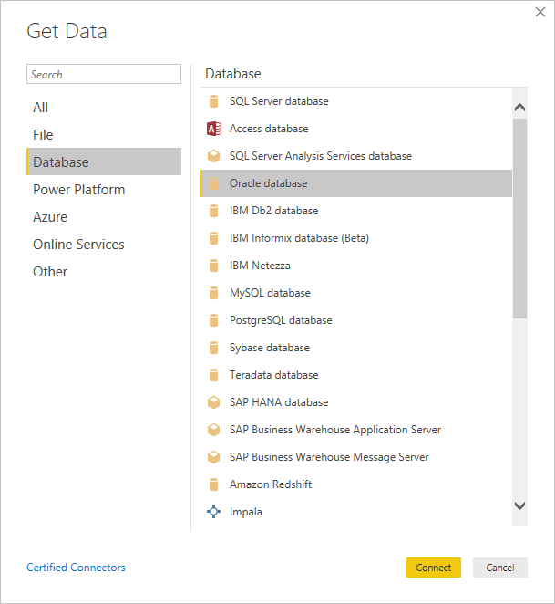
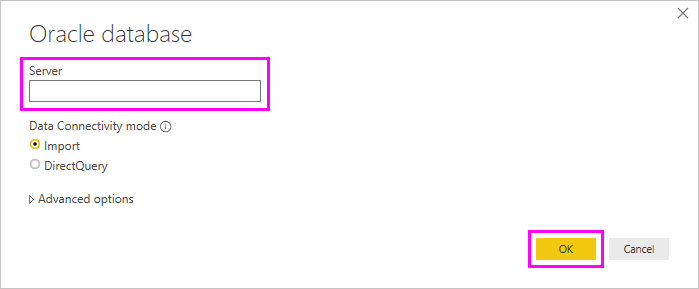

# Connect to an Oracle database
In order to connect to an Oracle database with **Power BI Desktop**, the correct Oracle client software must be installed on the computer running Power BI Desktop. Which Oracle client software you use depends on which version of Power BI Desktop you have installed - the **32-bit** version or the **64-bit** version.

**Supported versions**: Oracle 9 and later, Oracle client software 8.1.7 and later.

## Determining which version of Power BI Desktop is installed
To determine which version of Power BI Desktop is installed, select **File > Help > About** then check the **Version:** line. In the following image, a 64-bit version of Power BI Desktop is installed:

## Installing the Oracle client
For **32-bit** versions of Power BI Desktop, use the following link to download and install the **32-bit** Oracle client:

* [32-bit Oracle Data Access Components (ODAC) with Oracle Developer Tools for Visual Studio (12.1.0.2.4)](http://www.oracle.com/technetwork/topics/dotnet/utilsoft-086879.html)

For **64-bit** versions of Power BI Desktop, use the following link to download and install the **64-bit** Oracle client:

* [64-bit ODAC 12c Release 4 (12.1.0.2.4) for Windows x64](http://www.oracle.com/technetwork/database/windows/downloads/index-090165.html)

## Connect to an Oracle database
Once the matching Oracle client driver is installed, you can connect to an Oracle database. To make the connection, take the following steps:

1. From the Get Data window, select **Database > Oracle Database**
   
   
2. In the **Oracle Database** dialog that appears, provide the name of the server, and select **Connect**. If a SID is required, you can specify that using the format: *ServerName/SID*, where SID is the unique name of the database. If the *ServerName/SID* format doesn't work, try using *ServerName/ServiceName*, where ServiceName is the alias used when connecting.

   

   > [!TIP]
   > If you're having trouble connecting in this step, try using the following format in the Server Name field: (DESCRIPTION=(ADDRESS=(PROTOCOL=TCP)(HOST=host_name)(PORT=port_num))(CONNECT_DATA=(SERVICE_NAME=service_name)))
   
3. If you want to import data using a native database query, you can put your query in the **SQL Statement** box, available by expanding the **Advanced options** section of the **Oracle Database** dialog.
   
   
4. Once your Oracle database information is entered into the Oracle Database dialog (including any optional information such as a SID or a native database query), select **OK** to connect.
5. If the Oracle database requires database user credentials, input those credentials in the dialog when prompted.

## Troubleshooting

If you downloaded Power BI Desktop from the Microsoft Store, you might be unable to connect to Oracle databases because of an Oracle driver issue. If you encounter this issue, the error message returned is "Object reference not set". To address the issue, do one of the following:

* Download Power BI Desktop from https://powerbi.microsoft.com/desktop instead.

* If you want to use the version from the Microsoft Store: on your local computer, copy oraons.dll from _12.X.X\client_X_ into _12.X.X\client_X\bin_. The X represents version and directory numbers.
