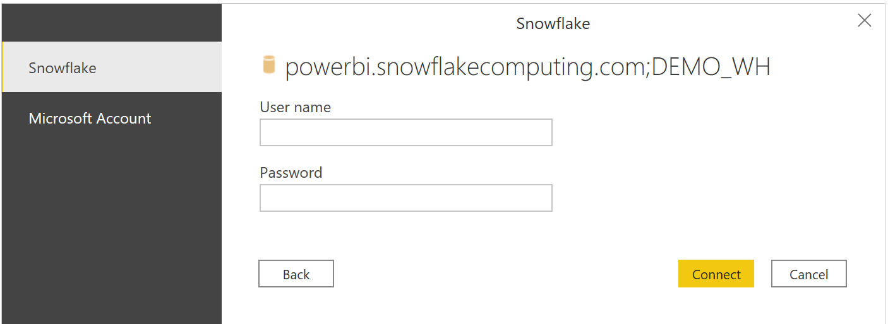

# Connect to Snowflake in Power BI Desktop
In Power BI Desktop, you can connect to a **Snowflake** computing warehouse and use the underlying data just like any other data source in Power BI Desktop. 

> [!NOTE]
> You also *must* install the **Snowflake ODBC driver** on computers that use the **Snowflake** connector, using the architecture that matches the installation of **Power BI Desktop**, either 32-bit or 64-bit. Just follow the following link and [download the appropriate Snowflake ODBC driver](http://go.microsoft.com/fwlink/?LinkID=823762).
> 
> 

## Connect to a Snowflake computing warehouse
To connect to a **Snowflake** computing warehouse, select **Get Data** from the **Home** ribbon in Power BI Desktop. Select **Database** from the categories on the left, and you see **Snowflake**.

In the **Snowflake** window that appears, type or paste the name of your Snowflake computing warehouse into the box and select **OK**. Note that you can choose to **Import** data directly into Power BI, or you can use **DirectQuery**. You can learn more about [using DirectQuery](desktop-use-directquery.md).

When prompted, put in your username and password.

> [!NOTE]
> Once you put in your username and password for a particular **Snowflake** server, Power BI Desktop uses those same credentials in subsequent connection attempts. You can modify those credentials by going to **File > Options and settings > Data source settings**.
> 
> 

Once you successfully connect, a **Navigator** window appears and displays the data available on the server, from which you can select one or multiple elements to import and use in **Power BI Desktop**.

You can **Load** the selected table, which brings the entire table into **Power BI Desktop**, or you can **Edit** the query, which opens **Query Editor** so you can filter and refine the set of data you want to use, and then load that refined set of data into **Power BI Desktop**.

## Next steps
There are all sorts of data you can connect to using Power BI Desktop. For more information on data sources, check out the following resources:

* [What is Power BI Desktop?](desktop-what-is-desktop.md)
* [Data Sources in Power BI Desktop](desktop-data-sources.md)
* [Shape and Combine Data with Power BI Desktop](desktop-shape-and-combine-data.md)
* [Connect to Excel workbooks in Power BI Desktop](desktop-connect-excel.md)   
* [Enter data directly into Power BI Desktop](desktop-enter-data-directly-into-desktop.md)   

