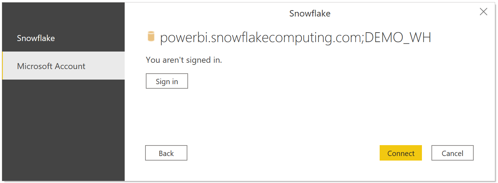

# Connect to Snowflake in Power BI Desktop
In Power BI Desktop, you can connect to a **Snowflake** computing warehouse and use the underlying data just like any other data source in Power BI Desktop. 

> [!NOTE]
> You also *must* install the **Snowflake ODBC driver** on computers that use the **Snowflake** connector, using the architecture that matches the installation of **Power BI Desktop**, either 32-bit or 64-bit. Just follow the following link and [download the appropriate Snowflake ODBC driver](https://go.microsoft.com/fwlink/?LinkID=823762).
> 
> 

## Connect to a Snowflake computing warehouse
To connect to a **Snowflake** computing warehouse, select **Get Data** from the **Home** ribbon in Power BI Desktop. Select **Database** from the categories on the left, and you see **Snowflake**.


In the **Snowflake** window that appears, type or paste the name of your Snowflake computing warehouse into the box and select **OK**. Note that you can choose to **Import** data directly into Power BI, or you can use **DirectQuery**. You can learn more about [using DirectQuery](desktop-use-directquery.md).


When prompted, put in your username and password.


> [!NOTE]
> Once you put in your username and password for a particular **Snowflake** server, Power BI Desktop uses those same credentials in subsequent connection attempts. You can modify those credentials by going to **File > Options and settings > Data source settings**.
> 
> 

If you want to use the Microsoft account option, please contact your Snowflake administrator and have them read the documentation below on enabling Snowflake security integration with AAD.




Once you successfully connect, a **Navigator** window appears and displays the data available on the server, from which you can select one or multiple elements to import and use in **Power BI Desktop**.


You can **Load** the selected table, which brings the entire table into **Power BI Desktop**, or you can **Edit** the query, which opens **Query Editor** so you can filter and refine the set of data you want to use, and then load that refined set of data into **Power BI Desktop**.

## Enabling Snowflake Integration with AAD

> [!NOTE]
> Once you put in your username and password for a particular **Snowflake** server, Power BI Desktop uses those same credentials in subsequent connection attempts. You can modify those credentials by going to **File > Options and settings > Data source settings**.
> 
> 

To enable  Snowflake  integration with Power BI AAD SSO, a user with  Snowflake  admin privileges for the account needs to run the following security integration in  Snowflake.

```
create security integration powerbi_sso
    type = external_oauth
    enabled = true
    external_oauth_type = azure
    external_oauth_issuer = '<AZURE_AD_ISSUER>'
    external_oauth_jws_keys_url = 'https://login.windows.net/common/discovery/keys'
    external_oauth_audience_list = ('https://analysis.windows.net/powerbi/connector/Snowflake')
    external_oauth_token_user_mapping_claim = 'upn'
    external_oauth_snowflake_user_mapping_attribute = 'login_name';
```
where you set ```<AZURE_AD_ISSUER>``` equal to ```https://sts.windows.net/<aad_tenant_id>/``` (e.g. https://sts.windows.net/a828b821-f44f-4698-85b2-3c6749302698/)

To get your Azure Active Directory ID:
* Go to 'Azure Active Directory' in the Azure Portal
* Select Properties on the menu along the left-hand side
* Copy the 'Directory ID'

Note: these settings are for the public production tenants. If you're using sovereign cloud, then modify these settings accordingly.

To make sure that the mapping will work properly between the user attribute and the incoming token, you can grab all user attributes with ```desc user user_name``` and search for the attribute "login_name". This attribute should match the upn value of the user in Azure AD.

The DEFAULT_ROLE user attribute of the user is what will be applied to the user in the SSO session.

> [!NOTE]
> Some users with the highly privileged roles of Account Admin or Security Admin may not be able to use this integration. To fix this, please contact  Snowflake  support.
>
>

If you run into an ODBC error when connecting with Microsoft accounts such as the one below, please refer to the [Troubleshooting Guide](https://docs.snowflake.net/manuals/LIMITEDACCESS/oauth-powerbi.html)


## Next steps
There are all sorts of data you can connect to using Power BI Desktop. For more information on data sources, check out the following resources:

* [What is Power BI Desktop?](desktop-what-is-desktop.md)
* [Data Sources in Power BI Desktop](desktop-data-sources.md)
* [Shape and Combine Data with Power BI Desktop](desktop-shape-and-combine-data.md)
* [Connect to Excel workbooks in Power BI Desktop](desktop-connect-excel.md)   
* [Enter data directly into Power BI Desktop](desktop-enter-data-directly-into-desktop.md)   

