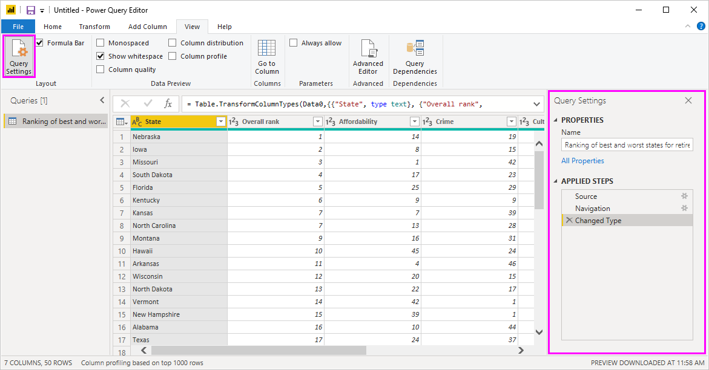
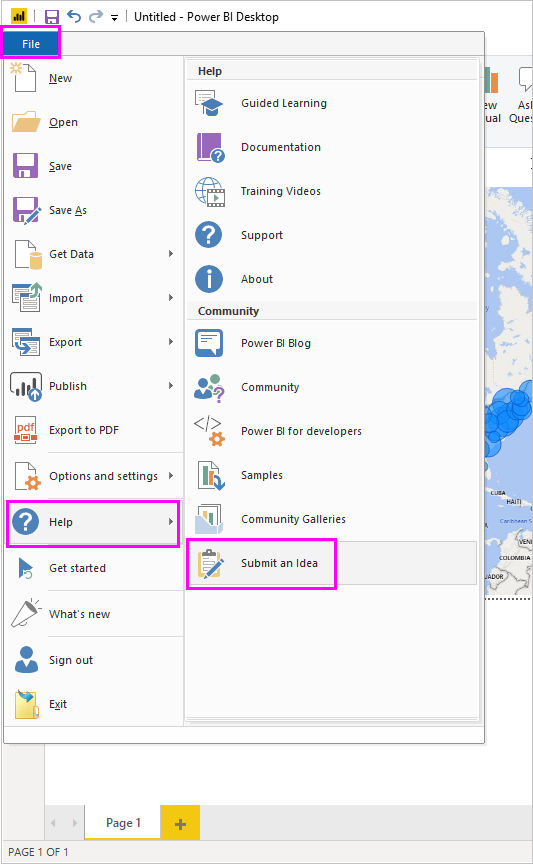

# Connect to data in Power BI Desktop
With Power BI Desktop, you can easily connect to the ever expanding world of data. If you don’t have Power BI Desktop, you can [download](http://go.microsoft.com/fwlink/?LinkID=521662) and install it.

There are *all sorts* of data sources available in Power BI Desktop. The following image shows how to connect to data, by selecting the **File** ribbon, then **Get Data \> More**.

## Example of connecting to data
For this example, we'll connect to a **Web** data source.

Imagine you’re retiring – you want to live where there’s lots of sunshine, preferable taxes, and good health care. Or… perhaps you’re a data analyst, and you want that information to help your customers – as in, help your raincoat manufacturing client target sales where it rains a *lot*.

Either way, you find a Web resource that has interesting data about those topics, and more:

[*http://www.bankrate.com/finance/retirement/best-places-retire-how-state-ranks.aspx*](http://www.bankrate.com/finance/retirement/best-places-retire-how-state-ranks.aspx)

You select **Get Data \> Web** and type the address.

When you select **OK**, the **Query** functionality of Power BI Desktop goes to work. Power BI Desktop contacts the Web resource, and the **Navigator** window returns the results of what it found on that Web page. In this case, it found a table (Table 0) and the overall Document. We’re interested in the table, so we select it from the list. The **Navigator** window displays a preview.

At this point we can edit the query before loading the table, by selecting **Edit** from the bottom of the window, or we can load the table.

If we select **Edit**, the table is loaded and Query Editor is launched. The **Query Settings** pane is displayed (if it’s not, you can select **View** from the ribbon, then **Show \> Query Settings** to display the **Query Settings** pane). Here’s what that looks like.

All those scores are text rather than numbers, and we need them to be numbers. No problem – just right-click the column header, and select **Change Type \> Whole Number** to change them. To choose more than one column, first select a column then hold down **SHIFT**, select additional adjacent columns, and then right-click a column header to change all selected columns. Use **CTRL** to choose columns that are not adjacent.

In **Query Settings**, the **Applied Steps** will reflect any changes that were made. As you make additional changes to the data, Query Editor will record those changes in the **Applied Steps** section, which you can adjust, revisit, rearrange, or delete as necessary.

Additional changes to the table can still be made after it’s loaded, but for now this will do. When we're done we select **Close & Apply** from the **Home** ribbon, and Power BI Desktop applies our changes and closes Query Editor.

With the data model loaded, in **Report** view in Power BI Desktop, we can begin creating visualizations by dragging fields onto the canvas.

Of course, this is a simple model with a single data connection; most Power BI Desktop reports will have connections to different data sources, shaped to meet your needs, with relationships that produce a rich data model. 

## Next steps
There are all sorts of things you can do with Power BI Desktop. For more information on its capabilities, check out the following resources:

* [What is Power BI Desktop?](desktop-what-is-desktop.md)
* [Query Overview with Power BI Desktop](desktop-query-overview.md)
* [Data Sources in Power BI Desktop](desktop-data-sources.md)
* [Shape and Combine Data with Power BI Desktop](desktop-shape-and-combine-data.md)
* [Common Query Tasks in Power BI Desktop](desktop-common-query-tasks.md)   

Want to give us feedback? Great – use the **Submit an Idea** menu item in Power BI Desktop or visit [Community Feedback](http://community.powerbi.com/t5/Community-Feedback/bd-p/community-feedback). We look forward to hearing from you!

