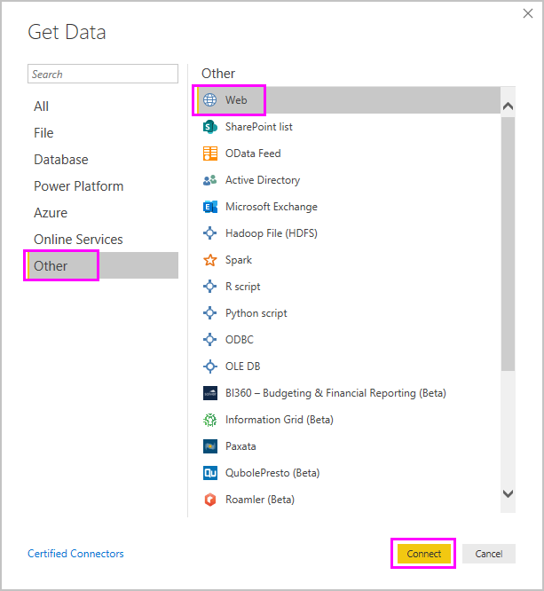

# Get data from a Web page by providing an example

Getting data from a web page lets users easily extract data from web pages, and import that data into **Power BI Desktop**. Often however, data on Web pages aren't in tidy tables that are easy to extract, so getting data from such pages - even if it's structured and consistent -  can be challenging. 

There is a solution. With the **Get Data from Web by example** feature, you can essentially show **Power BI Desktop** which data you want to extract by providing one or more examples within the connector dialog, and it will gather other data on the page that match your examples. With this solution you can extract all sorts of data from Web pages, including  data found in tables *and* other non-table data. 

## Using Get Data from Web by example

To use **Get Data from Web by example**, select **Get Data** from the **Home** ribbon menu. In the window that appears, select **Other** from the categories in the left pane, and then select **Web**.

From there, enter the URL of the Web page from which you'd like to extract data. In this article we'll use the Microsoft Store Web page, and show how this connector works. 

If you want to follow along, you can use the [Microsoft Store URL](https://www.microsoft.com/store/top-paid/games/xbox?category=classics) that we use in this article:

    https://www.microsoft.com/store/top-paid/games/xbox?category=classics

When you select **OK**, you're taken to the **Navigator** dialog where any auto-detected tables from the Web page are presented. In the case shown in the image below, no tables were found, but there is a button on the bottom of the page called **Extract table using examples** that lets you provide examples.

Selecting the **Extract table using examples** presents an interactive window where you can preview the content of the Web page, and enter sample values of the data you would like to extract. 

In this example, we'll extract the *Name* and *Price* for each of the games on the page. We can do that by specifying a couple of examples from the page for each column, as shown in the following image. As those examples are typed in, **Power Query** (which is the underlying technology that extracts the data from the Web page) is able to extract data that fits the pattern of example entries using smart data extraction algorithms.

> Note: Value suggestions only include values less than or equal to 128 characters in length.

Once we're happy with the data extracted from the Web page, we select **OK** to go to **Query Editor**, where we can apply more transformations or shape the data, such as combining this data with other data our sources.

From there, you can create visuals or otherwise use the Web page data when creating your **Power BI Desktop** reports.

## Next steps
There are all sorts of data you can connect to using **Power BI Desktop**. For more information on data sources, check out the following resources:

* [Add column by example](desktop-add-column-from-example.md)
* [Connect to a Web page](desktop-connect-to-web.md)
* [Data Sources in Power BI Desktop](desktop-data-sources.md)
* [Shape and Combine Data with Power BI Desktop](desktop-shape-and-combine-data.md)
* [Connect to Excel workbooks in Power BI Desktop](desktop-connect-excel.md)   
* [Connect to CSV files in Power BI Desktop](desktop-connect-csv.md)   
* [Enter data directly into Power BI Desktop](desktop-enter-data-directly-into-desktop.md)   

