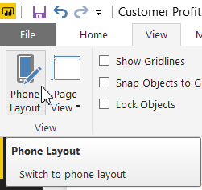
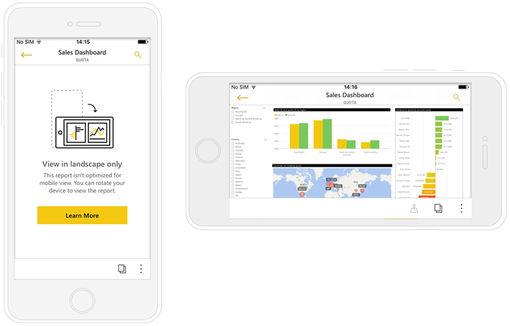

# Create reports optimized for the Power BI mobile apps
You can improve the experience of viewing your reports in the mobile apps on a phone or tablet. Create a portrait layout of a report, specifically for phones and tablets. In Power BI Desktop and in the Power BI service, you adapt your report by rearranging and resizing visuals in a portrait layout for an optimal experience. You don't have to include all of them. Plus you can create [*responsive* visuals](#optimize-a-visual-for-any-size) and [responsive slicers](#enhance-slicers-to-to-work-well-in-phone-reports) that resize well for viewing on a phone. Also, if you add filters to your report, those filters show up automatically in the optimized report. Your report readers can see them and filter the report with them.

## Lay out a portrait version of a report page

After you create a report, you can optimize it for phones and tablets.

1. In Report View in Power BI Desktop, on the **View** tab, select **Phone Layout**.  
   
    
   
    In the Power BI service, select **Edit Report** > **Mobile Layout**.

    You see a blank canvas shaped like a phone. All of the visuals on the original report page are listed in the Visualizations pane on the right.

3. To add a visual to the phone layout, drag it from the Visualizations pane to the phone canvas.
   
    Phone reports use a grid layout. As you drag visuals to the mobile canvas, they snap to that grid.
   
    
   
    You can add some or all the master report page visuals to the phone report page. You can add each visual only once.

4. You can resize your visuals on the grid, as you would for tiles on dashboards and mobile dashboards.
   
   The phone report grid scales across phones of different sizes, so your report looks good on small- and large-screen phones.
   
   

## Optimize a visual for any size
You can set the visuals in your dashboard or report to be *responsive*. They can change dynamically to display the maximum amount of data and insight, no matter the screen size. 

As a visual changes size, Power BI prioritizes the data view. For example, it can remove padding and move the legend to the top of the visual automatically, so the visual remains informative even as it gets smaller.

You choose whether to turn on responsiveness for each visual. Read more about [optimizing visuals](visuals/desktop-create-responsive-visuals.md).

## Considerations when creating phone report layouts
* For reports with multiple pages, you can optimize all the pages or only a few. 
* If you've defined a background color for a report page, the phone report will have the same background color.
* You can’t modify formatting settings for just the phone. Formatting is consistent between master and mobile layouts. For example, font sizes will be the same.
* To change a visual, such as changing its formatting, dataset, filters, or any other attribute, return to the regular report authoring mode.
* Power BI provides default titles and page names for phone reports in the mobile app. If you’ve created text visuals for titles and page names in your report, consider not adding them to your phone reports.     

## Remove a visual from the phone layout
* To remove a visual, click the X in the top-right  of the visual on the phone canvas, or select it and press **Delete**.
  
   Removing the visual here only removes it from the phone layout canvas. The visual and the original report aren't affected.
  
   

## Enhance slicers to work well in phone reports
Slicers offer on-canvas filtering of report data. When designing slicers in the regular report authoring mode, you can modify some slicer settings to make them more usable in phone reports:

* Decide if report readers can select only one or more than one item.
* Put a box around the slicer to make the report easier to scan.
* Make the slicer vertical, horizontal, or *responsive*. 

If you make the slicer responsive, as you change its size and shape it shows more or fewer options. It can be tall, short, wide, or narrow. If you make it small enough, it becomes just a filter icon on the report page. 

Read more about [creating responsive slicers](power-bi-slicer-filter-responsive.md).

## Publish a phone report
* To publish the phone version of a report, you [publish the main report from Power BI Desktop to the Power BI service](desktop-upload-desktop-files.md), and the phone version publishes at the same time.
  
    Read more about [sharing and permissions in Power BI](service-how-to-collaborate-distribute-dashboards-reports.md).

## View optimized and unoptimized reports on a phone or tablet
In the mobile apps on phones, Power BI automatically detects optimized and unoptimized phone reports. If a phone-optimized report exists, the Power BI phone app automatically opens the report in phone report mode.

If a phone-optimized report doesn’t exist, the report opens in the unoptimized, landscape view.  

When in a phone report, changing the phone’s orientation to landscape will open the report in the unoptimized view with the original report layout, whether the report is optimized or not.

If you only optimize some pages, readers will see a message in portrait view, indicating the report is available in landscape.

Report readers can turn their phones or tablets sideways to see the page in landscape mode. Read more about [interacting with Power BI reports optimized for portrait mode](consumer/mobile/mobile-apps-view-phone-report.md).

## Next steps
* [Create a phone view of a dashboard in Power BI](service-create-dashboard-mobile-phone-view.md)
* [View Power BI reports optimized for your phone](consumer/mobile/mobile-apps-view-phone-report.md)
* [Create responsive visuals optimized for any size](visuals/desktop-create-responsive-visuals.md)
* More questions? [Try asking the Power BI Community](http://community.powerbi.com/)

