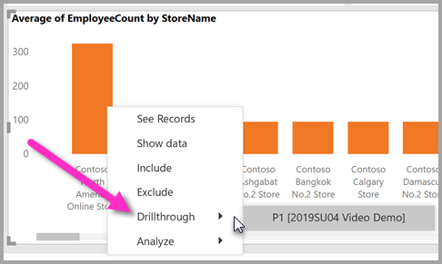
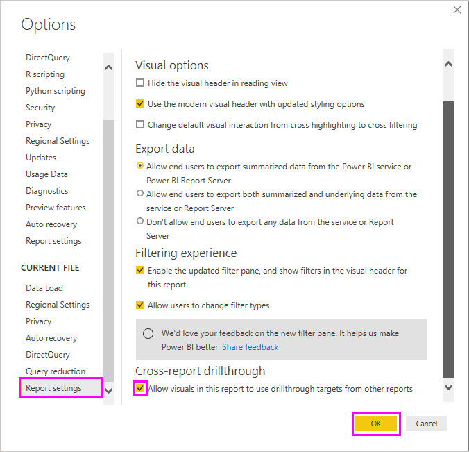
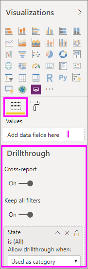

# Use cross-report drillthrough in Power BI Desktop

Early versions of drillthrough in Power BI worked only between pages of a single report. With the cross-report drillthrough feature in **Power BI Desktop**, you can contextually jump from one report to another report, as long as the reports are within the same workspace or app in the **Power BI service**. Cross-report drillthrough is useful in many situations, such as when you want to connect two or more reports that have related content, and want to pass the filter context along with the cross-report connection. In this article you learn how to set up a cross-report drillthrough for Power BI reports, and describes the experience users enjoy when using the cross-report drillthrough for themselves.

The following definitions are important to understand and establish, before we begin setting up and using cross-report drillthrough:

* **Source Visual:** the visual that  invokes the drillthrough action using the visual context menu
* **Source Report:** the report containing the source visual for cross-report drillthrough
* **Target Page:** the page that a user lands on after initiating a drillthrough action
* **Target Report:** the report containing the target page for cross-report drillthrough

## Enable cross-report drillthrough

To enable a report to be the target of a cross-report drillthrough, you must enable the feature for that report in the Options window. Go to **File > Options and settings > Options**, then navigate to **Report settings** near the bottom of the page on the left.

On that page in the Options window, select the checkbox to **Allow visuals in this report to use drillthrough targets from other reports**0, as shown in the following image.

Once set, you're ready to set up cross-report drillthrough in your report.

## Set up cross-report drillthrough

When setting up cross-report drillthrough, the steps are similar to setting up drillthrough within a report. Drillthrough is enabled on the target page, allowing other visuals to target the enabled page for drillthrough. To see the steps for creating drillthrough within a single report, read [use drillthrough in Power BI Desktop](desktop-drillthrough.md).

To start the setup process, you need to take a couple initial steps:

* Set up a drillthrough target page, which can then be accessed from other reports in the workspace or app
* Allow a report to see drillthrough pages from outside its own report

The drillthrough card is found in the **Fields** section of the **Visualizations** pane, as shown in the following image.

The first step in enabling drillthrough for a page is to validate the data models for the source and target reports. Make sure the following are observed: 

* Fields you want to pass must exist in both data models
* The names of the fields, and the names of the tables to which they belong, are identical (the strings must also match, and are case-sensitive)

For example, the schemas in each report don't have to be exactly the same, but if you want to pass a filter on field *Country* within table *Geography*, then both models must have a *Geography* table, and a *Country* field within that table. If not, you must update the field name or table name in the underlying model; simply updating the display name of the fields will not work properly for cross-report drillthrough.

To get started with setup, you need to get the target page ready. In Power BI Desktop, go to the page and make sure the cross-report drillthrough toggle is set to on. 

Next, drag the fields you want to use as the drillthrough target onto the canvas. Select whether you want the field to be used as a category, or summarized like a measure. At this point, you can select whether you want to disable the **Keep all filters** toggle for the visual; set it to off if you don't want to pass other applied filters from the source visual to your target drillthrough visual.

> [!NOTE]
> If you're using the page for cross-report drill only, you should delete the **Back** button that's automatically added. The **Back** botton only works for nagivation within a single report. 

Once you've configured the visual, make sure you save the report if you're in the Power BI service, or save and publish the report if you're using Power BI Desktop.

The previous section described how to enable cross-report drill through for Power BI Desktop (in the **Options** window). If you're using the Power BI service to create a cross-report drillthrough target, to enable cross-report drillthrough you must take the following steps: 

1. Select the workspace in which your target report and source report reside
2. Select **Reports**
3. Select the **Settings** icon for the source report
4. Make sure the cross-report drill toggle is **on**
5. Save your report

That's it, your report is ready for the cross-report drillthrough experience. 

In the next section, we take a look at the experience from the consumer perspective.

## Cross-report drillthrough experience

Once the cross-report drillthrough experience is configured for a report, you can experience it by putting the feature to use.

Select the source report in the Power BI service, and then select a visual using the field or fields in the way you specified when you set up the target page. Next, right-click on a data point to open the visual context menu, and select **drillthrough**.

You'll then see the results in the target cross-report drillthrough page, just as you set them up when you created the target, but filtered according to the drill-through settings.

> [!IMPORTANT]
> Power BI caches cross-report drillthrough targets, so if you make changes, be sure you refresh your browser if you don't see the drillthrough targets as expected. 

Cross-report targets are formatted in the following fashion: 

`Target Page Name [Target Report Name]`

After you select the Target page to which you want to drillthrough, Power BI navigates to that page and passes along filter context based on the settings of the target page. 

Filter context from the source visual can include the following: 

* Report, page, and visual level filters affecting source visual 
* Cross-filter and cross-highlighting that impact the source visual 
* Slicers on the page and sync-slicers
* URL parameters

When you land on the target report for drillthrough, Power BI only applies filters for fields for which exact string matches were found for field name and table name. Power BI does not apply sticky filters from the target report; however, it does apply your default personal bookmark if one exists. For example, if your default personal bookmark includes a report level filter for *Country = US*, then Power BI applies that filter first before applying the filter context from the source visual. 

For cross-report drillthrough, Power BI passes the filter context to all standard pages in the target report. Power BI does not pass filter context for tooltip pages, since tooltip pages are filtered based on the source visual that invokes the tooltip.

If you want to return to the source report after cross-report drillthrough action, use the browser's back button. 

## Next steps

You might also be interested in the following articles:

* [Using slicers Power BI Desktop](visuals/desktop-slicers.md)
* [Use drillthrough in Power BI Desktop](desktop-drillthrough.md)

