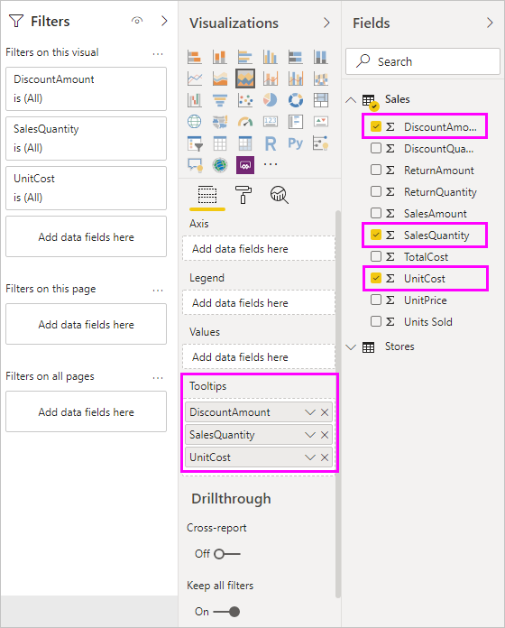
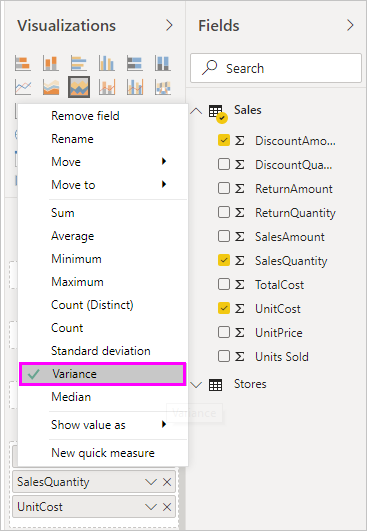

# Customizing Tooltips in Power BI Desktop
Tooltips are an elegant way of providing more contextual information and detail to data points on a visual. The following image shows a tooltip applied to a chart in Power BI Desktop.

When a visualization is created, the default tooltip displays the data point's value and category. There are many instances when being able to customize the tooltip information would be useful, and would provide additional context and information for users viewing the visual. Custom tooltips enable you to specify additional data points that display as part of the tooltip.

## How to customize tooltips
To create a customized tooltip, in the **Fields** well of the **Visualizations** pane, simply drag a field into the **Tooltips** bucket, shown in the following image. In the following image, two fields have been placed into the **Tooltips** bucket.

Once tooltips are added to the field well, hovering over a data point on the visualization shows the values for those fields in the tooltip.

## Customizing tooltips with aggregation or Quick Calcs
You can further customize a tooltip by selecting an aggregation function or a *Quick Calc* by selecting the arrow beside the field in the **Tooltips** bucket, and selecting from the available options.

There are many ways to customize **Tooltips**, using any field available in your dataset, to convey quick information and insights to users viewing your dashboards or reports.

