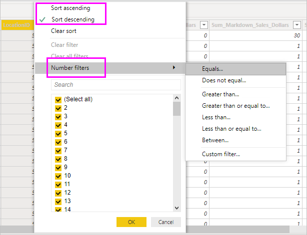

# Work with Data view in Power BI Desktop

*Data view* helps you inspect, explore, and understand data in your *Power BI Desktop* model. It's different from how you view tables, columns, and data in *Power Query Editor*. With Data view, you're looking at your data *after* it has been loaded into the model.

When you're modeling your data, sometimes you want to see what's actually in a table or column without creating a visual on the report canvas. You might want to see right down to the row level. This ability is especially useful when you're creating measures and calculated columns, or you need to identify a data type or data category.

Let's take a closer look at some of the elements found in Data view.

1. **Data view icon**. Select this icon to enter Data view.

2. **Data Grid**. This area shows the selected table and all columns and rows in it. Columns hidden from *Report* view are greyed out. You can right-click on a column for options.

3. **Modeling ribbon**. Here you can manage relationships, create calculations, change data type, format, data category for a column.

4. **Formula bar**. Enter Data Analysis Expression (DAX) formulas for Measures and Calculated columns.

5. **Search**. Search for a table or column in your model.

6. **Fields list**. Select a table or column to view in the data grid.

## Filtering in Data view

You can also filter and sort data in Data view. Each column shows an icon that identifies the sort direction, if applied.

You can filter individual values, or use advanced filtering based on the data in the column.

> [!NOTE]
> When a Power BI model is created in a different culture than your current user interface, the search box will not appear in the Data view user interface for anything other than text fields. For example, this would apply for a model created in US English that you view in Spanish.
