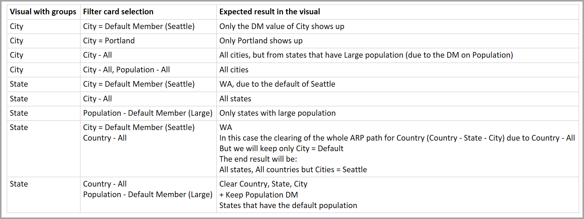

# Default member in multidimensional models in Power BI

You can connect to multidimensional models in Power BI, and create reports that visualize all sorts of data within the model. When working with multidimensional models, Power BI applies rules to how it processes data, based on which column is defined as the *default member*. 

When working with multidimensional models, Power BI handles data from the model based on where the column that contains the **DefaultMember** is used. The *DefaultMember* attribute is set in CSDL (Conceptual Schema Definition Language) for a particular column in a multidimensional model. You can learn more about the default member in its [attribute properties article](https://docs.microsoft.com/sql/analysis-services/multidimensional-models/attribute-properties-define-a-default-member?view=sql-server-2017). When a DAX query is executed, the default member specified in the model is applied automatically.

This article described how Power BI behaves under various circumstances when working with multidimensional models, based on where the *default member* is found. 

## Working with filter cards

When creating a filter card on a field with a default member, the default member field value is selected automatically in the filter card. The result is that all visuals that are affected by the filter card retain their default models in the database. The values in such filter cards reflect that default member.

If the default member is removed, de-selecting the value clears it for all visuals to which the filter card applies, and the values displayed do not reflect the default member.

For example, imagine we have a *Currency* column that has a default member set to *USD*:

* In this example case, if we have a card that shows *Total Sales*, the value will have the default member applied and we see sales that correspond to "USD".
* If we drag *Currency* to the filter card pane, we see *USD* as the default value selected. The value of *Total Sales* remains the same, since the default member is applied.
* However, if we deselect the *USD* value from the filter card, the default member for *Currency* is cleared, and now *Total Sales* reflects all currencies.
* Consequently, when we select another value in the filter card (let's say we select *EURO*), along the default member, the *Total Sales* reflects the filter *Currency IN {USD, EURO}*.

## Grouping behavior

In Power BI, whenever you group a visual on a column that has a *default member*, Power BI clears the *default member* for that column and its attribute relationship path. This ensures the visual displays all values, rather than just the default values.

## Attribute relationship paths (ARPs)

Attribute relationship paths (ARPs) provide *default members* with powerful capabilities, but also introduce a certain amount of complexity. When ARPs are encounter, Power BI follows the path of ARPs to clear additional default members for other columns, to provide consistent, and precise handling of data for visuals.

Let's look at an example to clarify the behavior. Consider the following configuration of ARPs:

Now let's imagine the following *default members* are set for these columns:

* City > Seattle
* State > WA
* Country > US
* Population > Large

Now let's examine what happens when each of the columns is used in Power BI. When visuals group on the following columns, here are the results:

* **City** - Power BI displays all the cities by clearing all the **default members** for *City*, *State*, *Country* but preserves the **default member** for *Population*; Power BI cleared the entire ARP for *City*.
    > [!NOTE]
    > *Population* is not in the ARP path of *City*, it is solely related to *State* and thus Power BI doesn't clear it.
* **State** - Power BI displays all the *States* by clearing all **default members** for *City*, *State*, *Country* and *Population*.
* **Country** - Power BI displays all the countries by clearing all **default members** for *City*, *State* and *Country*, but preserves the **default member** for *Population*.
* **City and State** - Power BI clears all **default members** for all columns.

Groups displayed in the visual have their entire ARP path cleared. 

If a group is not displayed in the visual, but is part of the ARP path of another grouped-on column, the following applies:

* Not all branches of the ARP path are cleared automatically.
* That group is still filtered by that uncleared **default member**.

### Slicers and filter cards

When working with slicers or filter cards, the following behavior occurs:

* When a slicer or filter card is loaded with data, Power BI groups on the column in the visual, so the display behavior is the same as described in the previous section.

Since slicers and filter cards are often used to interact with other visuals, the logic of clearing **default members** for the affected visuals occurs as explained in the following table. 

For this table, we use the same example data used earlier in this article:

The following rules apply for how Power BI behaves in these circumstances.

Power BI clears a **default member** for a given column if:

* Power BI groups on that column
* Power BI groups on a column related to that column (anywhere in the ARP, up or down)
* Power BI filters on a column that is in the ARP (up or down)
* The column has a filter card with *ALL* state
* The column has a filter card with any value selected (Power BI receives a filter for the column)

Power BI does not clear a **default member** for a given column if:

* The column has a filter card with default state, and Power BI is groupings on a column in its ARP.
* The column is above another column in the ARP, and Power BI has a filter card for that other column in default state.

## Next steps

This article described the behavior of Power BI when working with default members in multidimensional models. You might also be interested in the following articles: 

* [Show items with no data in Power BI](desktop-show-items-no-data.md)
* [Data sources in Power BI Desktop](desktop-data-sources.md)
