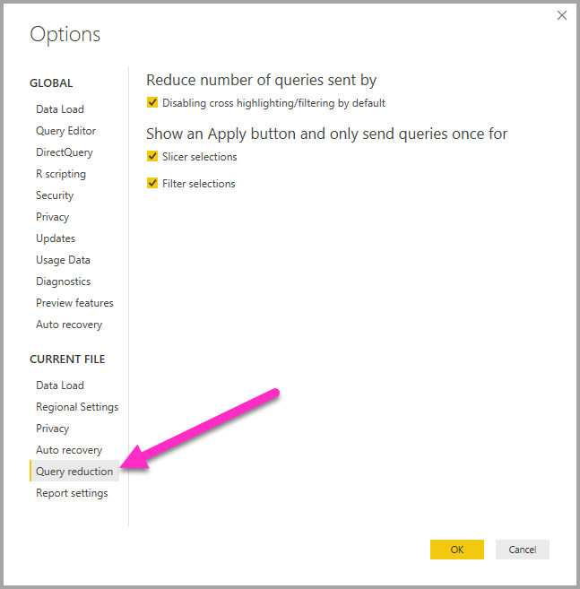
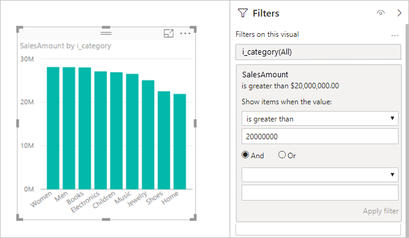
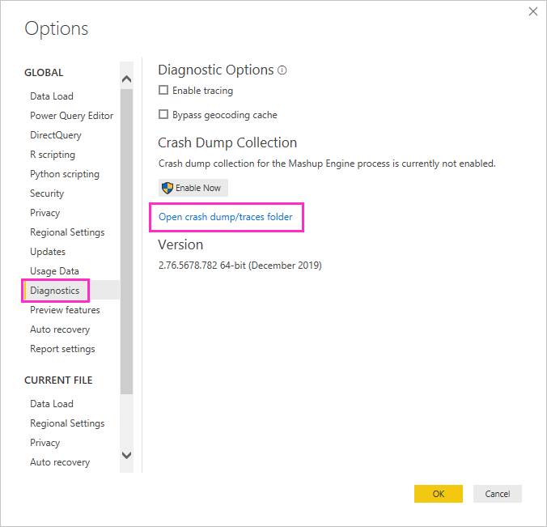
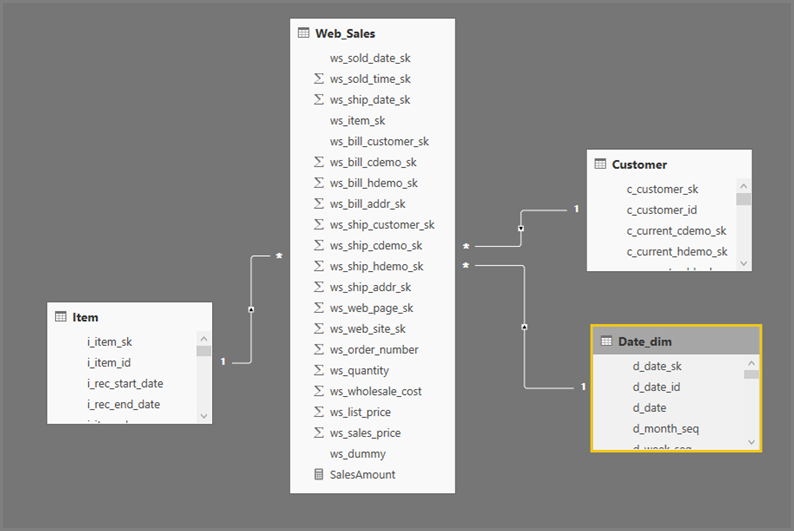
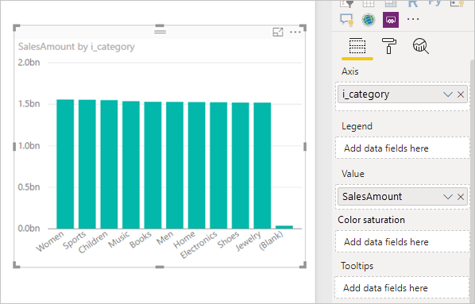
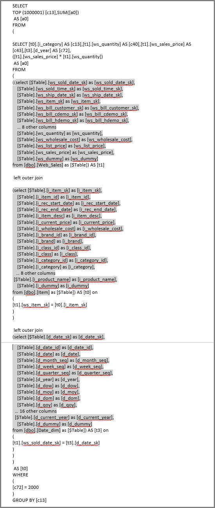

# Using DirectQuery in Power BI
You can connect to all sorts of different data sources when using **Power BI Desktop** or the **Power BI service**, and you can make those data connections in different ways. You can either *import* data to Power BI, which is the most common way to get data, or you can connect directly to data in its original source repository, which is known as **DirectQuery**. This article describes **DirectQuery** and its capabilities, including the following topics:

* Different connectivity options for DirectQuery
* Guidance for when you should consider using DirectQuery rather than import
* Drawbacks of using DirectQuery
* Best practice for using DirectQuery

In short, the best practice for using import versus DirectQuery is the following:

* You should **import** data to Power BI wherever possible. This takes advantage of the high performance query engine of Power BI, and provides a highly interactive and fully featured experience over your data.
* If your goals can't be met by importing data, then consider using **DirectQuery**. For example, if the data is changing frequently and reports must reflect the latest data, DirectQuery may be best. However, using DirectQuery is  generally only feasible when the underlying data source can provide interactive queries (less than 5 seconds) for the typical aggregate query, and is able to handle the query load that will be generated. Additionally, the list of limitations that accompany use of DirectQuery should be considered carefully, to ensure your goals can still be met.

The set of capabilities offered by Power BI for both connectivity modes – import and DirectQuery - will evolve over time. This will include providing more flexibility when using imported data, such that import can be used in more cases, as well as eliminating some of the drawbacks of using DirectQuery. Regardless of improvements, when using DirectQuery the performance of the underlying data source will always remain a major consideration. If that underlying data source is slow, then using DirectQuery for that source will remain unfeasible.

This topic covers DirectQuery with Power BI, and not SQL Server Analysis Services. DirectQuery is also a feature of **SQL Server Analysis Services**, and many of the details described below apply to its use, though there are also important differences. For information about using DirectQuery with SQL Server Analysis Services, see [the whitepaper that details DirectQuery in SQL Server Analysis Services 2016](http://download.microsoft.com/download/F/6/F/F6FBC1FC-F956-49A1-80CD-2941C3B6E417/DirectQuery%20in%20Analysis%20Services%20-%20Whitepaper.pdf).  

This article focuses on the recommended workflow for DirectQuery, where the report is created in **Power BI Desktop**, but also covers connecting directly in the **Power BI service**.

## Power BI connectivity modes
Power BI connects to a very large number of varied data sources, encompassing:

* Online services (Salesforce, Dynamics 365, others)
* Databases (SQL Server, Access, Amazon Redshift, others)
* Simple files (Excel, JSON, others)
* Other data sources (Spark, Web sites, Microsoft Exchange, others)

For these sources, it's usually possible to import the data to Power BI. For some, it is also possible to connect using DirectQuery. The exact set of sources that support DirectQuery is described in the [Data Sources supported by DirectQuery](desktop-directquery-data-sources.md) article. More sources will be DirectQuery enabled in the future, focusing primarily on sources that can be expected to deliver good interactive query performance.

**SQL Server Analysis Services** is a special case. When connecting to SQL Server Analysis Services, you can choose to import the data, or use a *live connection*.  Using a live connection is similar to DirectQuery, in that no data is imported, and the underlying data source is always queried to refresh a visual, but a *live connection* is different in many other regards, so a different term (*live* versus *DirectQuery*) is used.

These three options for connecting to data – **import**, **DirectQuery**, and **live connection** – are explained in detail in the following sections.

### Import connections
When using **Get Data** in **Power BI Desktop** to connect to a data source like SQL Server, and you choose **Import**, the behavior of that connection is as follows:

* During the initial **Get Data** experience, the set of tables selected each define a query that will return a set of data (those queries can be edited prior to loading the data, for example to apply filters, or aggregate the data, or join different tables).
* Upon load, all of the data defined by those queries will be imported into the Power BI cache.
* Upon building a visual within **Power BI Desktop**, the imported data will be queried. The Power BI store ensures the query will be very fast, hence all changes to the visual will be reflected immediately.
* Any changes to the underlying data will not be reflected in any visuals. It is necessary to *Refresh*, whereupon the data will be re-imported.
* Upon publishing the report (the .pbix file) to the **Power BI service**, a dataset is created and uploaded to the Power BI service.  The imported data is included with that dataset. It is then possible to set up scheduled refresh of that data, for example, to re-import the data every day. Depending upon the location of the original data source, it might be necessary to configure an On-premises data gateway.
* When opening an existing report in the **Power BI service**, or authoring a new report, the imported data is queried again, ensuring interactivity.
* Visuals, or entire report pages, can be pinned as dashboard tiles. The tiles will be automatically refreshed whenever the underlying dataset is refreshed.  

### DirectQuery connections
When using **Get Data** in **Power BI Desktop** to connect to a data source, and you choose **DirectQuery**, the behavior of that connection is as follows:

* During the initial **Get Data** experience, the source is selected. For relational sources, this means a set of tables are selected and each still define a query that logically returns a set of data. For multidimensional sources, like SAP BW, only the source is selected.
* However, upon load, no data will actually be imported into the Power BI store. Instead, upon building a visual within **Power BI Desktop**, queries will be sent to the underlying data source to retrieve the necessary data. The time then taken to refresh the visual will depend on the performance of the underlying data source.
* Any changes to the underlying data will not be immediately reflected in any existing visuals. It is still necessary to Refresh, whereupon the necessary queries will be resent for each visual, and the visual updated as necessary.
* Upon publishing the report to the **Power BI service**, it will again result in a Dataset in the Power BI service, just as for import. However, *no data* is included with that dataset.
* When opening an existing report in the **Power BI service**, or authoring a new one, the underlying data source is again queried to retrieve the necessary data. Depending upon the location of the original data source, it might be necessary to configure an On-premises data gateway, just as is needed for Import mode if the data is refreshed.
* Visuals, or entire report pages, can be pinned as Dashboard tiles. To ensure that opening a dashboard will be fast, the tiles are automatically refreshed on a schedule (for example, every hour). The frequency of this refresh can be controlled, to reflect how frequently the data is changing, and how important it is to see the very latest data. Thus, when opening a dashboard, the tiles will reflect the data as of the time of the last refresh, and not necessarily the very latest changes made to the underlying source. An open dashboard can always be Refreshed to ensure it is up-to-date.    

### Live connections
When connecting to **SQL Server Analysis Services** (SSAS), there is an option to either import data from, or connect live to, the selected data model. If you select **import**, then you define a query against that external SSAS source, and the data is imported as normal. If you select to **connect live** then there is no query defined, and the entire external model is shown in the field list. If you select **DirectQuery**, as visuals are built, queries are sent to the external SSAS source. However, unlike DirectQuery, there is no sense in which a new *model* is being created; in other words, it's not possible to define new calculated columns, hierarchies, relationships, and so on. Instead you are simply connecting directly to the external SSAS model.

The situation described in the previous paragraph applies to connecting to the following sources as well, except that there is no option to import the data:

* Power BI datasets (for example, when connecting to a Power BI dataset that has previously been created and published to the service, to author a new report over it)
* Common Data Services

The behavior of reports over SSAS, upon publishing to the **Power BI service**, is similar to DirectQuery reports in the following ways:

* When opening an existing report in the **Power BI service** or authoring a new report, the underlying SSAS source is queried  (possibly requiring an On-premises data gateway)
* Dashboard tiles are automatically refreshed on a schedule (such as every hour, or whatever frequency is defined)

However, there are also important differences, including that for live connections the identity of the user opening the report will always be passed to the underlying SSAS source.

With these comparisons out of the way, let's focus solely on **DirectQuery** for the rest of this article.

## When is DirectQuery useful?
The following table describes scenarios where connecting with DirectQuery could be especially useful, including cases where leaving the data in the original source would be considered beneficial. The description includes a discussion about whether the specified scenario is available in Power BI.

| Limitation | Description |
| --- | --- |
| Data is changing frequently, and near ‘real-time’ reporting is needed |Models with Imported data can be refreshed at most once per hour. Hence, if the data is continually changing, and it is necessary for reports to show the latest data, then using Import with scheduled refresh might simply not meet those needs. Note also that it is also possible to stream data directly into Power BI, though there are limits on the data volumes supported for this case.     Using DirectQuery, by contrast, means that opening or refreshing a report or dashboard will always show the latest data in the source. Additionally, the dashboard tiles can be updated more frequently (as often as every 15 mins). |
| Data is very large |If the data is very large, then it certainly would not be feasible to import it all. DirectQuery, by contrast, requires no large transfer of data, as it is queried in place.     However, large data might also imply that the performance of the queries against that underlying source are too slow (as discussed in *Implications of using DirectQuery* section, later in this article). And of course it is not always necessary to import the full detailed data. Instead the  data can be pre-aggregated during import (and **Query Editor** makes it easy to do exactly this). In the extreme it would be possible to import exactly the aggregate data needed for each visual. So while DirectQuery is the simplest approach to large data, you should always keep in mind that importing aggregate data might offer a solution if the underlying source is too slow. |
| Security rules are defined in the underlying source |When the data is imported,  Power BI will connect to the data source using the current user's credentials (from Power BI Desktop), or the credentials defined as part of configuring scheduled refresh (from the Power BI service). Thus, in publishing and sharing such a report, care must be taken to only share with users allowed to see the same data, or to define Row Level Security as part of the dataset.     Ideally, because DirectQuery always queries the underlying source, this would allow any security in that underlying source to be applied. However, today Power BI will always connect to the underlying source using the same credentials as would be used for Import.     Thus, until Power BI allows for the identity of the report consumer to pass through to the underlying source, DirectQuery offers no advantages with regard to data source security. |
| Data sovereignty restrictions apply |Some organizations have policies around data sovereignty, meaning that data cannot leave the organization premises. A solution based on import would clearly present issues. By contrast, with DirectQuery that data remains in the underlying source.     However, it should be noted that even with DirectQuery, some caches of data at the visual level are retained in the Power BI service (due to scheduled refresh of tiles). |
| Underlying data source is an OLAP source, containing measures |If the underlying data source contains *measures* (such as SAP HANA or SAP Business Warehouse), then importing the data brings other issues. It means that the data imported is at a particular level of aggregation, as defined by the query. For example, measures TotalSales by Class, Year, and  City. Then if a visual is built asking for data at a higher level aggregate (such as TotalSales by Year), it is further aggregating the aggregate value. This is fine for additive measures (such as Sum, Min), but it's an issue for non-additive measures (such as Average, DistinctCount).     To make it easy to get the correct aggregate data (as needed for the particular visual) directly from the source, it would be necessary to send queries per visual, as in DirectQuery.     When connecting to SAP Business Warehouse (BW), choosing DirectQuery allows for this treatment of measures. Support for SAP BW is covered further in [DirectQuery and SAP BW](desktop-directquery-sap-bw.md).     However, currently DirectQuery over SAP HANA treats it the same as a relational source, and hence provides similar behavior to import. This is covered further in [DirectQuery and SAP HANA](desktop-directquery-sap-hana.md). |

So in summary, given the current capabilities of DirectQuery in Power BI, the scenarios where it offers benefits are the following:

* Data is changing frequently, and near ‘real-time’ reporting is needed
* Handling very large data, without the need to pre-aggregate
* Data sovereignty restrictions apply
* The source is a multi dimensional source containing measures (such as SAP BW)

Note that the details in the previous list relate to the use of Power BI alone. There is always the option of instead using an external SQL Server Analysis Services (or Azure Analysis Services) model to import data, and then using Power BI to connect to that model. While that approach would require additional skills, it does provide greater flexibility. For example, much larger volumes of data can be imported, and there is no restriction on how frequently the data can be refreshed.

## Implications of using DirectQuery
Use of **DirectQuery** does have potentially negative implications, as detailed in this section. Some of those limitations are slightly different depending upon the exact source that is being used. This will be called out where applicable, and separate topics cover those sources that are substantially different.  

### Performance and load on the underlying source
When using **DirectQuery**, the overall experience depends very much on the performance of the underlying data source. If refreshing each visual (for example, after changing a slicer value) takes a few seconds (<5s) then the experience would be reasonable, yet might still feel sluggish compared to the immediate response we are used to when importing the data to Power BI. If instead the slowness of the source means that individual visuals take longer than that (tens of seconds), then the experience becomes extremely poor, possibly even to the point of queries timing out.

Along with the performance of the underlying source, careful consideration should be paid to the load that will be placed upon it (that of course then often impacts the performance). As discussed further below, each user that opens a shared report, and each dashboard tile that is periodically refreshed, will be sending at least one query per visual to the underlying source. This fact requires that the source be able to handle such a query load, while still maintaining reasonable performance.

### Limited to a single source
When importing data, it is possible to combine data from multiple sources into a single model, for example, to easily join some data from a corporate SQL Server database with some local data maintained in an Excel file. This is not possible when using DirectQuery. When selecting DirectQuery for a source, it will then only be possible to use data from that single source (such as a single SQL Server database).

### Limited data transformations
Similarly, there are limitations in the data transformations that can be applied within **Query Editor**. With imported data, a sophisticated set of transformations can easily be applied to clean and re-shape the data before using it to create visuals (such as parsing JSON documents, or pivoting data from a column to a row orientated form). Those transformations are more limited in DirectQuery. First, when connecting to an OLAP source like SAP Business Warehouse, no transformations can be defined at all, and the entire external ‘model’ is taken from the source. For relational sources, like SQL Server, it is still possible to define a set of transformations per query, but those transformations are limited for performance reasons. Any such transformation will need to be applied on every query to the underlying source, rather than once on data refresh, so they are limited to those transformations that can reasonably be translated into a single native query. If you use a transformation that is too complex, then you will receive an error that either it must be deleted, or the model switched to Import mode.

Additionally, the query that results from the **Get Data** dialog or **Query Editor** will be used in a subselect within the queries generated and sent to retrieve the necessary data for a visual. Thus the query defined in Query Editor must be valid within this context. In particular, this means it is not possible to use a query using Common Table Expressions, nor one that invokes Stored Procedures.

### Modeling limitations
The term *modeling* in this context means the act of refining and enriching the raw data, as part of authoring a report using it. Examples include:

* Defining relationships between tables
* Adding new calculations (calculated columns and measures)
* Renaming and hiding columns and measures
* Defining hierarchies
* Defining the formatting, default summarization and sort order for a column
* Grouping or clustering values

When using **DirectQuery**, many of these model enrichments can still be made, and certainly there is still the principle that the raw data is being enriched, so as to improve later consumption. However, there are some modeling capabilities that are not available, or are limited, when using DirectQuery. The limitations are generally applied to avoid performance issues. The set of limitations that are common to all DirectQuery sources are listed in the following bulleted list. Additional limitations might apply to individual sources, as described in *Data source specific details* found near the end of this article.

* **No built-in date hierarchy:** When importing data, then by default every date/datetime column will also have a built-in date hierarchy available by default. For example, if importing a table of sales orders including a column OrderDate, then upon using OrderDate in a visual, it will be possible to choose the appropriate level (Year, Month, Day) to use. This built-in date hierarchy is not available when using DirectQuery mode. Note however that if there is a Date table available in the underlying source (as is common in many data warehouses) then the DAX Time Intelligence functions can be used as normal.
* **Limitations in calculated columns:** Calculated columns are limited to being intra-row, as in, they can only refer to values of other columns of the same table, without the use of any aggregate functions. Additionally, the DAX scalar functions (such as LEFT()) that are allowed, will be limited to those which can simply be pushed to the underlying source, hence will vary depending upon the exact capabilities of the source. Functions that are not supported will not be listed in autocomplete when authoring the DAX for a calculated column, and would result in an error if used.
* **No support for parent-child DAX functions:** When in DirectQuery model, it is not possible to use the family of DAX PATH() functions, that generally handle Parent-Child structures (such as chart of accounts, or employee hierarchies).
* **Limitations (by default) for measures:** By default, the DAX functions and expressions that can be used in measures are restricted. Again, autocomplete will restrict the functions listed, and an error will occur if an invalid function or expression is used. The reason is simply to ensure that, by default, measures are restricted to simple measures that are unlikely by themselves to cause any performance issues. Advanced users can choose to bypass this limitation by selecting **File > Options and settings > Options** and then **DirectQuery**, then selecting the option *Allow unrestricted measures in DirectQuery mode*. When that option is selected, any DAX expression that is valid for a measure can be used. Users must be aware, however, that some expressions that perform well when the data is imported may result in very slow queries to the backend source when in DirectQuery mode.
  
  * For example, by default:
    
    * It would be possible to author a measure that simply summed the sales amount:
      
          SalesAmount = SUMX(Web_Sales, [ws_sales_price]* [ws_quantity])
    * It would *not* be possible to author a measure that then averaged that SalesAmount over all of the Items:
      
          AverageItemSalesAmount = AVERAGEX('Item', [SalesAmount])
    
    The reason is that such a measure could result in poor performance if there were a very large number of items.
* **Calculated tables are not supported:** The ability to define a calculated table using a DAX expression is not supported in DirectQuery mode.
* **Relationship filtering is limited to a single direction:** When using DirectQuery, it is not possible to set the Cross Filter direction on a relationship to “Both”. For example, with the three tables below, it would not be possible to build a visual showing each Customer[Gender], and the number of Product[Category] bought by each. Use of such bi-directional filtering is described [in this detailed whitepaper](http://download.microsoft.com/download/2/7/8/2782DF95-3E0D-40CD-BFC8-749A2882E109/Bidirectional%20cross-filtering%20in%20Analysis%20Services%202016%20and%20Power%20BI.docx) (the paper presents examples in the context of SQL Server Analysis Services, but the fundamental points apply equally to Power BI).
  
  
  
  Again, the limitation is imposed due to the performance implications. One particularly important application of this is when defining Row Level Security as part of the report, as a common pattern is to have a many-many relationship between the users and the entities they are allowed access to, and use of bi-directional filtering is necessary to enforce this. However, use of bi-directional filtering for DirectQuery models should be used judiciously, with careful attention paid to any detrimental impact on performance.  
* **No Clustering:** When using DirectQuery, it is not possible to use the Clustering  capability, to automatically find groups

### Reporting limitations
Almost all reporting capabilities are supported for DirectQuery models. As such, so long as the underlying source offers a suitable level of performance, the same set of visualizations can be used. However, there are some important limitations in some of the other capabilities offered in the **Power BI service** after a report is published, as described in the following bullets:

* **Quick Insights is not supported:** Power BI Quick Insights searches different subsets of your dataset while applying a set of sophisticated algorithms to discover potentially-interesting insights. Given the need for very high performance queries, this capability is not available on datasets using DirectQuery.
* **Q&A is not supported:** Power BI Q&A enables you to explore your data using intuitive, natural language capabilities and receive answers in the form of charts and graphs. However, it is currently not supported on datasets using DirectQuery.
* **Using Explore in Excel will likely result in poorer performance:** It is possible to explore your data by using the “Explore in Excel” capability on a dataset. This will allow Pivot Tables and Pivot Charts to be created in Excel. While this capability is supported on datasets using DirectQuery, the performance is generally slower than creating visuals in Power BI, and therefore if the use of Excel is important for your scenarios, this should be accounted for in your decision to use DirectQuery.

### Security
As discussed earlier in this article, a report using **DirectQuery** will always use the same fixed credentials to connect to the underlying data source, after publish to the **Power BI service**. Again, note this refers specifically to DirectQuery, not to live connections to SQL Server Analysis Services, which is different in this respect. Hence immediately after publish of a DirectQuery report, it is necessary to configure the credentials of the user that will be used. Until this is done, opening the report on the Power BI service would result in an error.

Once the user credentials are provided, then those credentials will be used, *irrespective of the user who opens the report*. In this regard it is exactly like imported data, in that every user will see the same data, unless Row Level Security has been defined as part of the report. Hence the same attention must be paid to sharing the report, if there are any security rules defined in the underlying source.

### Behavior in the Power BI service
This section describes the behavior of a **DirectQuery** report in the **Power BI service**, primarily so as to be able to understand the degree of load that will be placed on the back end data source, given the number of users that the report and dashboard will be shared with, the complexity of the report, and whether Row Level Security has been defined in the report.

#### Reports – opening, interacting with, editing
When a report is opened, then all the visuals on the currently visible page will refresh. Each visual will generally require at least one query to the underlying data source. Some visuals might require more than one query (for example, if it showed aggregate values from two different fact tables, or contained a more complex measure, or contained totals of a non-additive measure like Count Distinct). Moving to a new page will result in those visuals being refreshed, resulting in a new set of queries to the underlying source.

Every user interaction on the report might result in visuals being refreshed. For example, selecting a different value on a slicer will require sending a new set of queries to refresh all of the effected visuals. The same is true for clicking on a visual to cross-highlight other visuals, or changing a filter.  

Similarly of course, editing a new report will require queries to be sent for each step on the path to produce the final desired visual.

There is some caching of results, so that the refresh of a visual will be instantaneous if the exact same results have recently been obtained. Such caches are not shared across users, if there is any Row Level Security defined as part of the report.

#### Dashboard Refresh
Individual visuals, or entire pages, can be pinned to dashboard as tiles. Tiles based on **DirectQuery** datasets are then refreshed automatically according to a schedule, resulting in queries being sent to the backend data source. By default, this occurs every hour, but can be configured as part of Dataset settings to be between weekly, and every 15 minutes.

If no Row Level Security is defined in the model, this means that each tile would be refreshed once, and the results shared across all users. If Row Level Security is defined, then there can be a large multiplier effect – each tile requires separate queries per user to be sent to the underlying source.  

Hence a dashboard with ten tiles, shared with 100 users, created on a dataset using **DirectQuery** with Row Level Security, and configured to refresh every 15 minutes, would result in at least 1000 queries being sent every 15 minutes to the back end source.

Hence careful consideration must be paid to the use of Row Level Security, and the configuring of the refresh schedule.

#### Timeouts
A timeout of four minutes is applied to individual queries in the **Power BI service**, and queries taking longer than that will simply fail. As stressed earlier, it is recommended that DirectQuery be used for sources that provide near interactive query performance, so this limit is intended to prevent issues from overly long execution times.

### Other implications
Some other general implications of using **DirectQuery** are the following:

* **If data is changing, it is necessary to Refresh to ensure the latest data is shown:** Given the use of caches, there is no guarantee that the visual is always showing the latest data. For example, a visual might show the transactions in the last day. Then due to a slicer being changed, it might refresh to show the transactions for the last two days, including some very recent, newly arrived transactions. Returning the slicer to its original value would result in it again showing the cached value previously obtained, that would not include the newly arrived transaction seen before.
  
  Selecting Refresh will clear any caches, and refresh all the visuals on the page to show the latest data.
* **If data is changing, there is no guarantee of consistency between visuals:** Different visuals, whether on the same page or on different pages, might be refreshed at different times. Thus if the data in the underlying source is changing, there is no guarantee that each visual will be showing the data at the exact same point of time. Indeed, given that sometimes more than one query is required for a single visual (for example, to obtain the details and the totals) then consistency even within a single visual is not guaranteed. To guarantee this would require the overhead of refreshing all visuals whenever any visual refreshed, in tandem with the use of costly features like Snapshot Isolation in the underlying data source.
  
  This issue can be mitigated to a large extent by again selecting Refresh, to refresh all of the visuals on the page. And it should be noted that even if using Import mode, there is a similar problem of guaranteeing consistency if importing data from more than one table.
* **Refresh in Power BI Desktop is needed to reflect any metadata changes:** After a report is published, Refresh will simply refresh the visuals in the report. If the schema of the underlying source has changed, then those changes are not automatically applied to change the available fields in the field list. Thus if tables or columns have been removed from the underlying source, it might result in query failure upon refresh. Opening the report in Power BI Desktop, and choosing Refresh, will update the fields in the model to reflect the changes.
* **Limit of one million rows returned on any query:** There is a fixed limit of one million rows placed on the number of rows that can be returned in any single query to the underlying source. This generally has no practical implications, and visuals themselves aren’t going to display that many points. However, the limit can occur in cases where Power BI is not fully optimizing the queries sent, and there is some intermediate result being requested that exceeds the limit. It can also occur whilst building a visual, on the path to a more reasonable final state. For example, including Customer and TotalSalesQuantity would hit this limit if there were more than 1m customers, until some filter were applied.
  
  The error that would be returned would be “The resultset of a query to external data source has exceeded the maximum allowed size of '1000000' rows.”
* **Cannot change from import to DirectQuery mode:**  Note that while it's generally possible to switch a model from DirectQuery mode to use import mode, this means all the necessary data must be imported. It is also not possible to switch back (primarily due to the set of features not supported in DirectQuery mode). DirectQuery models over multidimensional sources like SAP BW, also cannot be switched from DirectQuery to import, due to the completely different treatment of external measures.

## DirectQuery in the Power BI service
All sources are supported from **Power BI Desktop**. Some sources are also available directly from within the **Power BI service**. For example, it is possible for a business user to use Power BI to connect to their data in Salesforce, and immediately get a dashboard, without use of **Power BI Desktop**.

Only two of the DirectQuery enabled-sources are available directly in the service:

* Spark
* Azure SQL Data Warehouse

However, it is strongly recommended that any use of **DirectQuery** over those two sources start within **Power BI Desktop**. The reason is that when the connection is initially made in the **Power BI service**, many key limitations will apply, meaning that while the start point was easy (starting in the Power BI service), there are limitations on enhancing the resulting report any further (for example, it's not possible then to create any calculations, or use many analytical features, or even refresh the metadata to reflect any changes to the underlying schema).   

## Guidance for using DirectQuery successfully
If you're going to use **DirectQuery**, then this section provides you with some high level guidance on how to ensure success. The guidance in this section is derived from the implications of using DirectQuery that have been described in this article.

### Backend data source performance
It is strongly recommended to validate that simple visuals will be able to refresh in a reasonable time. This should be within 5 seconds to have a reasonable interactive experience. Certainly if visuals are taking longer than 30 seconds, then it's highly likely that further issues will occur following publication of the report, which will make the solution unworkable.

If queries are slow, then the first point of investigation is to examine the queries being sent to the underlying source, and the reason for the query performance being observed. This topic doesn't cover the wide range of database optimization best practices across the full set of potential underlying sources, but it does apply to the standard database practices that apply to most situations:

* Relationships based on integer columns generally perform better than joins on columns of other data types
* The appropriate indexes should be created, which generally means the use of column store indexes in those sources that support them (for example, SQL Server).
* Any necessary statistics in the source should be updated

### Model Design Guidance
When defining the model, consider doing the following:

* **Avoid complex queries in Query Editor.** The query that's defined in the Query Editor will be translated into a single SQL query, that will then be included in the subselect of every query sent to that table. If that query is complex, it might result in performance issues on every query sent. The actual SQL query for a set of steps can be obtained by selecting the last step in Query Editor, and choosing *View Native Query* from the context menu.
* **Keep measures simple.** At least initially, it is recommended to limit measures to simple aggregates. Then if those perform in a satisfactory manner, more complex measures can be defined, but paying attention to the performance for each.
* **Avoid relationships on calculated columns.** This is particularly relevant to databases where it is necessary to perform multi-column joins. Power BI today does not allow a relationship to be based on multiple columns as the FK/PK. The common workaround is to concatenate the columns together using a calculated column, and base the join on that. While this workaround is reasonable for imported data, in the case of **DirectQuery** it results in a join on an expression, that commonly prevents use of any indexes, and leads to poor performance. The only workaround is to actually materialize the multiple columns into a single column in the underlying database.
* **Avoid relationships on uniqueidentifier columns.** Power BI does not natively support a datatype of uniqueidentifier. Hence defining a relationship between columns of type uniqueidentifier column will result in a query with a join involving a Cast. Again, this commonly leads to poor performance. Until this case is specifically optimized, the only workaround is to materialize columns of an alternative type in the underlying database.
* **Hide the *to* column on relationships.** The *to* column on relationships (commonly the primary key on the *to* table) should be hidden, so that it does not appear in the field list, and therefore cannot be used in visuals. Often the columns on which relationships are based are in fact *system columns* (for example, surrogate keys in a data warehouse) and hiding such columns is good practice anyway. If the column does have meaning, then introduce a calculated column that is visible, and that has a simple expression of being equal to the primary key. For example:
  
      ProductKey_PK   (Destination of a relationship, hidden)
      ProductKey (= [ProductKey_PK],   visible)
      ProductName
      ...
  
  The reason for doing this is simply to avoid a performance issue that can occur otherwise if a visual includes the primary key column.
* **Examine all uses of calculated columns and data type changes.** Use of these capabilities are not necessarily harmful, they result in the queries sent to the underlying source containing expressions rather than simple references to columns, that again might result in indexes not being used.  
* **Avoid use of the (preview) bi-directional cross filtering on relationships.**
* **Experiment with setting *Assume referential integrity*.** The *Assume Referential Integrity* setting on relationships enables queries to use INNER JOIN statements rather than OUTER JOIN. This generally improves query performance, though it does depend on the specifics of the data source.
* **Do not use the relative data filtering in Query Editor.** It's possible to define relative date filtering in Query Editor. For example, to filter to the rows where the date is in the last 14 days.
  
  
  
  However, this will be translated into a filter based on the fixed date, as at the time the query was authored. This can be seen from viewing the native query.
  
  
  
  This is almost certainly not what was wanted. To ensure the filter is applied based upon the date as at the time the report is executed then instead apply the filter in the report as a Report Filter. Currently this would be done by creating a calculated column calculating the number of days ago (using the DAX DATE() function), and then using that calculated column in a filter.

### Report Design Guidance
When creating a report using a DirectQuery connection, adhere to the following guidance:

* **Consider use of Query Reduction options:** Power BI provides options in the report to send fewer queries, and to disable certain interactions that would result in a poor experience if the resulting queries take a long time to execute. To access these options in **Power BI Desktop**, go to **File > Options and settings > Options** and select **Query reduction**. 

   

    Checking box selections on the **Query reduction** let you disable cross-highlighting throughout your entire report. You can also show an *Apply* button to slicers and/or filter selections, which lets you then make many slicer and filter selections before applying them, which results in no queries being sent until you select the **Apply** button on the slicer. Your selections can then be used to filter the data.

    These options will apply to your report while you interact with it in **Power BI Desktop**, as well as when your users consume the report in the **Power BI service**.

* **Apply filters first:** Always apply any applicable filters at the start of building a visual. For example, rather than drag in the TotalSalesAmount, and ProductName, then filter to a particular year, apply the filter on Year at the very start. This is because each step of building a visual will send a query, and whilst it is possible to then make another change before the first query has completed, this still leaves unnecessary load on the underlying source. By applying filters early, it generally makes those intermediate queries less costly. Also, failing to apply filters early can result in hitting the 1m row limit above.
* **Limit the number of visuals on a page:** When a page is opened (or some page level slicer or filter changed) then all of the visuals on a page are refreshed. There is also a limit on the number of queries that are sent in parallel, hence as the number of visuals increases, some of the visuals will be refreshed in a serial manner, increasing the time taken to refresh the entire page. For this reason it's recommended to limit the number of visuals on a single page, and instead have more, simpler pages.
* **Consider switching off interaction between visuals:** By default, visualizations on a report page can be used to cross-filter and cross-highlight the other visualizations on the page. For example, having selected “1999” on the pie chart, the column chart is cross highlighted to show the sales by category for “1999”.                                                                  
  
  
  
  In DirectQuery such cross-filtering and cross-highlighting require queries to be submitted to the underlying source, so the interaction should be switched off if the time taken to respond to users' selections would be unreasonably long. However, this interaction can be switched off, either for the entire report (as described above for *Query reduction options*), or on a case-by-case basis as described [in this article](consumer/end-user-interactions.md).

In addition to the above list of suggestions, note that each of the following reporting capabilities can cause performance issues:

* **Measure filters:** Visuals containing measures (or aggregates of columns) can contain filters in those measures. For example, the visual below shows SalesAmount by Category, but only including those Categories with more than 20M of sales.
  
  
  
  This will result in two queries being sent to the underlying source:
  
  * The first query will retrieve the Categories meeting the condition (Sales > 20M)
  * The second query will then retrieve the necessary data for the visual, including the Categories that met the condition in the WHERE clause.  
  
  This generally performs just fine if there are hundreds or thousands of categories, as in this example. Performance can degrade if the number of categories is much larger (and indeed, the query will fail if there were more than a million categories meeting the condition, due to the one million row limit discussed earlier).
* **TopN filters:** Advanced filters can be defined to filter on only the Top (or Bottom) N values ranked by some measure, for example, to only include the Top 10 Categories in the visual above. This will again result in two queries being sent to the underlying source. However, the first query will return all categories from the underlying source, and then the TopN are determined based on the returned results. Depending on the cardinality of the column involved, this can lead to performance issues (or query failures due to the 1m row limit).
* **Median:** Generally, any aggregation (Sum, Count Distinct, so on) is pushed to the underlying source. However, this is not true for Median, as this aggregate is generally not supported by the underlying source. In such cases, the detail data is retrieved from the underlying source, and the Median calculated from the returned results. This is reasonable when the median is to be calculated over a relatively small number of results, but performance issues (or query failures due to the 1m row limit) will occur if the cardinality is large.  For example, Median Country Population might be reasonable, but Median Sales Price might not be.
* **Advanced text filters (‘contains’ and similar):** When filtering on a text column, the advanced filtering allows filters like ‘contains’ and ‘begins with’ and so on. These filters can certainly result in degraded performance for some data sources. In particular, the default ‘contains’ filter should not be used if what is really required is an exact match (‘is’ or ‘is not’). Although the results might be the same, depending on the actual data, the performance might be drastically different due to the use of indexes.
* **Multi select slicers:** By default, slicers only allow a single selection to be made. Allowing multi selection in filters can cause some performance issues, because as the user selects a set of items in the slicer (for example, the ten products they are interested in), then each new selection will result in  queries being sent to the backend source. Whilst the user can select the next item prior to the query completing, this does result in extra load on the underlying source.

* **Consider switching off totals on visuals:** By default, tables and matrices display totals and subtotals. In many cases, separate queries must be sent to the underlying source to obtain the values for such totals. This applies whenever using *DistinctCount* aggregation, or in all cases when using DirectQuery over SAP BW or SAP HANA. Such totals should be switched off (by using the **Format** pane) if not required. 

### Diagnosing performance issues
This section describes how to diagnose performance issues, or how to get more detailed information to allow the reports to be optimized.

It's strongly recommended that any diagnosis of performance issues starts in **Power BI Desktop**, rather than in the **Power BI service**. It's commonly the case that performance issues are simply based on the level of performance of the underlying source, and these are more easily identified and diagnosed in the much more isolated environment of **Power BI Desktop**, and initially eliminates certain components (such as the Power BI gateway). Only if the performance issues are found to not be present with Power BI Desktop should investigation focus on the specifics of the report in the Power BI service.

Similarly, it is recommended to first try to isolate any issues to an individual visual, rather than many visuals on a page.

So, let's say those steps (in the previous paragraphs in this section) have been taken - we now have a single visual on a page in **Power BI Desktop** that is still sluggish. To determine the queries that are sent to the underlying source by Power BI Desktop, it's possible to view traces/diagnostic information that might be emitted by that source. Such traces might also contain useful information about  the details of how the query was executed, and how it can be improved.

Further, even in the absence of such traces from the source, it's possible to view the queries sent by Power BI, along with their execution times, as described next.

#### Determining the queries sent by Power BI Desktop
By default, **Power BI Desktop** logs events during a given session to a trace file called FlightRecorderCurrent.trc.

For some **DirectQuery** sources, this log includes all queries sent to the underlying data source (the remaining DirectQuery sources will be included in the future). The sources that send queries to the log are the following:

* SQL Server
* Azure SQL Database
* Azure SQL Data warehouse
* Oracle
* Teradata
* SAP HANA

The trace file can be found in the **AppData** folder for the current user:

    \<User>\AppData\Local\Microsoft\Power BI Desktop\AnalysisServicesWorkspaces

Here's an easy way to get to this folder: In **Power BI Desktop** select **File > Options and settings > Options**, and then select **Diagnostics**. The following dialog window appears:

When you select the *Open traces folder* link, under **Diagnostic Options**, the following folder opens:

    \<User>\AppData\Local\Microsoft\Power BI Desktop\Traces

Navigating to that folder's parent folder displays the folder containing *AnalysisServicesWorkspaces*, which will contain one workspace subfolder for every open instance of **Power BI Desktop**. These subfolders are named with an integer suffix, such as *AnalysisServicesWorkspace2058279583*.

Inside that folder is a *\\Data* subfolder that contains the trace file FlightRecorderCurrent.trc for the current Power BI session. The corresponding workspace folder is deleted when the associated Power BI Desktop session ends.

The trace files can be read using the **SQL Server Profiler** tool, which is available as a free download as part of **SQL Server Management Studio**. You can get that from [this location](https://msdn.microsoft.com/library/mt238290.aspx).

Once you download and install **SQL Server Management Studio**, run **SQL Server Profiler**.

To open the trace file, take the following steps:

1. In **SQL Server Profiler**, select **File > Open > Trace file**
2. Enter the path to the trace file for the currently open Power BI session, such as:
   
         C:\Users\<user>\AppData\Local\Microsoft\Power BI Desktop\AnalysisServicesWorkspaces\AnalysisServicesWorkspace2058279583\Data
3. Open FilghtRecorderCurrent.trc

All  events from the current session are displayed. An annotated example is shown below, which highlights groups of events. Each group has the following:

* A *Query Begin* and *Query End* event, which represent the start and end of a DAX query generated by the UI (for example, from a visual, or from populating a list of values in the filter UI)
* One or more pairs of *DirectQuery Begin* and *DirectQuery End* events, which represent a query sent to the underlying data source, as part of evaluating the DAX query.

Note that multiple DAX queries can be executed in parallel, so events from different groups can be interleaved. The value of the ActivityID can be used to determine which events belong to the same group.

Other  columns of interest are the following:

* **TextData:** The textual detail of the event. For “Query Begin/End” events this will be the DAX query. For “DirectQuery Begin/End” events this will be the SQL query sent to the underlying source. The TextData for the currently selected event is also displayed in the region at the bottom.
* **EndTime:** When the event completed.
* **Duration:** The duration, in milliseconds, taken to execute the DAX or SQL query.
* **Error:** Indicates if an error occurred (in which case the event is also displayed in red).

Note that in the image above, some of the less interesting columns have been narrowed, to allow the interesting columns to be seen more easily.

The recommended approach to capturing a trace to help diagnose a potential performance issue is the following:

* Open a single **Power BI Desktop** session (to avoid the confusion of multiple workspace folders)
* Perform the set of actions of interest in **Power BI Desktop**. Include a few additional actions beyond that, to ensure that the events of interest are flushed into the trace file.
* Open **SQL Server Profiler** and examine the trace, as described earlier. Remember that the trace file will be deleted upon closing **Power BI Desktop**. Also, further actions in Power BI Desktop will not immediately appear – the trace file should be closed and re-opened to see the new events.
* Keep individual sessions reasonably small (ten seconds of actions, not hundreds) to make it easier to interpret the trace file (and because there is a limit on the size of the trace file, thus for very long sessions there is a chance of early events being dropped).

#### Understanding the form of query sent by Power BI Desktop
The general format of queries created and sent by **Power BI Desktop** use subselects for each of the tables referenced, where the subselect is as defined by the query defined in **Query Editor**. For example, assume the following TPC-DS tables in SQL Server:

Consider the following query:

That query results in the following visual:

Refreshing that visual will result in the SQL query shown below the next paragraph. As you can tell, there are three subselects for Web Sales, Item, and Date_dim, that each return all the columns on the respective table, even though only four columns are actually referenced by the visual. These queries in the subselects (they're shaded) are exactly the result of the queries defined in **Query editor**. Use of subselects in this manner has not been found to impact performance, for the data sources so far supported for DirectQuery. Data sources like SQL Server simply optimize away the references to the other columns.

One reason Power BI employs this pattern is because the SQL query used can be provided directly by the analyst, so it's used "as provided", without an attempt to rewrite it.

## Next steps
This article describes aspects of **DirectQuery** that are common across all data sources. There are certain details that are specific to individual sources. See the following topics covering specific sources:

* [DirectQuery and SAP HANA](desktop-directquery-sap-hana.md)
* [DirectQuery and SAP BW](desktop-directquery-sap-bw.md)

For more information about **DirectQuery**, check out the following resources:

* [Data Sources supported by DirectQuery](desktop-directquery-data-sources.md)

