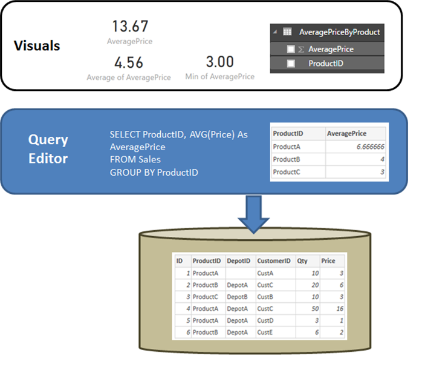

# DirectQuery and SAP HANA
You can connect to **SAP HANA** data sources directly using **DirectQuery**.

When using **SAP HANA** it is important to understand some aspects of how connections to it are treated, to ensure that:

* The results are as expected, when the SAP HANA view contains non-additive measures (for example, distinct counts, or averages, rather than simple sums)
* The resulting queries are efficient

It's useful to start by taking a moment to clarify the behavior of a relational source such as **SQL Server**, when the query defined in **Get Data** or **Query Editor** performs an aggregation. In the example that follows, a query defined in  **Query Editor** returns the average price by **ProductID**.

If the data is being imported into Power BI (versus using DirectQuery), the following would result:

* The data is imported at the level of aggregation defined by the query created in **Query Editor**. For example, average price by product. This results in a table with the two columns *ProductID* and *AveragePrice* that can be used in visuals.
* In a visual, any subsequent aggregation (such as *Sum*, *Average*, *Min*, others) is performed over that imported data.  For example, including *AveragePrice* on a visual will use the *Sum* aggregate by default, and would return the sum over the *AveragePrice* for each *ProductID* – which in this case would be 13.67. The same applies to any alternative aggregate function (such as *Min*, *Average*, so on) used on the visual. For example, *Average* of *AveragePrice* returns the average of 6.66, 4 and 3, which equates to 4.56, and *not* the average of *Price* on the 6 records in the underlying table, which is 5.17.

If **DirectQuery** is being used instead of Import, the same semantics apply and the results would be exactly the same:

* Given the same query, logically exactly the same data is presented to the reporting layer – even though the data is not actually imported.
* In a visual, any subsequent aggregation (*Sum*, *Average*, *Min*, others) is again performed over that logical table from the query. And again, a visual containing *Average* of *AveragePrice* returns the same 4.56.

So now let's consider **SAP HANA**. Power BI can work with both *Analytic Views* and *Calculation Views* in SAP HANA, both of which can contain measures. Yet today the approach for SAP HANA follows the same principles as described previously: the query defined in **Get Data** or **Query Editor** will determine the data available, and then any subsequent aggregation in a visual is over that data, and the same applies for both Import and DirectQuery.

However, given the nature of HANA, the query defined in the initial **Get Data** dialog or **Query Editor** is always an aggregate query, and generally will include measures where the actual aggregation that will be used is defined by the HANA view.

The equivalent of the SQL Server example above is that there is a HANA view containing **ID**, **ProductID**, **DepotID**, and measures including **AveragePrice**, defined in the view as **Average of Price**.

If, in the **Get Data** experience, the selections made were for **ProductID** and the **AveragePrice** measure, then that is defining a query over the view, requesting that aggregate data (in the example above, for simplicity pseudo-SQL is used that doesn’t match the exact syntax of HANA SQL). Then any further aggregations defined in a visual are further aggregating the results of such a query. Again, as described above for **SQL Server**, this applies both for the Import and DirectQuery case. Note that in the DirectQuery case, the query from **Get Data** or **Query Editor** will be used in a subselect within a single query sent to HANA, and thus it is not actually the case that all the data would be read in, prior to aggregating further.

This gives rise to the following important considerations when using DirectQuery over HANA:

* Attention must be paid to any further aggregation performed in visuals, whenever the measure in HANA is non-additive (for example, not a simple *Sum*, *Min*, or *Max*).
* In **Get Data** or **Query Editor**, only the required columns should be included to retrieve the necessary data, reflecting the fact that the result will be a query, that must be a reasonable query that can be sent to HANA. For example, if dozens of columns were selected, with the thought that they might be needed on subsequent visuals, then even for DirectQuery a simple visual will mean the aggregate query used in the subselect will contain those dozens of columns, which will generally perform very poorly.

Let's look at an example. In the following example, selecting five columns (CalendarQuarter, Color, LastName, ProductLine, SalesOrderNumber) in the **Get Data** dialog, along with the measure OrderQuantity, will mean that later creating a simple visual containing the Min OrderQuantity will result in the following SQL query to HANA. The shaded portion is the subselect, containing the query from **Get Data** / **Query Editor**. If this subselect gives a very high cardinality result, then it is likely the resulting HANA performance will be poor.

Because of this, it is recommended that the items selected in **Get Data** or **Query Editor** should be limited to those items that are needed, while still resulting in a reasonable query for HANA.

## More Information
For more information about DirectQuery, check out the following resources:

* [DirectQuery in Power BI](desktop-directquery-about.md)
* [Data sources supported by DirectQuery](desktop-directquery-data-sources.md)
* [DirectQuery and SAP BW](desktop-directquery-sap-bw.md)
* [On-premises data gateway](service-gateway-onprem.md)

