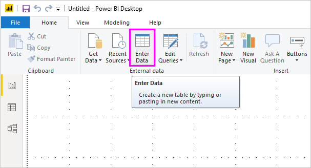

# Enter data directly into Power BI Desktop
With Power BI Desktop, you can enter data directly and use that data in your reports and visualizations. For example, you can copy portions of a workbook or web page, then paste it into Power BI Desktop.

To enter data directly, select **Enter Data** from the **Home** ribbon.

Power BI Desktop may attempt to make minor transformations on the data, if appropriate, just like it does when you load data from any source. For example, in the following case it promoted the first row of data to headers.

If you want to shape the data you entered (or pasted), you can select the Edit button to bring up **Query Editor**, where you can shape and transform the data before bringing it into Power BI Desktop. Or you can select the **Load** button to import the data as it appears.

When you select **Load**, Power BI Desktop creates a new table from your data, and makes it available in the **Fields** pane. In the following image, Power BI Desktop shows my new table, called *Table1* by default, and the two fields within that table that were created.

If you want to modify the entered data, you can open this talbe in **Power Query**. Then, nagivate to **Query Settings** -> **Applied Steps**, double click the first step named **Source** to open the **Create Data** window again for modification.

And that’s it – it’s that easy to enter data into Power BI Desktop.

You’re now ready to use the data in Power BI Desktop to create visuals, reports, or interact with any other data you might want to connect with and import, such as Excel workbooks, databases, or any other data source.

### Next steps
There are all sorts of data you can connect to using Power BI Desktop. For more information on data sources, check out the following resources:

* [What is Power BI Desktop?](desktop-what-is-desktop.md)
* [Data Sources in Power BI Desktop](desktop-data-sources.md)
* [Shape and Combine Data with Power BI Desktop](desktop-shape-and-combine-data.md)
* [Connect to Excel workbooks in Power BI Desktop](desktop-connect-excel.md)   
* [Connect to CSV files in Power BI Desktop](desktop-connect-csv.md)   

