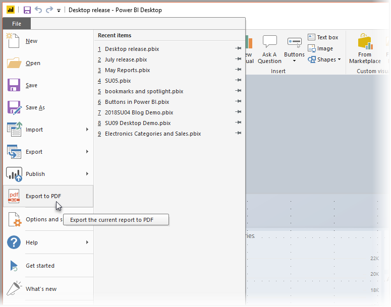
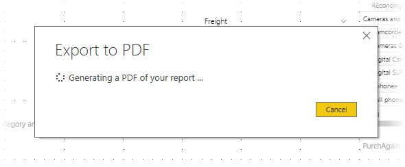

# Export reports to PDF from Power BI Desktop
In **Power BI Desktop**, you can export reports to a PDF file, and thereby easily share or print your reports from that PDF.

The process of exporting your report from **Power BI Desktop** to a PDF, so that you can print the PDF or share that PDF document with others, is straightforward. Simply select **File > Export to PDF** from Power BI Deskop.

The **Export to PDF** process will export all *visible* pages in the report, with each report page exporting to a single page in the PDF. Report pages that are currently not visible, such as any tooltips or hidden pages, are not exported to the PDF file. 

When you select **File > Export to PDF** the export is initiated, and a dialog appears that shows the export process is underway. The dialog remains on the screen until the export process completes. During the export process, all interaction with the report being exported is disabled. The only way to interact with the report is to wait until the export process completes, or to cancel the export. 

When the export completes, the PDF is loaded into the default PDF viewer on the computer. 

## Considerations and limitations
There are a few considerations to keep in mind with the **Export to PDF** feature:

* The **Export to PDF** feature is only available with **Power BI Desktop**, and is not currently available in the **Power BI service**.
* The feature does export custom visuals, but it does *not* export any wallpaper you may have applied to the report.

Since wallpaper is not exported to the PDF, you should pay special attention to reports that use dark wallpaper. If the text in your report is light or white, to have it stand out against your dark wallpaper, it will be difficult to read or unreadable in the export to PDF process since the wallpaper will not be exported with the rest of the report. 

## Next steps
There are all sorts of interesting visual elements and features in **Power BI Desktop**. For more information in inforamtion, check out the following resources:

* [Use visual elements to enhance Power BI reports](desktop-visual-elements-for-reports.md)
* [What is Power BI Desktop?](desktop-what-is-desktop.md)

